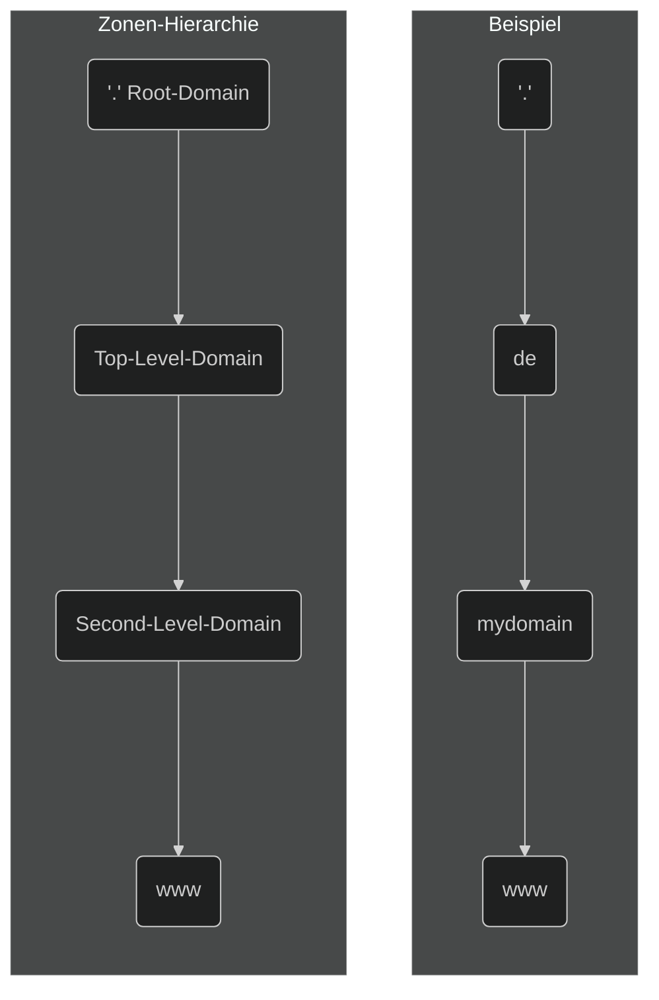
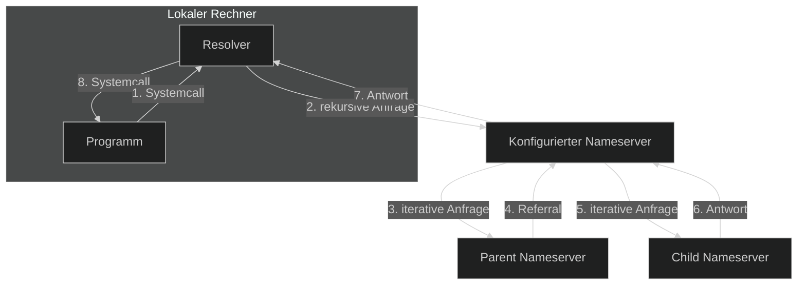
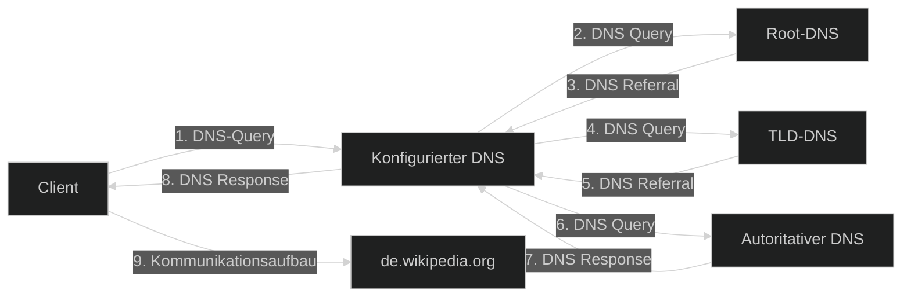
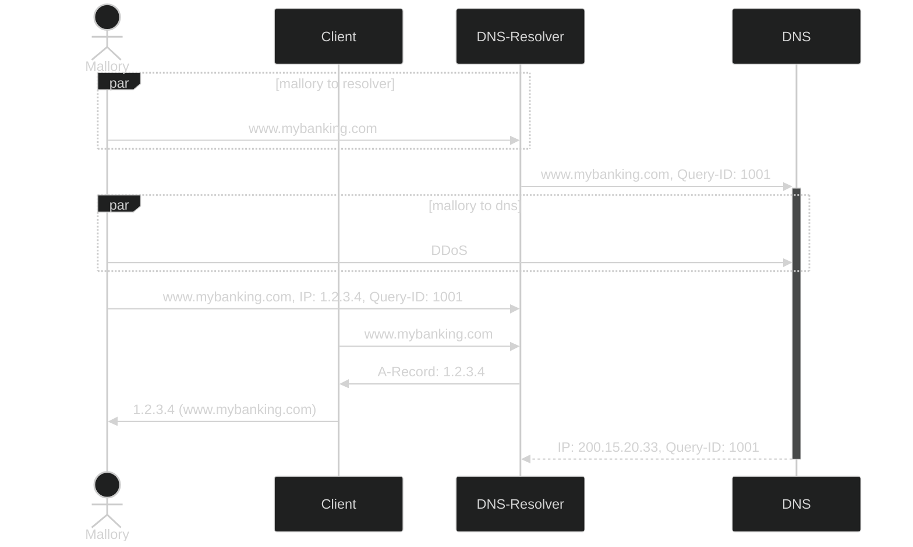

# IT-Themenzusammenfassung

Dieses Markdown-Dokument soll verschiedene IT-Themen zusammenfassen, die ich hin und wieder angeschaut habe.

## Disclaimer

Dieses Markdown-Dokument wurde in Joplin verfasst. Das bedeutet, dass hier nicht 100% auf Markdown gesetzt wird. **Es kann vorkommen, dass Elemente anders oder gar nicht angezeigt werden, wird Joplin nicht benutzt.** Ich versuche mich jedoch daran zu halten, ausschließlich Markdown zu benutzen. Es kann ebenfalls dazu kommen, dass **HTML-Elemente** wie `` oder auch `` eingebaut werden, um Fußnoten darzustellen! Außerdem werden für Diagramme **mermaid** benutzt! Eine aktuelle PDF-Kopie ist immer beigelegt.

## Inhaltsverzeichnis

[toc]

## DNS
<!-- 
Weitere DNS-Themen zur Bearbeitung:
- DNSSEC
- DNS over https
- DNS over TLS
- DynDNS
-->
### DNS - Quick Facts

- **Osi-Schicht:** 7
- **Ports:**
	- 53 (TCP / UDP)
	- 853 TLS - TCP
	- 853 DTLS - UDP
- **Standards:**
	- [RFC 1034](https://www.rfc-editor.org/rfc/rfc1034)
	- [RFC 1035](https://www.rfc-editor.org/rfc/rfc1035)

### Einleitung - Was ist DNS?

Das **D**omain **N**ame **S**ystem (DNS) ist ein integraler Bestandteil des Internets. Ohne diesen würde das Internet so in der heutigen Form nicht funktionieren. DNS beschreibt die Übersetzung eines Namens wie z.B. `www.wikipedia.org` in die zugehörige IPv4 / IPv6 Adresse `91.198.174.192` / `2620:0:862:ed1a::1`. Um *DNS* auszuführen werden entsprechende DNS-Server eingesetzt. Von diesen gibt es weltweit **mehrere tausende** und sie besitzen unterschiedlichste Funktionen und Aufgaben.

### Die Zeit vor dem DNS

Bevor es das DNS gab, zu Zeiten des [ARPANETs](https://de.wikipedia.org/wiki/Arpanet) (Vorgänger des Internets) wurden, wurden Namensauflösungen von **Webseiten** oder einfachen **Computernamen** anhand der sogenannten **Host**-Datei aufgelöst. Die Host-Datei ist eine Datei, welche -auch heute noch- auf dem Betriebssystem des Computers bzw. eines zentralen Computers abgelegt ist. Sie enthält alle Einträge, welche ein Systemadministrator für wichtig hielt einzutragen.

Und genau hier liegt der Knackpunkt. Denn mit der Host-Datei kommen folgende Probleme auf:

- Ein **Einzelner** konnte bestimmen, welche Einträge in der Host-Datei existieren und welche nicht → **Kein Schutz vor Manipulation**.
- Es gab keine zentrale Verwaltung der unterschiedlichen Namens-Zuordnungen.
- Bei **steigender** Hostanzahl wurde die **manuelle** Administration deutlich schwieriger.
	- Dadurch wurde die Aktualität der Host-Datei gefährdet.
- Die Host-Datei wurde **manuell** gepflegt. Es gab keine automatisch anpassbaren Lösungen.

Diese Probleme zeigten schnell Grenzen der Benutzung der lokalen Host-Datei auf, weshalb ein neues, (de-) zentrales System mit einer besseren Namensordnung entwickelt werden musste. Dies ist als das heutige **Domain Name System** bekannt.

### Die Domain

Ein integraler Bestandteil des Domain Name System ist natürlich die **Domain**. Eine Domain ist ein Bereich, welcher Computernamen verwaltet und diese entsprechend hierarchisch gliedert. Ein wichtiger Bestandsteil einer Domain ist der sogenannte **Domain-Name**.

Der Domain-Name wird dazu verwendet, um bestimmte Computer innerhalb des Domain-Namen zugeordneten Bereichs zu identifizieren. Sie wird ebenfalls im sogenannten Uniform Resource Locator (URL) verwendet, welcher eine **einheitliche Angabeform für Ressourcen** innerhalb eines Netzwerks darstellt. Ein URL beginnt meistens mit dem Dienst, gefolgt von den unterschiedlichen Domain-Hierarchien und endet symbolisch mit einem Punkt, welcher jedoch weggelassen werden kann. Ein URL teilt sich dementsprechend wie folgt auf: `computername.sub-level-domain.second-level-domain.top-level-domain.` bzw. `dienst.sub-level-domain.second-level-domain.top-level-domain.`. Die `sub-level-domain` ist meist optional und muss nicht angegeben werden, wenn diese nicht existiert. Folglich sind folgende URLs meist anzutreffen:

- `ftp.data.de`
- `https://wikipedia.org`
- `www.wikipedia.org`
- `de.wikipedia.org`

Die hier aufgelisteten Beispiele werden auch als **Fully Qualified Domain Name** (FQDN) bezeichnet.

**Bemerke:** Bei einer Namensauflösung wird der FQDN von **rechts nach links** gelesen. Für das Beispiel `www.wikipedia.org` würde dies wie folgt aussehen: `.org.wikipedia.www` bzw. `org.wikipedia.www`.

Wie bereits angedeutet gibt es unterschiedliche Domain-Arten. Dabei sind die **Second-Level-Domain** (SLD) und **Top-Level-Domain** (TLD) am bekanntesten und immer verwendet, wenn ein Computername aufgerufen wird. 

#### Top-Level-Domain

Die TLD ist in der DNS-Baum-Hierarchie an zweiter Stelle. Hier eingesetzte Server verwalten Namensbereiche, welche wie "*.de*", "*.org*" oder auch "*.uk*" verwalten. Dabei muss man zwischen zwei Arten von TLDs unterschieden:

1. **ccTLD:** Ausgeschrieben bedeutet das "*Country Code Top-Level-Domain*" und beschreibt Ländercodes, die nach [ISO 31166-1](https://en.wikipedia.org/wiki/ISO_3166-1_alpha-2) spezifiziert sind.
2. **gTLD:** Ausgeschrieben bedeutet das "*Generic Top-Level-Domain*" und beschreibt generische bzw. geografische TLDs.

**Auflistung an ccTLDs:**

| Domain | Land |
| :---: | :---: |
| at | Österreich |
| au | Australien |
| cc | Kokos-Inseln |
| ch | Schweiz |
| de | Deutschland |
| fr | Frankreich |
| gb | Groß-Britannien |
| ie | Irland |
| it | Italien |
| li | Lichtenstein |
| ... | ... |

**Auflistung an gTLDs:**

| Domain | Organisationsform |
| :---: | :---: |
| aero | Lufttransportindustrie |
| arpa | Alte ARPANET Domäne |
| biz | Buiseness |
| com | Kommerzielle Domain |
| gov | Regierungsstelle der vereinigten Staaten von Amerika |
| net | Nutzspezifische Angebote und Dienste |
| org | Nicht kommerzielle Unternehmen, Projekte |
| ... | ... |

#### Second-Level-Domain

Die SLD ist in der DNS-Baum-Hierarchie an dritter Stelle. Hier existierende Namensbereiche können von jedem frei erfunden und registriert werden. Wichtig ist jedoch, dass eine SLD unterhalb einer TLD **eindeutig** sein muss. Eine Vergabe von doppelten Namen kann aufzulösende Namen durcheinanderbringen.

### DNS-Zone

Eine DNS-Zone ist ein **Verwaltungs-** bzw. **Verantwortungsbereich** eines DNS-Servers. In einer Zone befindet sich mindestens ein DNS-Server. Ein DNS-Server kann zudem auch mehrere Zonen besitzen. Innerhalb jeder Zone existiert die **komplette** Datenbasis für einen bestimmten Bereich des Domänen-Namensraums. 

Die Daten der DNS-Zone wird in einer sogenannte **(DNS-) Zonendatei** lokal auf dem DNS-Server gespeichert. Dabei handelt es sich um eine Textdatei, welche die Einträge zeilenweise pflegt und nur wenige Megabytes groß ist. Pro Zeile können entweder Kommandos, gekennzeichnet an einem `$`-Symbol, vorkommen, welche Aktionen wie `INCLUDE`-Statements ausführen oder einfache DNS-Einträge (Resource Records). 

Die Zonen der Baum-Hierarchie sehen dabei wie folgt aus:

#### Zoneneinträge

Jeder einfache DNS-Eintrag innerhalb einer DNS-Zone wird als **Resource Record** bezeichnet. Jeder Resource Record bezieht sich auf einen bestimmten **Record-Type**, welcher bestimmte Informationen enthält.

Die Record-Types sind wie folgt:

| Record-Type | Eintrag |
| :---: | :---: |
| A | IPv4-Adresse |
| AAAA | IPv6-Adresse |
| CNAME | Verweis; Weiterleitung; Alias; Verweis von einem Namen auf einen anderen Namen |
| MX | Zuständiger Mailserver für die Zone (Mail Exchange) |
| NS | Zuständiger Nameserver für die Zone |
| SRV | Server für einen Dienst im Windows-AD |
| PTR | Weist einer IP-Adresse einen Namen zu. (IPv4 → **IN-ADDR-ARPA**, IPv6 → **IPv6.ARPA**)
| TXT | Liefert einen Text zurück |
| SOA | Ansprechpartner und Parameter zur abgefragten Zone (Start of Authority) |

#### DNS-Cluster

Damit die Zonen-Dateien auf unterschiedlichen Servern in den unterschiedlichen Domain-Level-Bereichen gleich sind und redundant gespeichert werden, werden Server, die einer gleichen Domain zugeordnet sind, in Clustern zusammengeschlossen. Dies erhöht die Redundanz und vermindert die Ausfallswahrscheinlichkeit. Zudem werden die Zonendateien über die jeweiligen Server entsprechend abgeglichen und aktuell gehalten.

DNS-Server-Cluster werden dabei in zwei Gruppen eingeteilt:

1. **Primary:** Hier werden die Zonendateien gespeichert, angepasst und modifiziert. Die Primary-DNS-Server sind zudem jene, welche bei einer Namensauflösung zuerst angesprochen werden. Sie teilen ihre Zonendatei mit anderen, in der gleichen Domain befindlichen Primary-Servern.
2. **Secondary:** Die Secondary-DNS-Server sind dafür da, um die entsprechenden Zonendateien abzuspeichern. Sie dienen ausschließlich als Zonendatei-Backup.

### DNS-Server Arten

*Den einen* DNS-Server gibt es so nicht, denn es gibt unterschiedliche DNS-Server, die unterschiedliche Aufgaben übernehmen. Jedoch ist zwischen zwei Haupt-DNS-Arten zu unterscheiden:

1. Autoritative DNS-Server
2. Nicht-autoritative DNS-Server

#### Autoritativer DNS-Server

Ein autoritativer DNS-Server speichert alle DNS-Informationen für seine befugte Zone. Das bedeutet, dass dieser die **Endstation** einer DNS-Anfrage ist. **Er besitzt die Informationen, um den jeweiligen DNS-Namen in eine IP-Adresse aufzulösen**. Daher gilt die Kommunikation bzw. die Antwort als **verbindlich** / **gesichert** (autoritativ).

#### Nicht-autoritativer DNS-Server

Ein nicht-autoritativer DNS-Server ist **nicht selbst** für die DNS-Zone verantwortlich und bedient sich für die Namensauflösung daher an Dritte (DNS-Server) derer DNR-Einträge (Resource Records). DNS-Einträge, welche er aufgelöst hat, werden dabei für eine bestimmte Zeit (**TTL** → Time to Live) im Cache (RAM) gespeichert des DNS-Servers gespeichert. Da sich die Einträge der ursprünglichen Zonendatei in der Zwischenzeit jedoch ändern kann, gelten die abgefragten Informationen als **nicht gesichert** und daher auch als **nicht-autoritativ**.

Bei dieser Vorgehensweise nimmt der DNS-Server die Rolle eines **Resolvers** ein, weshalb dieser auch als **DNS-Resolver** bezeichnet wird.

#### Weitere DNS-Server Arten

**Root-DNS-Server:** Der Root-DNS-Server ist ein **autoritativer** Server, welcher sich um die Root-Zone kümmert. Er besitzt alle Einträge für die TLD-Server weltweit. Ohne diesen wäre das DNS-Netzwerk nicht möglich.

**TLD-DNS-Server:** Der TLD-DNS-Server ist ebenfalls ein **autoritativer** Server, welcher alle Second-Level-Domain-Server / Namen für seine entsprechende Zone besitzt.

#### DNS-Resolver

Ein **Resolver** ist per se kein DNS-Server, sondern vielmehr eine **ogrammschnittstelle**  (Vermittlungsstelle) für Anwendung und DNS. Die Aufgabe des Resolvers ist es, sich mit den entsprechenden autoritativen DNS-Servern auseinanderzusetzen, um die jeweilige IP-Adresse zu bekommen. Dabei besitzt dieser auch zweit Methoden:

1. **Rekursives Resolving**
	1. Kontaktiert den zugeordneten Nameserver
	2. Wenn dieser die Adresse nicht im Datenbestand hat, fragt der Nameserver weitere Nameserver ab.
	3. Dies geht solange bis entweder der Adressname aufgelöst wird oder eine negative Antwort eines autoritativen DNS-Servers zurückkommt.
2. **Iteratives Resolving**
	1. Entweder bekommt der Resolver den entsprechenden Resource Record direkt vom DNS-Cache mitgeteilt oder er bekommt eine Adresse eines weiteren Nameservers zurück.
	2. Im zweiten Fall würde der Resolver so lange Namerserver nach Nameserver abfragen, bis dieser eine verbindliche Antwort enthält.
	3. Dabei werden die Anfragen meist eine Instanz höher (eine Zone nach oben) weitergeleitet, um die Adresse aufzulösen.

**Bemerke:** Das Iterative-Verfahren wird kaum für Resolver oder Clients eingesetzt, da diese damit nicht umgehen können. Deshalb wird das Verfahren nur unter DNS-Servern eingesetzt.

### Funktionsweise eines DNS-Lookups

**Bemerke:** Nachfolgender Ausschnitt wurde größtenteils von Wikipedia übernommen!

Angenommen, ein Rechner X (Zur Einfachheit: Alice) möchte eine Verbindung zu `de.wikipedia.org` (Rechner Y, zur Einfachheit: Bob) aufbauen. Dazu braucht er dessen IP-Adresse. Falls Alice IPv6-fähig ist, läuft der Vorgang zunächst für IPv6 (AAAA-Record) und **sofort** danach für IPv4 (A-Record) ab. Falls am Ende eine IPv6 **und** eine IPv4 Adresse für Rechner Y ermittelt wurde, wird i.d.R. laut der Default Policy [RFC 6724](https://tools.ietf.org/html/rfc6724) die Kommunikation zwischen Alice und Bob über IPv6 bevorzugt, es sei denn im Betriebssystem oder in den benutzten Anwendungen, wie z.B. ein Webbrowser, wurde dieses Verhalten anders eingestellt.

1. Alice sucht in ihrer lokalen *host*-Datei nach dem Eintrag `de.wikipedia.org`. Falls dieser nicht existiert, fragt Alice bei ihrem konfigurierten DNS-Server (konfigurierter DNS-Server) nach.
2. Hat der DNS-Server die IP-Adresse von Bob zwischengespeichert, antwortet er mit dieser und beendet die Kommunikation. Andernfalls fragt er bei einem Root-Server nach `de.wikipedia.org`.
3. Der Root-Server findet heraus, dass `de.wikipedia.org` zur TLD `.org` gehört und schickt die Adresse des zuständigen Nameservers an den Alices konfigurierten DNS-Servers zurück (NS Resource Record und AAAA oder A Resource Record)
4. Nun fragt der konfigurierte DNS-Server von Alice den zurückbekommenen Nameserver für die `.org`-Zone nach `wikipedia.org` an.
5. Der ".org"-Nameserver findet den Eintrag von "wikipedia.org" und sendet den autoritativen Nameserver mit IP-Adresse zurück an den DNS von Rechner X.
6. Anschließend fragt der konfigurierte DNS-Server von Alice den autoritativen Nameserver von `wikipedia.org` nach `de.wikipedia.org`.
7. Der autoritative Nameserver von `wikipedia.org` schickt die IP-Adresse für `de.wikipedia.org` zurück an den konfigurierten DNS-Server von Alice.
8. Der konfigurierte DNS-Server von Alice sendet anschließend an Alice.
9. Alice kann anschließend mit Bob (`de.wikipedia.org`) eine Kommunikation aufbauen.

### Sichtbarkeit

DNS-Server können einerseits **privat** andererseits **öffentlich** betrieben werden. Im folgenden werden die Unterschiede gezeigt:

| Public DNS | Private DNS |
| :---: | :---: |
| Öffentlich zugänglich | Nur für private Nutzer eines (Unternehmens-) Netzwerks |
| Wird durch keine Firewall blockiert | Ist in einem internen (Unternehmens-) Netzwerk. Befindet sich hinter einer Firewall |
| Wird mittels öffentlichen IP-Adressen angesprochen | Besitzt private IP-Adresse |
| Lösen öffentliche Adressen auf | Lösen private und öffentliche Adressen auf |

### Angriffsvektoren

Nachfolgend werden zwei Angriffszenarien gezeigt. Es gibt natürlich noch weitere Angriffsmöglichkeiten, als hier dargestellt.

#### Distributed Denial of Service (DDoS)

Hier werden meist Botnetzwerke benutzt, um einen DNS-Server mit vielen Anfragen zu fluten und die **Systemressourcen stark zu belasten**, bis dieser, im (aus Angreifersicht) Best-Case abstürzt. Zwar sind vor allem Root-DNS-Server sehr performante DNS-Server, können jedoch bei einem großflächigem Angriff temporär ausfallen. Daher ist es wichtig DNS-Server in **Cluster** zu stecken, um die **Ausfallsicherheit** zu erhöhen.

Ein DDoS-Angriff kann ebenfalls in Verbindung mit anderen Angriffen erfolgen.

#### DNS-Spoofing - Cache Poisoning

*Cache Poisoning* beschreibt ein Vorgehen, bei welchem der Angreifer versucht dem DNS-Server eine **gefälschte IP-Adresse** für einen DNS-Namen unterzubringen. Dadurch können DNS-Anfragen von unwissenden Clients auf die entsprechende Adresse auf das **Ziel des Hackers** umgeleitet werden. Dieser kann z.B. eine entsprechende Webseite so präparieren, sodass diese täuschend echt zur Originalseite ist. Hier geben Unwissentliche ihre **geheimen Informationen** an, die der Hacker anschließend missbrauchen kann.

**Ein möglicher Ablauf von Cache-Poisoning:**

Der Angreifer sendet eine DNS-Anfrage an den entsprechenden lokalen DNS-Server. Dieser DNS-Name kann entweder eine existierende Seite oder eine ausgedachte sein. In beiden Fällen **muss** es jedoch ein DNS-Name sein, die der DNS-Server **auflösen muss**.

Sobald der Hacker seine DNS-Anfrage versendet hat und den entsprechenden Upstream-DNS-Server kennt, versucht er diesen z.B. mittels DDoS-Attacken zu beschäftigen, **sodass die Antwortzeit stark verlängert wird**. Während dieser Zeit versucht der Angreifer die präparierte IP-Adresse dem DNS-Server für den entsprechend angefragten DNS-Namen unterzubringen.

Problem ist jedoch, dass der DNS-Server eine **Query-ID** zu seinem Upstream-DNS-Server schickt, welche bei einer Antwort des Upstream-DNS als Authentitäts-Code benutzt wird. Ohne die entsprechende Query-ID kann der Angreifer seine präparierte IP-Adresse nicht als Antwort zum DNS-Server senden. Da DNS jedoch grundsätzlich **unverschlüsselt** ist, kann der Angreifer die Query-ID entweder mit einem **Sniffer** auslesen oder er **errät** diese. Das Erraten der Query-ID ist nicht umfangreich, da die Query-ID *nur* zwischen 1-65535 groß sein kann. Im Durchschnitt braucht man meist jedoch nur 216 / 2 = **32.768** Versuche, um die richtige Query-ID zu erraten. Zudem wird das Erraten dadurch vereinfacht, dass mehrere Query-Antworten parallel geschickt werden können.

Hat der Angreifer die Query-ID des DNS-Servers erraten, schickt dieser auf die Anfrage des DNS-Servers seine präparierte IP-Adresse. Wenn nun ein User den entsprechenden DNS-Namen eingibt, wird dieser anstatt auf die Originalwebseite auf die gefälschte Webseite des Angreifer weitergeleitet. Hier kann der Angreifer nun die geheimen Daten abgreifen und entsprechend missbrauchen.

### Sicherheitserweiterungen

**Notiz Stand 07.11.2022:** Aufgrund der Komplexität und Länge der nachfolgenden Themen, wurden diese nur kurz beschrieben. Eine ausführliche Ausarbeitung ist noch geplant.

#### Transaction Signature (TSIG)

TSIG beschreibt ein Verfahren, bei welchem die **Authentizität** von kommunizierenden DNS-Server bewahrt werden soll. TSIG wird hauptsächlich zwischen **DNS-Servern** benutzt. Es funktioniert mittels symmetrischer Verschlüsselung. Um TSIG konfigurieren zu können, muss auf den entsprechenden DNS-Server mindestens ein Administrator-Zugriff bereitgestellt sein.

Auf den jeweiligen DNS-Servern muss ein **geteiltes Geheimnis** konfiguriert werden. Mit diesem berechnen die DNS-Server den **MD5-Hash** des zu verschickenden DNS-Pakets und hängen diesen an besagtes. Der jeweilige empfangenden Server berechnet ebenfalls mit dem geheimen Schlüssel den MD5-Hash des empfangenen Pakets und überprüft beide Hashes. Sind sie **gleich**, ist die Authentizität **gewährleistet**. Unterscheiden sich die Hashes, wird die DNS-Anfrage nicht zurückgewiesen.

Grundsätzlich ist dies ein deutlich einfacheres Verfahren als **DNSSEC**, welches auf **Public-Key-Infrastructure** setzt. Jedoch ist der **Konfigurationsaufwand** bei vielen Servern **sehr hoch**, weshalb der Einsatz von PKI hier ein Vorteil besitzt. TSIG ist in [RFC 2845](https://www.rfc-editor.org/rfc/rfc2845) beschrieben.

#### DNS over https (DoH)

Beschreibt die Funktion, wie DNS über das **https-Protokoll** verwendet werden kann, um **Sicherheit und Authentizität** der DNS-Anfragen zu stärken. DoH ist ein [RFC 8484](https://www.rfc-editor.org/rfc/rfc8484.html) beschrieben.

#### DNS over TLS (DoT)

Beschreibt die Funktion, wie DNS über TLS verwendet werden kann, um **Sicherheit und Authentizität** der DNS-Anfragen zu stärken. Es ist ähnlich zu DNS over https (DoH) und ist in [RFC 8310](https://datatracker.ietf.org/doc/html/rfc8310) und in [RFC 7858](https://datatracker.ietf.org/doc/html/rfc7858) beschrieben.

#### DNSSEC

Beschreibt eine Reihe von Internetstandards zur Stärkung der DNS-Abfragen in **Authentizität** und **Integrität** der Daten, nicht aber der Server. Es wurde entwickelt, um **DNS-Poisoning-Angriffe** entgegenzuwirken. Für **Vertraulichkeit** ist DNSSEC **nicht** vorgesehen! DNS-Daten werden zudem **nicht verschlüsselt**!

### DNS-Zensur

In verschiedenen Ländern der Welt -so auch in Deutschland- werden ebenfalls DNS-Sperren für bestimmte Websites verhängt. Auch hier könnte man von einem *DNS-Poisoning* reden, da die Einträge entweder auf **andere Webseiten verwiesen** werden oder einfach **gesperrt** werden. Im letzteren Fall wird der abzufragende DNS-Name gegen eine **Sperrliste** (Blacklist) verglichen. Ist der DNS-Name dort enthalten, wird der Zugriff entsprechend **blockiert**. Es existieren jedoch DNS-Service-Provider, die darauf schören **zensurfrei** zu sein.

### Quellen

[https://de.wikipedia.org/wiki/Domain_Name_System](https://de.wikipedia.org/wiki/Domain_Name_System)

[https://www.ionos.de/digitalguide/server/knowhow/namensaufloesung-im-netz-was-ist-ein-dns-server/](https://www.ionos.de/digitalguide/server/knowhow/namensaufloesung-im-netz-was-ist-ein-dns-server/)

[https://www.varonis.com/de/blog/was-dns-ist-wie-es-funktioniert-und-schwachstellen](https://www.varonis.com/de/blog/was-dns-ist-wie-es-funktioniert-und-schwachstellen)

[https://www.elektronik-kompendium.de/sites/net/0901141.htm](https://www.elektronik-kompendium.de/sites/net/0901141.htm)

[https://aws.amazon.com/de/route53/what-is-dns/](https://aws.amazon.com/de/route53/what-is-dns/)

[https://de.wikipedia.org/wiki/TSIG](https://de.wikipedia.org/wiki/TSIG)

[https://www.cira.ca/resources/anycast/guide-how/using-transaction-signatures-tsig-secure-dns-server-communication](https://www.cira.ca/resources/anycast/guide-how/using-transaction-signatures-tsig-secure-dns-server-communication)

[https://de.wikipedia.org/wiki/Cache_Poisoning](https://de.wikipedia.org/wiki/Cache_Poisoning)

[https://en.wikipedia.org/wiki/DNS_over_HTTPS](https://en.wikipedia.org/wiki/DNS_over_HTTPS)

[https://en.wikipedia.org/wiki/DNS_over_TLS](https://en.wikipedia.org/wiki/DNS_over_TLS)

[https://en.wikipedia.org/wiki/Domain_Name_System_Security_Extensions](https://en.wikipedia.org/wiki/Domain_Name_System_Security_Extensions)

[https://www.ionos.de/digitalguide/server/knowhow/dns-zone/](https://www.ionos.de/digitalguide/server/knowhow/dns-zone/)

[https://www.elektronik-kompendium.de/sites/net/1910181.htm](https://www.elektronik-kompendium.de/sites/net/1910181.htm)
