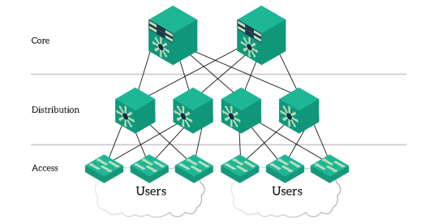
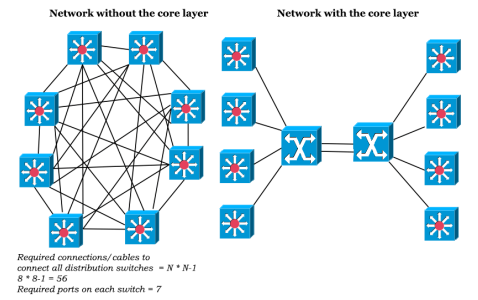
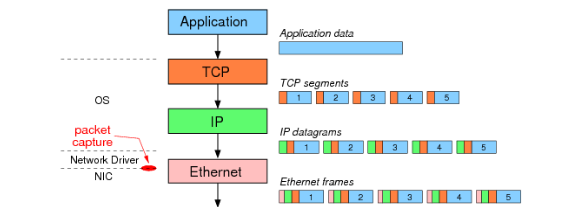

<!-- omit in toc -->
# IT-Themenzusammenfassung

Dieses Markdown-Dokument soll verschiedene IT-Themen zusammenfassen, die ich hin und wieder angeschaut habe.

<!-- omit in toc -->
## Disclaimer

Dieses Markdown-Dokument wurde in [Visual Studio Code von Microsoft](https://code.visualstudio.com/) mit diversen Plugins verfasst. Das bedeutet, dass hier nicht 100% auf Markdown gesetzt wird. **Es kann vorkommen, dass Elemente anders oder gar nicht angezeigt werden, wird VScode mit den entsprechenden Plugins nicht benutzt.** Für weitere Informationen bezüglich benutzten Plugins, Einstellungen etc. siehe *misc/VS-Code-Customizing.md*.

<!-- omit in toc -->
## Inhaltsverzeichnis

- [APN - Access Point Name](#apn---access-point-name)
- [Cisco - Access Control List](#cisco---access-control-list)
- [Cisco - Passwort vs. Secret](#cisco---passwort-vs-secret)
- [DNS - Domain Name System](#dns---domain-name-system)
- [Domain und Domaincontroller](#domain-und-domaincontroller)
- [DSL - Digital Subscriber Line](#dsl---digital-subscriber-line)
- [Flow Control](#flow-control)
- [FTP - File Transfer Protocol](#ftp---file-transfer-protocol)
- [LLDP - Link Layer Discovery Protokoll](#lldp---link-layer-discovery-protokoll)
- [LRO - Large Receive Offload](#lro---large-receive-offload)
- [Netzwerkplanung - Hierarchisches Netzwerk](#netzwerkplanung---hierarchisches-netzwerk)
- [UNIX-Prozesse](#unix-prozesse)
- [Round-Robin](#round-robin)
- [.rhosts](#rhosts)
- [TSO - TCP Segmentation Offloading](#tso---tcp-segmentation-offloading)
- [VRRP - Virtual Router Redundancy Protocol](#vrrp---virtual-router-redundancy-protocol)
- [WSUS - Windows Server Update Services](#wsus---windows-server-update-services)
- [X11](#x11)

# APN - Access Point Name

"*APN*" steht für "**A**ccess **P**oint **N**ame" - nicht zu verwechseln mit einem Access-Point als Netzwerkgerät. Ein APN ist eine Art "*Gateway*" eines Mobilfunkbetreibers, welches ein Netzwerk für das jeweilige mobile Endgerät zur Verfügung stellt. Mithilfe dieses Netzwerks kann ein mobiles Endgerät das **öffentliche Netzwerk** (Internet) erreichen. Ein APN dient jedoch nicht nur als Gateway, sondern setzt weitere verschiedene Eigenschaften für das jeweilige mobile Endgerät wie zum Beispiel wie es sich am **Netzwerk authentifiziert**, welche **Kommunikationswege** es benutzt als auch welche **Sicherheitsmaßnahmen** für das mobile Endgerät greifen.

Mithilfe eines APNs ist es möglich verschiedene Endgeräte als auch IoT-Geräte zu administrieren und **voneinander zu trennen**. Um diese Geräte jedoch in ein APN-Netzwerk aufnehmen zu können, muss als aller erstes ein APN angefordert / gekauft werden. Ein solcher APN wird i.d.R. bei einem **Mobilfunkanbieter** gemietet. Dabei gibt es jedoch ein paar Dinge wie folgend zu beachten:

- Für jedes neue APN-Netzwerk muss dieses beim Mobilfunkanbieter gemietet werden.
- Die APNs werden (meist) monatlich abgerechnet.
- Jedes mobile Endgerät oder IoT-Gerät erhält meist eine SIM-Karte, auf welcher der APN bereits fest eingetragen ist.
  - Oft kommt es aber auch vor, dass der APN in den LTE-Einstellungen des Geräts eingegeben werden muss, damit sich das Gerät mit dem Mobilfunkanbieter verbindet (siehe Telekom).
- Jedes mobile Endgerät oder IoT-Gerät innerhalb eines APN-Netzwerks muss den gleichen Mobilfunkanbieter besitzen. Es ist nur unter Umständen möglich, dass mobile Endgeräte zu verschiedenen APN-Netzen eine Verbindung aufbauen können.
  - Ist der Mobilfunkanbieter im Ausland nicht unter gleichem Namen gelistet, wird der entsprechende, zum Unternehmen gehörende APN-Übergangspunkt für die Einwahl benutzt. Existiert der Mobilfunkanbieter gar nicht, so versucht sich die SIM-Karte in das nächst beste Netzwerk / Parnternetzwerk einzuwählen.

Wie bereits erwähnt ist es möglich, dass ein Gerät zwar mehrere verschiedene APNs von verschiedenen Mobilfunkanbietern besitzen kann, dies aber nur mit erhöhten Kosten möglich ist. Dafür gibt es zwei Möglichkeiten, um dieses Vorhaben umzusetzen:

1. Die **preisgünstigere** Variante ist es, dass der Mobilfunkanbieter mehrere APN-Profile auf seiner SIM-Karte hinterlegt (oder entsprechend in der Software). Somit können jedoch nur die vorgefertigten APN-Profile für andere Mobilfunkanbieter benutzt werden.
2. Die **teurere** Variante ist es eine E-SIM zu benutzen, welche ohne physische SIM-Karte mehrere APN-Profile innerhalb eines Speicherchips abspeichern kann.

<!-- omit in toc -->
## Kommunikationswege der APN-Typen

Vor der Mietung eines APNs sollte man im Klaren sein, welche Art von APN man benutzen möchte. Dabei gibt es zwei Arten mit jeweils statischer und dynamischer IP-Adressvergabe.

<!-- omit in toc -->
### Öffentlicher APN

Wird ein öffentliches APN-Netzwerk benutzt, dann können mobile End- und IoT-Geräte **direkt mit dem Internet** mit Umweg über den Mobilfunkanbieter kommunizieren. Ist die IP-Adressvergabe dynamisch konfiguriert, so holt sich das jeweilige zu verbindende Endgerät entsprechend nach DHCP eine freie IP-Adresse aus einem verfügbaren Pool und benutzt diese so lange, bis das Endgerät die Verbindung abbaut und somit die Session schließt (oftmals auch im entsprechend Management-Portal konfigurierbar).

Dabei gibt das mobile End- oder IoT-Gerät die IP-Adresse wieder zurück an den Adresspool. Bei einem neuen Verbindungsaufbau wird eine neue freie IP-Adresse aus dem vorhandenen Adresspool benutzt. Ist das APN-Netzwerk statisch konfiguriert, so besitzt jedes mobile End- oder IoT-Gerät seine eigene statische Adresse innerhalb des Netzwerk. Diese wird für jede Verbindung mit dem Internet benutzt.


<!-- omit in toc -->
### Privater APN

Im Vergleich zu einem öffentlichen APN-Netzwerk, welches die Daten der mobilen End- und IoT-Geräte **in das Internet routen**, macht das private APN-Netzwerk **dies nicht unbedingt**. Grundsätzlich ist es möglich auch diesen Datenverkehr in das Internet zu routen, jedoch kann man bei einem privaten APN mehrere **Sicherheitseinstellungen** einstellen als bei einem öffentlichen APN.

Meist werden private APNs jedoch dafür benutzt, um den **Datenverkehr mittels VPN** zum eigenen (Unternehmens-) Netzwerk zu routen. So ist es möglich, dass Dienste innerhalb eines privaten APN-Netzwerks mit Diensten innerhalb des eigenen (Unternehmens-) Netzwerk kommunizieren können. Damit diese Dienste miteinander kommunizieren können, wird klassischerweise ein VPN-Tunnel vom Mobilfunkanbieter zum eigenen (Unternehmens-) Netzwerk erstellt. Die IP-Adressen innerhalb eines privaten APN-Netzwerks können ebenfalls **statisch** oder **dynamisch** verteilt werden.


<!-- omit in toc -->
## APN vs. VPN

Es kommt hin und wieder vor, ass ein APN mit einem VPN verwechselt oder verglichen wird. Dies ist nicht möglich, da die Aufgaben von einem APN und eines VPNs **sehr unterschiedlich** sind. ***Während der APN die Verbindung für ein mobiles End- und IoT-Gerät in das Netzwerk des Mobilfunkanbieters herstellt, stellt ein VPN einen Tunnel zwischen zwei Standorten her.*** Zudem verschlüsselt ein VPN den Datenverkehr innerhalb eines VPN-Tunnels, während ein APN keine Verschlüsselung verwendet,

# Cisco - Access Control List

<!-- omit in toc -->
## Überblick - Was ist eine Access Control List

Eine ***Access Control List*** (ACL) ist eine Liste an unterschiedlichen Kommandos, welche Datenverkehr für bestimmte Netzwerke und Anwendungen **zulassen** oder **blockieren** kann. ACLs werden zum **Absichern des Datenverkehrs** auf Routern benutzt. Somit gleichen ACLs einer Art Firewall.

ACLs gibt es in verschiedenen Formen und Arten. Darunter sind die bekanntesten:

- **Standard ACLs**: Grober Datenfilter anhand IP-Adressen.
- **Extended ACLs**: Granularer Datenfilter anhand IP-Adressen, Protokolle und Anwendungen.

Desweiteren gibt es weitere ACLs, welche unterschiedliche Zwecke erfüllen.

ACLs werden im Konfigurationsmodus des Routers angelegt. Sie wirken jedoch erst dann, wenn diese **auf einem Interface** konfiguriert wurden. Auf dem Interface selbst gibt es zwei Richtungen:

- **Inbound (In)**: Datenverkehr, welcher am Interface ankommt und nach *innen* weiterverarbeitet werden soll. Z.B. Public-Datenverkehr nach Intern.
- **Outbound (Out)**: Datenverkehr, welcher am Interface ankommt und nach *draußen* weiterverarbeitet werden soll. Z.B. Interner Datenverkehr nach Public.

<!-- omit in toc -->
## ACL Grundlagen

<!-- omit in toc -->
### Masken

ACLs verwenden Zugriffskontroll-Masken (ACL-Maske / Wildcard Mask), um festzulegen welche IP-Adresse bzw. Netzwerkbereiche zugelassen oder abgelehnt werden sollen. Die ACL-Masken sind dabei den Subnetzmasken von IP-Adressen sehr ähnlich. Anders als bei den Subnetzmasken, werden ACL-Masken *vekehrt herum* gebildet. Folgendes Beispiel erläutert den Prozess:

- Netzwerk: 192.168.1.0
- Subnetzmaske: 255.255.255.0

Das Netzwerk `192.168.1.0` mit der Subnetzmaske `255.255.255.0` beschreibt, dass die ersten drei Oktette `192.168.1` immer identisch sein müssen, damit ein Client innerhalb des Netzwerks mit einem anderen Client im gleichen Netzwerk kommunizieren kann. Der **Hostanteil** besitzt den Wert `0` im 4 Oktett der Subnetzmaske. Das bedeutet, dass alle Adressen `0 - 255` (-2 für Netz- und Broadcastadresse) als **Hostadressen** benutzbar und somit frei im Netzwerk zur Verfügung sind. Sommit können z.B. Client_A mit `192.168.1.5` und Client_B mit `192.168.1.250` miteinander kommunizieren.

Dieses Konzept wird bei den ACL-Masken umgekehrt behandelt:

- Netzwerk: 192.168.1.0
- Subnetzmaske: 255.255.255.0
- ACL-Maske: 0.0.0.255

Das bedeutet, dass **exakte Übereinstimmungen** mit einer `0` gekennzeichnet werden und alles andere, was **nicht exakt übereinstimmen muss** mit einer `1` (binär) gekennzeichnet wird. Aufgeteilt im Binärformat wäre das folgendermaßen:

- Netzwerk: 192.168.1.0
- Subnetzmaske: 11111111.11111111.11111111.00000000 (→ Binär 1 = Exakte Übereinsteimmung; Binär 0 = Keine Übereinstimmung)
- ACL-Maske: 00000000.00000000.00000000.11111111 (→ Binär 1 = Keine Übereinstimmung; Binär 0 = Exakte Übereinstimmung)

Möchte man also eine ACL-Maske erstellen, in welcher z.B. das letzte Oktett einer Netzwerkadresse **nicht übereinstimmen** muss, dann würde man die Maske `0.0.0.255` dafür wählen.

Das Errechnen der ACL-Maske kann ebenfalls durch folgenden Trick **vereinfacht** werden:

```txt
255.255.255.255 - Subnetzmaske = ACL-Maske

255.255.255.255 - 255.255.255.0 = 0.0.0.255
```

**Beachte**:

- Der Wert `0.0.0.0 (Subnetzmaske) / 255.255.255.255 (ACL-Maske)` ist eine *Default-Route* und steht für den Wert `any`.
- Eine Host-Adresse kann auf der CLI abgekürzt werden: ❌ `192.168.1.0 0.0.0.0` / ✅ `host 192.168.1.0`

<!-- omit in toc -->
### Zusammenfassen von Netzwerken in ACL-Masken

Besitzt man mehrere **aufeinanderfolgende** Netzwerke, welche gleiche Regeln besitzen sollen, dann kann es viel Aufwand sein, die entsprechenden Regeln zu erstellen. Das kann deutlich einfacher gemacht werden, indem man die Netzwerke zusammenfasst. Bei Subnetzmasken ist das auch unter `Supernet` bekannt. Angenommen es existieren folgende Netzwerke:

- 192.168.32.0/24
- 192.168.33.0/24
- 192.168.34.0/24
- 192.168.35.0/24
- 192.168.36.0/24
- 192.168.37.0/24
- 192.168.38.0/24
- 192.168.39.0/24

Die Oktette 1, 2 und 4 sind bei allen Adressen gleich. Nur das dritte Oktett unterscheidet sich. Das 4. Oktett braucht keine weitere beachtung, da hier wieder alle Adressen nicht übereinstimmen müssen. Das ist wiederum bei den ersten drei Oktetten nicht der Fall. Das dritte Oktett kann von der ACL-Maske jedoch so zusammengefasst werden, dass nur ein Netzwerk mit entsprechender ACL-Maske angegeben werden muss. Die nachfolgenden Tabelle erläutert wie die Maske aussehen kann:

| Dezimal / Binär | 128 | 64 | 32 | 16 | 8 | 4 | 2 | 1 |
| --- | --- | --- | --- | --- | --- | --- | --- | --- |
| 32 | 0 | 0 | 1 | 0 | 0 | 0 | 0 | 0 |
| 33 | 0 | 0 | 1 | 0 | 0 | 0 | 0 | 1 |
| 34 | 0 | 0 | 1 | 0 | 0 | 0 | 1 | 0 |
| 35 | 0 | 0 | 1 | 0 | 0 | 0 | 1 | 1 |
| 36 | 0 | 0 | 1 | 0 | 0 | 1 | 0 | 0 |
| 37 | 0 | 0 | 1 | 0 | 0 | 1 | 0 | 1 |
| 38 | 0 | 0 | 1 | 0 | 0 | 1 | 1 | 0 |
| 39 | 0 | 0 | 1 | 0 | 0 | 1 | 1 | 1 |

Da die ersten 5 Bits übereinstimmen, kann das Netzwerk bis dahin zusammengefasst werden. Daraus entsteht folgendes Netzwerk: 192.168.1.0/21. Die daraus resultierende ACL-Maske ist 0.0.7.255.

Mit folgendem Befehl könnten also die entsprechenden IP-Adressen in einer ACL erlaubt werden:

```txt
access-list acl_permit permit ip 192.168.32.0 0.0.7.255
```

**Aufgepasst**: Adressen können nur dann zusammengefasst werden, wenn diese auch in den entsprechenden Bereichen vertreten sind. So können zwar oben gezeigte Adressen komplett zusammengefasst werden, jedoch funktioniert das nicht immer, wie das nächste Beispiel zeigt.

Geht man davon aus, man hätte die folgenden Adressblöcke:

- 192.168.146.0/24
- 192.168.147.0/24
- 192.168.148.0/24
- 192.168.149.0/24

Hier könnten, wie beim oben gezeigten Beispiel, auch die ersten 5 Bits des dritten Oktetts zusammengefasst werden. So könnte man meinen, dass folgende ACL ausreichend wäre:

```txt
access-list acl_permit permit ip 192.168.146.0 0.0.7.255
```

Die Problematik hierbei ist jedoch, dass **mehr Adressen als angegeben** in dieser Regel umfasst werden würden:

```txt
3. Oktett = 8 Bits
Supernet-Bits = 8 - 5 (Netzteil) = 3 Bits (flexibel)
2^3 = 8
```

Es können somit 8 Netzwerke gebildet werden. Damit würde die access-list "acl_permit" folgenden Bereich haben: `192.168.146.0 - 192.168.153.255`. In diesem Bereich wären zudem folgende Netzwerke inkludiert:

- 192.168.150.0/24
- 192.168.151.0/24
- 192.168.152.0/24
- 192.168.153.0/24

In diesem Beispiel müsste man die 4 Adressen auf jeweil **2 Supernetze** aufteilen:

```txt
access-list acl_permit permit ip 192.168.146.0 0.0.1.255
access-list acl_permit permit ip 192.168.148.0 0.0.1.255
```

<!-- omit in toc -->
### Verarbeitung von ACLs

Das **Abgleichen von Regelsätzen** in einer ACL geht immer der Reihenfolge von **oben nach unten** durch. Trifft eine Regel zu, wird diese sofort angewandt. Trifft keine Regel zu, wird durch eine **implizite** `deny any` Regel der Datenverkehr verworfen. Diese Regel ist bei jeder ACL am Ende vorhanden und muss **nicht** explizit gesetzt werden.

Erstellt man eine ACL oder bearbeitet diese und fügt neue Regelsätze hinzu, dann werden diese **standardmäßig am Ende der ACL** angehangen. Es gibt jedoch Möglichkeiten je nach ACL-Typ die Regeln an entsprechende Positionen zu packen. Grundsätzlich gilt folgende **Best-Practice-Regel**:

> **Zitat**
> 
> Order ACL with multiple statements from most specific to least specific.

<!-- omit in toc -->
## Standard-ACL

- Standard-ACLs wurden bereits vor der Cisco IOS-Version 8.3 benutzt. 
- Sie besitzen einen anwendbaren Zahlenbereich von `1 - 99` und `1300 - 1999` (erweiterter Zahlenbereich).
- Sie arbeitet **ausschließlich** mit Quell-Adressen. Die ACL-Maske kann ist dabei optional und kann weggelassen werden.
- Die Standard-ACL besitzt zwar wie alle anderen ACLs eine implizite `deny any`-Regel, ist wird jedoch vorausgesetzt, dass am Ende jeder Standard-ACL eine `permit any`-Regel geschrieben wird.
  - Ansonsten wird sämtlicher Datenvekehr blockiert!

Die Syntax ist wie folgt:

```txt
access-list <access-list-number> {permit|deny} {host|source source-wildcard|any}
```

Eine solche Konfiguration einer Standard-ACL sieht wie folgt aus:

```txt
access-list 99 deny host 172.16.0.55
access-list 99 permit any
```

<!-- omit in toc -->
## Erweiterte ACLs

- Erweiterte ACLs sind seit der Cisco IOS Version 8.3 verfügbar
- Anders als bei der Standard-ACL wird hier nach **Quell- und Ziel-Adresse** gefiltert. Optional kann noch das Protokoll und der Port angegeben werden.
- Der anwendbare Zahlenbereich für erweitere ACLs liegt bei `100 - 199` und `2000 - 2699` (erweiteter Zahlenbereich).
- Auch diese ACL besitzt ein implizites `deny any any` am Ende. Auch hier wird empfohlen, ein `permit any any` am Ende der ACL zu konfigurieren, um sonstigen Datenverkehr zuzulasen.
  - Kann aus Sicherheitsgründen auch entfallen

Die Syntax ist wie folgt:

```txt
access-list <access-list-number> {permit|deny} {ip|tcp|udp} <source> <source-wildcard-mask> <destination> <destination-wildcard-mask> <protocol> 
```

Die Syntax kann, je nach ACL-Einstellung auch noch um weitere Parameter wie `timeout`, `tos` `log` etc. ergänzt werden.

Eine solche Konfiguration einer erweiterten ACL kann wie folgt aussehen:

```txt
# Lasse sämtlichen Datenverkehr von 192.168.1.2 nach 172.16.0.55 zu
access-list 100 permit ip host 192.168.1.2 host 172.16.0.55
# Lasse HTTPS-Datenverkehr von 192.168.1.0/24 nach 172.16.1.3 zu
access-list 100 permit tcp 192.168.1.0 0.0.0.255 host 172.16.1.3 eq 443
# Lass ICMP-Echo Antworten nicht zu
access-list 100 deny icmp any any echo
```

**Bemerke:**

- Bei `ICMP` muss anstatt des Ports der entsprechende ICMP-Code eingetragen werden!
  - Sämtliche ICMP-Codes können bei der [IANA](https://www.iana.org/assignments/icmp-parameters/icmp-parameters.xhtml) nachgeschaut werden.
- Es gibt auch die Möglichkeit, anstatt die Ports mit ihrer Zahl konfigurieren, die dahinterstehende Anwendung auch beim Namen zu nennen. Dies gilt auch für ICMP-Codes.
  - Das funktioniert jedoch ausschließlich für **standardisierte Ports** wie:
    - http / https: 80 / 443
    - telnt: 23
    - ssh: 22
    - Etc.

<!-- omit in toc -->
## ACL Namen anstatt Zahlen

Ansatt die Nummern-Bereiche für die entsprechenden ACLs zu benutzen, ist es auch möglich **Namen** zu verwenden. Das macht den Einsatz und Wieder-Erkennungswert von ACls deutlicher. Das Verwenden von ACLs mit einem Namen birgt zudem einige Vorteile:

- **Benutzung von Namen anstatt Nummern**: Wie bereits gesagt verbessert das den Wieder-Erkennungswert. Dadurch können ACLs besser beschrieben werden.
- **Neu anordnen der Regeln**: Bei der Benutzung von nummerierten ACLs ist es **nicht** möglich die Regeln an andere Stellen zu packen. Um Regeln in nummerierten ACLs umzustellen, müssen die entsprechenden ACLs zuerst gelöscht und dann mit der entsprechenden neuen Reihenfolge neu erstellt werden.
  - Hierbei ist es jedoch wichtig, dass man die ACL vorher abspeichert!
- **Löschen von ACL-Einträgen**: Bei der Benutzung von nummerierten ACLs ist es **nicht** möglich die Regeln zu löschen. Diese können jedoch mit dem `no`-Keyword bei **benannten** ACLs entsprechend gelöscht werden.

Die Konfiguration von ACLs mit Namen unterscheidet sich leicht zu den nummerierten ACLs:

**Standard-ACLs**: Standard ACLs können von Extended-ACLs durch das Keyword `standard` im Kommando unterschieden werden.

```txt
conf t
ip access-list standard my_standard_acl 	# Enter
remark my rules for the standard acl
permit 172.16.0.0 0.0.255.255
deny any
exit
```

**Extended-ACls**: Extended ACLs können von Standard-ACLs durch das Keyword `extended` im Kommando unterschieden werden.

```txt
conf t
ip access-list extended my_extended_acl		# Enter
remark my rules for the extended acl
permit tcp 192.168.1.0 0.0.0.255 172.16.0.254 0.0.0.0 eq https
deny any any
exit
```

<!-- omit in toc -->
## Anwendung von ACLs

Wie bereits erwähnt werden ACLs auf Interfaces angewandt. Dabei gibt es zwei Ausrichtungen:

- **Inbound (In)**: Datenverkehr, welcher am Interface ankommt und nach *innen* weiterverarbeitet werden soll. Z.B. Public-Datenverkehr nach Intern.
- **Outbound (Out)**: Datenverkehr, welcher am Interface ankommt und nach *draußen* weiterverarbeitet werden soll. Z.B. Interner Datenverkehr nach Public.

Bereits definierten ACLs werden wie folgt für Interfaces konfiguriert:

```txt
conf t
ip access-list extended my_acl
remark acl for webservices
permit any 172.16.0.254 0.0.0.0 eq https
deny any any
exit

ip access-list extended my_acl_web
remark acl for webserver to public
permit host 172.16.0.254 any any
exit

int gi1/0/2
ip access-group my_acl in
ip access-group my_acl_web out
```

**Tipp**: Mittels des Keywords `remark` können Kommentare zu ACL-Einträge verfasst werden. Jedoch können diese selbst in ACLs mit Namen **nicht die Position wechseln**! Daher sollte **vor** einer neuen Regel, welche beschrieben werden soll, der Kommentar erfolgen!

<!-- omit in toc -->
## ACL - Best Practices

- ACLs sollten immer zuerst konfiguriert werden, bevor diese auf Interfaces angewandt werden. Das kann Fehler oder auch Aussperrungen vermeiden.
- **Extended** ACLs sollten immer **nahe der Quelle** platziert werden. Hier findet meistens eine feinere, granularere Abstimmung von Regelsätzen für den Datenverkehr statt.
- **Standard** ACLs sollte immer **nahe des Ziels** platziert werden. Hier findet meistens eher eine grobere Abstimmung von Regelsätzen für den Datenverkehr statt.
- ACL-Regelsätze sollten von **meist benutzt** nach **wenig benutzt** sortiert werden. Das vermeidet unnötige Rechenkapazität bei der Begutachtung der Regeln für den zu evaluierenden Datenverkehr.
- Es können **maximal 2** ACLs auf **einem Interface** angewandt werden. Darunter je 1 für inbound und outbound.
- Eine ACL sollte **mindestens eine `permit`-Regel** besitzen. Ansonsten wird sämtlicher Datenverkehr blockiert.
- Eine `deny any any`-Regel ist zwar, durch das implizit gesetzte `deny any any` nicht nötig, sollte aber dennoch für das allgemeine Verständnis gesetzt werden.
- Standard- und Erweitere-ACLs können **nicht den gleichen** Namen besitzen.

<!-- omit in toc -->
## Quellen

- [https://www.cisco.com/c/de_de/support/docs/security/ios-firewall/23602-confaccesslists.html](https://www.cisco.com/c/de_de/support/docs/security/ios-firewall/23602-confaccesslists.html)
- [https://community.cisco.com/t5/networking-knowledge-base/access-control-lists-acl-explained/ta-p/4182349](https://community.cisco.com/t5/networking-knowledge-base/access-control-lists-acl-explained/ta-p/4182349)
- [https://content.cisco.com/chapter.sjs?uri=/searchable/chapter/content/en/us/td/docs/ios-xml/ios/sec_data_acl/configuration/xe-3e/sec-data-acl-xe-3e-book/sec-acl-named.html.xml](https://content.cisco.com/chapter.sjs?uri=/searchable/chapter/content/en/us/td/docs/ios-xml/ios/sec_data_acl/configuration/xe-3e/sec-data-acl-xe-3e-book/sec-acl-named.html.xml)

# Cisco - Passwort vs. Secret

Standardmäßig sind Cisco-Geräte wie Router oder Switches ***nicht*** passwortgeschützt. Das bedeutet, dass ein Zugriff auf das Gerät als auch in den erhöhten EXEC-Modus **ohne Authentifizierung** stattfinden kann. Da dies jedoch ein **enormes Sicherheitsrisiko** darstellt, werden Passwörter benutzt, um diese Bereiche abzusichern. Bei Cisco-Geräten gibt es zwei Methoden, um Passwörter zu setzen:

1. Mittels dem `enable password`-Kommando
2. Mittels dem `enable secret` -Kommando

Doch es gibt einen großen Unterschied, welcher im Nachfolgenden erklärt wird.

<!-- omit in toc -->
## Das Password-Kommando

Zu Beginn wurden Cisco-Geräte **ausschließlich** mit dem Passwort-Kommando hergestellt. Dieses Kommando setzt ein Passwort für die verschiedenen zu sichernden Bereiche (1-15). Das Problem ist jedoch, dass dieses im **Klartext** in die Running / Startup-Config geschrieben wird. Somit kann es einfach ausgelesen werden.

Damit dies verhindert wird, hat Cisco **Passwortsicherheitsypen** als auch den Befehl `service password-encryption` eingeführt. Mit dem Kommando `service password-encryption` werden alle im Klartext gespeicherten Kennwörter **verschlüsselt**. Dies ist zwar im Vergleich zum vorherigen Verfahren eine gute Verbesserung, da dieses mit einer einfachen **Vigenère-Verschlüsselung** verschlüsselt wurde. Heutzutage existieren jedoch einige Programme, die eine solche Verschlüsselung **brechen** können. Damit das Risiko für das Auslesen oder der Entschlüsselung des Passworts gemindert werden kann, wurde das `secret`-Kommando eingeführt.

<!-- omit in toc -->
## Das Secret-Kommando

Das **Secret**-Kommando löst das ursprüngliche **Password**-Kommando ab. Aus historischen Gründen und für Entwicklungsumgebungen ist das Passwort-Kommando immer noch im Cisco IOS enthalten. Es wird jedoch ausdrücklich geraten dieses ***nicht mehr einzusetzen***. Stattdessen soll das Secret-Kommando als Passwort benutzt werden. Das Secret-Kommando ist ein zweites Passwort, welches auf dem System hinterlegt wird. **Existiert** bereits ein Passwort, welches durch das **Passwort-Kommando** gesetzt wurde, wird dieses vom **Secret-Kommando abgelöst**. Wie beim Passwort-Kommando gibt es auch beim Secret-Kommando unterschiedliche **Passwortsicherheitstypen.** Zu benutzende Sicherheitstypen bei Cisco sind:

- **Typ 5** → MD5-Hash (***nicht empfohlen***)
- **Typ 8** → PBKDF2 ()
- **Typ 9** → SCRYPT (**empfohlen**)

<!-- omit in toc -->
## Secret-Verschlüsselungstypen erklärt

Generell wird **abgeraten** andere Verschlüsselungstypen, die **nicht** den oben genannten entsprechen, für Cisco-Geräte **weiter einzusetzen**. **MD5** wird zwar mit einem **zusätzlichem Salt[^1]** versehen, ist dennoch weiterhin ein schnell zu berechenbarer Hash-Algorithmus. Auch hier gibt es bereits ein paar Programme, welche es schaffen MD5-Hashes umzukehren.

Deswegen und daher, dass MD5 bereits im Jahr **2008** von der IETF (Internet Engineering Task Force) als **unsicher** begutachtet wurde, wird auch davon **abgeraten**, MD5 weiter als Passwort-Hash einzusetzen. MD5 sollte **nur dann** eingesetzt werden, wenn es **keinen weiteren verfügbaren Hashalgorithmus** zur Verfügung steht. Auch beim sichereren PBKDF2-Hashalgorithmus scheiden sich in der Sicherheit der Verwendung die Gemüter, da es, je nach **Stärke der Verschlüsselung** schneller oder langsamer mittels eines **Bruteforce-Angriffs** entschlüsselt werden kann. Daher wird auch davon abgeraten PBKDF2 zu benutzen.

Als letzte Option bleibt daher **SCRYPT**. SCRYPT ist die empfohlene Variante, um Passwörter **sicher** zu verschlüsseln. Zwar ist kein Algorithmus vor einer Bruteforce-Attacke sicher, jedoch macht SCRYPT es einem Angreifer besonders schwer an das Passwort zu gelangen. Denn SCRYPT sorgt mit seiner Berechnung dafür, dass eine hohe Menge an Hardware-Ressourcen benötigt werden, um überhaupt eine Chance zu besitzen die Verschlüsselung brechen zu können.

***DAHER WIRD DAZU GERATEN ALLE ALTEN UND NEUEN PASSWÖRTER MITTELS SCRYPT ZU VERSCHLÜSSELN.***

<!-- omit in toc -->
## Quellen

- [https://community.cisco.com/t5/networking-documents/understanding-the-differences-between-the-cisco-password-secret/ta-p/3163238](https://community.cisco.com/t5/networking-documents/understanding-the-differences-between-the-cisco-password-secret/ta-p/3163238)
- [https://learningnetwork.cisco.com/s/article/cisco-routers-password-types](https://learningnetwork.cisco.com/s/article/cisco-routers-password-types)
- [https://de.wikipedia.org/wiki/Scrypt](https://de.wikipedia.org/wiki/Scrypt)
- [https://security.stackexchange.com/questions/19906/is-md5-considered-insecure](https://security.stackexchange.com/questions/19906/is-md5-considered-insecure)
- [https://www.section.io/engineering-education/what-is-md5/](https://www.section.io/engineering-education/what-is-md5/)
- [https://www.oreilly.com/library/view/hardening-cisco-routers/0596001665/ch04.html](https://www.oreilly.com/library/view/hardening-cisco-routers/0596001665/ch04.html)

# DNS - Domain Name System
<!-- 
Weitere DNS-Themen zur Bearbeitung:
- DNSSEC
- DNS over https
- DNS over TLS
- DynDNS
-->
<!-- omit in toc -->
## DNS - Quick Facts

- **Osi-Schicht:** 7
- **Ports:**
  - 53 (TCP / UDP)
  - 853 TLS - TCP
  - 853 DTLS - UDP
- **Standards:**
  - [RFC 1034](https://www.rfc-editor.org/rfc/rfc1034)
  - [RFC 1035](https://www.rfc-editor.org/rfc/rfc1035)

<!-- omit in toc -->
## Einleitung - Was ist DNS?

Das **D**omain **N**ame **S**ystem (DNS) ist ein integraler Bestandteil des Internets. Ohne diesen würde das Internet so in der heutigen Form nicht funktionieren. DNS beschreibt die Übersetzung eines Namens wie z.B. `www.wikipedia.org` in die zugehörige IPv4 / IPv6 Adresse `91.198.174.192` / `2620:0:862:ed1a::1`. Um *DNS* auszuführen werden entsprechende DNS-Server eingesetzt. Von diesen gibt es weltweit **mehrere tausende** und sie besitzen unterschiedlichste Funktionen und Aufgaben.

<!-- omit in toc -->
## Die Zeit vor dem DNS

Bevor es das DNS gab, zu Zeiten des [ARPANETs](https://de.wikipedia.org/wiki/Arpanet) (Vorgänger des Internets) wurden, wurden Namensauflösungen von **Webseiten** oder einfachen **Computernamen** anhand der sogenannten **Host**-Datei aufgelöst. Die Host-Datei ist eine Datei, welche -auch heute noch- auf dem Betriebssystem des Computers bzw. eines zentralen Computers abgelegt ist. Sie enthält alle Einträge, welche ein Systemadministrator für wichtig hielt einzutragen.

Und genau hier liegt der Knackpunkt. Denn mit der Host-Datei kommen folgende Probleme auf:

- Ein **Einzelner** konnte bestimmen, welche Einträge in der Host-Datei existieren und welche nicht → **Kein Schutz vor Manipulation**.
- Es gab keine zentrale Verwaltung der unterschiedlichen Namens-Zuordnungen.
- Bei **steigender** Hostanzahl wurde die **manuelle** Administration deutlich schwieriger.
  - Dadurch wurde die Aktualität der Host-Datei gefährdet.
- Die Host-Datei wurde **manuell** gepflegt. Es gab keine automatisch anpassbaren Lösungen.

Diese Probleme zeigten schnell Grenzen der Benutzung der lokalen Host-Datei auf, weshalb ein neues, (de-) zentrales System mit einer besseren Namensordnung entwickelt werden musste. Dies ist als das heutige **Domain Name System** bekannt.

<!-- omit in toc -->
## Die Domain

Ein integraler Bestandteil des Domain Name System ist natürlich die **Domain**. Eine Domain ist ein Bereich, welcher Computernamen verwaltet und diese entsprechend hierarchisch gliedert. Ein wichtiger Bestandsteil einer Domain ist der sogenannte **Domain-Name**.

Der Domain-Name wird dazu verwendet, um bestimmte Computer innerhalb des Domain-Namen zugeordneten Bereichs zu identifizieren. Sie wird ebenfalls im sogenannten Uniform Resource Locator (URL) verwendet, welcher eine **einheitliche Angabeform für Ressourcen** innerhalb eines Netzwerks darstellt. Ein URL beginnt meistens mit dem Dienst, gefolgt von den unterschiedlichen Domain-Hierarchien und endet symbolisch mit einem Punkt, welcher jedoch weggelassen werden kann. Ein URL teilt sich dementsprechend wie folgt auf: `computername.sub-level-domain.second-level-domain.top-level-domain.` bzw. `dienst.sub-level-domain.second-level-domain.top-level-domain.`. Die `sub-level-domain` ist meist optional und muss nicht angegeben werden, wenn diese nicht existiert. Folglich sind folgende URLs meist anzutreffen:

- `ftp.data.de`
- `https://wikipedia.org`
- `www.wikipedia.org`
- `de.wikipedia.org`

Die hier aufgelisteten Beispiele werden auch als **Fully Qualified Domain Name** (FQDN) bezeichnet.

**Bemerke:** Bei einer Namensauflösung wird der FQDN von **rechts nach links** gelesen. Für das Beispiel `www.wikipedia.org` würde dies wie folgt aussehen: `.org.wikipedia.www` bzw. `org.wikipedia.www`.

Wie bereits angedeutet gibt es unterschiedliche Domain-Arten. Dabei sind die **Second-Level-Domain** (SLD) und **Top-Level-Domain** (TLD) am bekanntesten und immer verwendet, wenn ein Computername aufgerufen wird. 

<!-- omit in toc -->
### Top-Level-Domain

Die TLD ist in der DNS-Baum-Hierarchie an zweiter Stelle. Hier eingesetzte Server verwalten Namensbereiche, welche wie "*.de*", "*.org*" oder auch "*.uk*" verwalten. Dabei muss man zwischen zwei Arten von TLDs unterschieden:

1. **ccTLD:** Ausgeschrieben bedeutet das "*Country Code Top-Level-Domain*" und beschreibt Ländercodes, die nach [ISO 31166-1](https://en.wikipedia.org/wiki/ISO_3166-1_alpha-2) spezifiziert sind.
2. **gTLD:** Ausgeschrieben bedeutet das "*Generic Top-Level-Domain*" und beschreibt generische bzw. geografische TLDs.

**Auflistung an ccTLDs:**

| Domain | Land |
| :---: | :---: |
| at | Österreich |
| au | Australien |
| cc | Kokos-Inseln |
| ch | Schweiz |
| de | Deutschland |
| fr | Frankreich |
| gb | Groß-Britannien |
| ie | Irland |
| it | Italien |
| li | Lichtenstein |
| ... | ... |

**Auflistung an gTLDs:**

| Domain | Organisationsform |
| :---: | :---: |
| aero | Lufttransportindustrie |
| arpa | Alte ARPANET Domäne |
| biz | Buiseness |
| com | Kommerzielle Domain |
| gov | Regierungsstelle der vereinigten Staaten von Amerika |
| net | Nutzspezifische Angebote und Dienste |
| org | Nicht kommerzielle Unternehmen, Projekte |
| ... | ... |

<!-- omit in toc -->
### Second-Level-Domain

Die SLD ist in der DNS-Baum-Hierarchie an dritter Stelle. Hier existierende Namensbereiche können von jedem frei erfunden und registriert werden. Wichtig ist jedoch, dass eine SLD unterhalb einer TLD **eindeutig** sein muss. Eine Vergabe von doppelten Namen kann aufzulösende Namen durcheinanderbringen.

<!-- omit in toc -->
## DNS-Zone

Eine DNS-Zone ist ein **Verwaltungs-** bzw. **Verantwortungsbereich** eines DNS-Servers. In einer Zone befindet sich mindestens ein DNS-Server. Ein DNS-Server kann zudem auch mehrere Zonen besitzen. Innerhalb jeder Zone existiert die **komplette** Datenbasis für einen bestimmten Bereich des Domänen-Namensraums. 

Die Daten der DNS-Zone wird in einer sogenannte **(DNS-) Zonendatei** lokal auf dem DNS-Server gespeichert. Dabei handelt es sich um eine Textdatei, welche die Einträge zeilenweise pflegt und nur wenige Megabytes groß ist. Pro Zeile können entweder Kommandos, gekennzeichnet an einem `$`-Symbol, vorkommen, welche Aktionen wie `INCLUDE`-Statements ausführen oder einfache DNS-Einträge (Resource Records). 

Die Zonen der Baum-Hierarchie sehen dabei wie folgt aus:


<!-- omit in toc -->
### Zoneneinträge

Jeder einfache DNS-Eintrag innerhalb einer DNS-Zone wird als **Resource Record** bezeichnet. Jeder Resource Record bezieht sich auf einen bestimmten **Record-Type**, welcher bestimmte Informationen enthält.

Die Record-Types sind wie folgt:

| Record-Type | Eintrag |
| :---: | :---: |
| A | IPv4-Adresse |
| AAAA | IPv6-Adresse |
| CNAME | Verweis; Weiterleitung; Alias; Verweis von einem Namen auf einen anderen Namen |
| MX | Zuständiger Mailserver für die Zone (Mail Exchange) |
| NS | Zuständiger Nameserver für die Zone |
| SRV | Server für einen Dienst im Windows-AD |
| PTR | Weist einer IP-Adresse einen Namen zu. (IPv4 → **IN-ADDR-ARPA**, IPv6 → **IPv6.ARPA**)
| TXT | Liefert einen Text zurück |
| SOA | Ansprechpartner und Parameter zur abgefragten Zone (Start of Authority) |

<!-- omit in toc -->
### DNS-Cluster

Damit die Zonen-Dateien auf unterschiedlichen Servern in den unterschiedlichen Domain-Level-Bereichen gleich sind und redundant gespeichert werden, werden Server, die einer gleichen Domain zugeordnet sind, in Clustern zusammengeschlossen. Dies erhöht die Redundanz und vermindert die Ausfallswahrscheinlichkeit. Zudem werden die Zonendateien über die jeweiligen Server entsprechend abgeglichen und aktuell gehalten.

DNS-Server-Cluster werden dabei in zwei Gruppen eingeteilt:

1. **Primary:** Hier werden die Zonendateien gespeichert, angepasst und modifiziert. Die Primary-DNS-Server sind zudem jene, welche bei einer Namensauflösung zuerst angesprochen werden. Sie teilen ihre Zonendatei mit anderen, in der gleichen Domain befindlichen Primary-Servern.
2. **Secondary:** Die Secondary-DNS-Server sind dafür da, um die entsprechenden Zonendateien abzuspeichern. Sie dienen ausschließlich als Zonendatei-Backup.

<!-- omit in toc -->
## DNS-Server Arten

*Den einen* DNS-Server gibt es so nicht, denn es gibt unterschiedliche DNS-Server, die unterschiedliche Aufgaben übernehmen. Jedoch ist zwischen zwei Haupt-DNS-Arten zu unterscheiden:

1. Autoritative DNS-Server
2. Nicht-autoritative DNS-Server

<!-- omit in toc -->
### Autoritativer DNS-Server

Ein autoritativer DNS-Server speichert alle DNS-Informationen für seine befugte Zone. Das bedeutet, dass dieser die **Endstation** einer DNS-Anfrage ist. **Er besitzt die Informationen, um den jeweiligen DNS-Namen in eine IP-Adresse aufzulösen**. Daher gilt die Kommunikation bzw. die Antwort als **verbindlich** / **gesichert** (autoritativ).

<!-- omit in toc -->
### Nicht-autoritativer DNS-Server

Ein nicht-autoritativer DNS-Server ist **nicht selbst** für die DNS-Zone verantwortlich und bedient sich für die Namensauflösung daher an Dritte (DNS-Server) derer DNR-Einträge (Resource Records). DNS-Einträge, welche er aufgelöst hat, werden dabei für eine bestimmte Zeit (**TTL** → Time to Live) im Cache (RAM) gespeichert des DNS-Servers gespeichert. Da sich die Einträge der ursprünglichen Zonendatei in der Zwischenzeit jedoch ändern kann, gelten die abgefragten Informationen als **nicht gesichert** und daher auch als **nicht-autoritativ**.

Bei dieser Vorgehensweise nimmt der DNS-Server die Rolle eines **Resolvers** ein, weshalb dieser auch als **DNS-Resolver** bezeichnet wird.

<!-- omit in toc -->
### Weitere DNS-Server Arten

**Root-DNS-Server:** Der Root-DNS-Server ist ein **autoritativer** Server, welcher sich um die Root-Zone kümmert. Er besitzt alle Einträge für die TLD-Server weltweit. Ohne diesen wäre das DNS-Netzwerk nicht möglich.

**TLD-DNS-Server:** Der TLD-DNS-Server ist ebenfalls ein **autoritativer** Server, welcher alle Second-Level-Domain-Server / Namen für seine entsprechende Zone besitzt.

<!-- omit in toc -->
### DNS-Resolver

Ein **Resolver** ist per se kein DNS-Server, sondern vielmehr eine **ogrammschnittstelle**  (Vermittlungsstelle) für Anwendung und DNS. Die Aufgabe des Resolvers ist es, sich mit den entsprechenden autoritativen DNS-Servern auseinanderzusetzen, um die jeweilige IP-Adresse zu bekommen. Dabei besitzt dieser auch zweit Methoden:

1. **Rekursives Resolving**
   1. Kontaktiert den zugeordneten Nameserver
   2. Wenn dieser die Adresse nicht im Datenbestand hat, fragt der Nameserver weitere Nameserver ab.
   3. Dies geht solange bis entweder der Adressname aufgelöst wird oder eine negative Antwort eines autoritativen DNS-Servers zurückkommt.
2. **Iteratives Resolving**
   1. Entweder bekommt der Resolver den entsprechenden Resource Record direkt vom DNS-Cache mitgeteilt oder er bekommt eine Adresse eines weiteren Nameservers zurück.
   2. Im zweiten Fall würde der Resolver so lange Namerserver nach Nameserver abfragen, bis dieser eine verbindliche Antwort enthält.
   3. Dabei werden die Anfragen meist eine Instanz höher (eine Zone nach oben) weitergeleitet, um die Adresse aufzulösen.

**Bemerke:** Das Iterative-Verfahren wird kaum für Resolver oder Clients eingesetzt, da diese damit nicht umgehen können. Deshalb wird das Verfahren nur unter DNS-Servern eingesetzt.


<!-- omit in toc -->
## Funktionsweise eines DNS-Lookups

**Bemerke:** Nachfolgender Ausschnitt wurde größtenteils von Wikipedia übernommen!

Angenommen, ein Rechner X (Zur Einfachheit: Alice) möchte eine Verbindung zu `de.wikipedia.org` (Rechner Y, zur Einfachheit: Bob) aufbauen. Dazu braucht er dessen IP-Adresse. Falls Alice IPv6-fähig ist, läuft der Vorgang zunächst für IPv6 (AAAA-Record) und **sofort** danach für IPv4 (A-Record) ab. Falls am Ende eine IPv6 **und** eine IPv4 Adresse für Rechner Y ermittelt wurde, wird i.d.R. laut der Default Policy [RFC 6724](https://tools.ietf.org/html/rfc6724) die Kommunikation zwischen Alice und Bob über IPv6 bevorzugt, es sei denn im Betriebssystem oder in den benutzten Anwendungen, wie z.B. ein Webbrowser, wurde dieses Verhalten anders eingestellt.

1. Alice sucht in ihrer lokalen *host*-Datei nach dem Eintrag `de.wikipedia.org`. Falls dieser nicht existiert, fragt Alice bei ihrem konfigurierten DNS-Server (konfigurierter DNS-Server) nach.
2. Hat der DNS-Server die IP-Adresse von Bob zwischengespeichert, antwortet er mit dieser und beendet die Kommunikation. Andernfalls fragt er bei einem Root-Server nach `de.wikipedia.org`.
3. Der Root-Server findet heraus, dass `de.wikipedia.org` zur TLD `.org` gehört und schickt die Adresse des zuständigen Nameservers an den Alices konfigurierten DNS-Servers zurück (NS Resource Record und AAAA oder A Resource Record)
4. Nun fragt der konfigurierte DNS-Server von Alice den zurückbekommenen Nameserver für die `.org`-Zone nach `wikipedia.org` an.
5. Der ".org"-Nameserver findet den Eintrag von "wikipedia.org" und sendet den autoritativen Nameserver mit IP-Adresse zurück an den DNS von Rechner X.
6. Anschließend fragt der konfigurierte DNS-Server von Alice den autoritativen Nameserver von `wikipedia.org` nach `de.wikipedia.org`.
7. Der autoritative Nameserver von `wikipedia.org` schickt die IP-Adresse für `de.wikipedia.org` zurück an den konfigurierten DNS-Server von Alice.
8. Der konfigurierte DNS-Server von Alice sendet anschließend an Alice.
9. Alice kann anschließend mit Bob (`de.wikipedia.org`) eine Kommunikation aufbauen.


<!-- omit in toc -->
## Sichtbarkeit

DNS-Server können einerseits **privat** andererseits **öffentlich** betrieben werden. Im folgenden werden die Unterschiede gezeigt:

| Public DNS | Private DNS |
| :---: | :---: |
| Öffentlich zugänglich | Nur für private Nutzer eines (Unternehmens-) Netzwerks |
| Wird durch keine Firewall blockiert | Ist in einem internen (Unternehmens-) Netzwerk. Befindet sich hinter einer Firewall |
| Wird mittels öffentlichen IP-Adressen angesprochen | Besitzt private IP-Adresse |
| Lösen öffentliche Adressen auf | Lösen private und öffentliche Adressen auf |

<!-- omit in toc -->
## Angriffsvektoren

Nachfolgend werden zwei Angriffszenarien gezeigt. Es gibt natürlich noch weitere Angriffsmöglichkeiten, als hier dargestellt.

<!-- omit in toc -->
### Distributed Denial of Service (DDoS)

Hier werden meist Botnetzwerke benutzt, um einen DNS-Server mit vielen Anfragen zu fluten und die **Systemressourcen stark zu belasten**, bis dieser, im (aus Angreifersicht) Best-Case abstürzt. Zwar sind vor allem Root-DNS-Server sehr performante DNS-Server, können jedoch bei einem großflächigem Angriff temporär ausfallen. Daher ist es wichtig DNS-Server in **Cluster** zu stecken, um die **Ausfallsicherheit** zu erhöhen.

Ein DDoS-Angriff kann ebenfalls in Verbindung mit anderen Angriffen erfolgen.

<!-- omit in toc -->
### DNS-Spoofing - Cache Poisoning

*Cache Poisoning* beschreibt ein Vorgehen, bei welchem der Angreifer versucht dem DNS-Server eine **gefälschte IP-Adresse** für einen DNS-Namen unterzubringen. Dadurch können DNS-Anfragen von unwissenden Clients auf die entsprechende Adresse auf das **Ziel des Hackers** umgeleitet werden. Dieser kann z.B. eine entsprechende Webseite so präparieren, sodass diese täuschend echt zur Originalseite ist. Hier geben Unwissentliche ihre **geheimen Informationen** an, die der Hacker anschließend missbrauchen kann.

**Ein möglicher Ablauf von Cache-Poisoning:**

Der Angreifer sendet eine DNS-Anfrage an den entsprechenden lokalen DNS-Server. Dieser DNS-Name kann entweder eine existierende Seite oder eine ausgedachte sein. In beiden Fällen **muss** es jedoch ein DNS-Name sein, die der DNS-Server **auflösen muss**.

Sobald der Hacker seine DNS-Anfrage versendet hat und den entsprechenden Upstream-DNS-Server kennt, versucht er diesen z.B. mittels DDoS-Attacken zu beschäftigen, **sodass die Antwortzeit stark verlängert wird**. Während dieser Zeit versucht der Angreifer die präparierte IP-Adresse dem DNS-Server für den entsprechend angefragten DNS-Namen unterzubringen.

Problem ist jedoch, dass der DNS-Server eine **Query-ID** zu seinem Upstream-DNS-Server schickt, welche bei einer Antwort des Upstream-DNS als Authentitäts-Code benutzt wird. Ohne die entsprechende Query-ID kann der Angreifer seine präparierte IP-Adresse nicht als Antwort zum DNS-Server senden. Da DNS jedoch grundsätzlich **unverschlüsselt** ist, kann der Angreifer die Query-ID entweder mit einem **Sniffer** auslesen oder er **errät** diese. Das Erraten der Query-ID ist nicht umfangreich, da die Query-ID *nur* zwischen 1-65535 groß sein kann. Im Durchschnitt braucht man meist jedoch nur 2<sup>16</sup> / 2 = **32.768** Versuche, um die richtige Query-ID zu erraten. Zudem wird das Erraten dadurch vereinfacht, dass mehrere Query-Antworten parallel geschickt werden können.

Hat der Angreifer die Query-ID des DNS-Servers erraten, schickt dieser auf die Anfrage des DNS-Servers seine präparierte IP-Adresse. Wenn nun ein User den entsprechenden DNS-Namen eingibt, wird dieser anstatt auf die Originalwebseite auf die gefälschte Webseite des Angreifer weitergeleitet. Hier kann der Angreifer nun die geheimen Daten abgreifen und entsprechend missbrauchen.


<!-- 
Nur für PDF-Print-Version aktivieren, da aus unbekannten Gründen ein Mermaid-Fehler kommt
Der Mermaid-Fehler ist nicht genau spezifiziert.
-->
<!--  -->

<!-- omit in toc -->
## Sicherheitserweiterungen

**Notiz Stand 07.11.2022:** Aufgrund der Komplexität und Länge der nachfolgenden Themen, wurden diese nur kurz beschrieben. Eine ausführliche Ausarbeitung ist noch geplant.

<!-- omit in toc -->
### Transaction Signature (TSIG)

TSIG beschreibt ein Verfahren, bei welchem die **Authentizität** von kommunizierenden DNS-Server bewahrt werden soll. TSIG wird hauptsächlich zwischen **DNS-Servern** benutzt. Es funktioniert mittels symmetrischer Verschlüsselung. Um TSIG konfigurieren zu können, muss auf den entsprechenden DNS-Server mindestens ein Administrator-Zugriff bereitgestellt sein.

Auf den jeweiligen DNS-Servern muss ein **geteiltes Geheimnis** konfiguriert werden. Mit diesem berechnen die DNS-Server den **MD5-Hash** des zu verschickenden DNS-Pakets und hängen diesen an besagtes. Der jeweilige empfangenden Server berechnet ebenfalls mit dem geheimen Schlüssel den MD5-Hash des empfangenen Pakets und überprüft beide Hashes. Sind sie **gleich**, ist die Authentizität **gewährleistet**. Unterscheiden sich die Hashes, wird die DNS-Anfrage nicht zurückgewiesen.

Grundsätzlich ist dies ein deutlich einfacheres Verfahren als **DNSSEC**, welches auf **Public-Key-Infrastructure** setzt. Jedoch ist der **Konfigurationsaufwand** bei vielen Servern **sehr hoch**, weshalb der Einsatz von PKI hier ein Vorteil besitzt. TSIG ist in [RFC 2845](https://www.rfc-editor.org/rfc/rfc2845) beschrieben.

<!-- omit in toc -->
### DNS over https (DoH)

Beschreibt die Funktion, wie DNS über das **https-Protokoll** verwendet werden kann, um **Sicherheit und Authentizität** der DNS-Anfragen zu stärken. DoH ist ein [RFC 8484](https://www.rfc-editor.org/rfc/rfc8484.html) beschrieben.

<!-- omit in toc -->
### DNS over TLS (DoT)

Beschreibt die Funktion, wie DNS über TLS verwendet werden kann, um **Sicherheit und Authentizität** der DNS-Anfragen zu stärken. Es ist ähnlich zu DNS over https (DoH) und ist in [RFC 8310](https://datatracker.ietf.org/doc/html/rfc8310) und in [RFC 7858](https://datatracker.ietf.org/doc/html/rfc7858) beschrieben.

<!-- omit in toc -->
### DNSSEC

Beschreibt eine Reihe von Internetstandards zur Stärkung der DNS-Abfragen in **Authentizität** und **Integrität** der Daten, nicht aber der Server. Es wurde entwickelt, um **DNS-Poisoning-Angriffe** entgegenzuwirken. Für **Vertraulichkeit** ist DNSSEC **nicht** vorgesehen! DNS-Daten werden zudem **nicht verschlüsselt**!

<!-- omit in toc -->
## DNS-Zensur

In verschiedenen Ländern der Welt -so auch in Deutschland- werden ebenfalls DNS-Sperren für bestimmte Websites verhängt. Auch hier könnte man von einem *DNS-Poisoning* reden, da die Einträge entweder auf **andere Webseiten verwiesen** werden oder einfach **gesperrt** werden. Im letzteren Fall wird der abzufragende DNS-Name gegen eine **Sperrliste** (Blacklist) verglichen. Ist der DNS-Name dort enthalten, wird der Zugriff entsprechend **blockiert**. Es existieren jedoch DNS-Service-Provider, die darauf schören **zensurfrei** zu sein.

<!-- omit in toc -->
## Quellen

- [https://de.wikipedia.org/wiki/Domain_Name_System](https://de.wikipedia.org/wiki/Domain_Name_System)
- [https://www.ionos.de/digitalguide/server/knowhow/namensaufloesung-im-netz-was-ist-ein-dns-server/](https://www.ionos.de/digitalguide/server/knowhow/namensaufloesung-im-netz-was-ist-ein-dns-server/)
- [https://www.varonis.com/de/blog/was-dns-ist-wie-es-funktioniert-und-schwachstellen](https://www.varonis.com/de/blog/was-dns-ist-wie-es-funktioniert-und-schwachstellen)
- [https://www.elektronik-kompendium.de/sites/net/0901141.htm](https://www.elektronik-kompendium.de/sites/net/0901141.htm)
- [https://aws.amazon.com/de/route53/what-is-dns/](https://aws.amazon.com/de/route53/what-is-dns/)
- [https://de.wikipedia.org/wiki/TSIG](https://de.wikipedia.org/wiki/TSIG)
- [https://www.cira.ca/resources/anycast/guide-how/using-transaction-signatures-tsig-secure-dns-server-communication](https://www.cira.ca/resources/anycast/guide-how/using-transaction-signatures-tsig-secure-dns-server-communication)
- [https://de.wikipedia.org/wiki/Cache_Poisoning](https://de.wikipedia.org/wiki/Cache_Poisoning)
- [https://en.wikipedia.org/wiki/DNS_over_HTTPS](https://en.wikipedia.org/wiki/DNS_over_HTTPS)
- [https://en.wikipedia.org/wiki/DNS_over_TLS](https://en.wikipedia.org/wiki/DNS_over_TLS)
- [https://en.wikipedia.org/wiki/Domain_Name_System_Security_Extensions](https://en.wikipedia.org/wiki/Domain_Name_System_Security_Extensions)
- [https://www.ionos.de/digitalguide/server/knowhow/dns-zone/](https://www.ionos.de/digitalguide/server/knowhow/dns-zone/)
- [https://www.elektronik-kompendium.de/sites/net/1910181.htm](https://www.elektronik-kompendium.de/sites/net/1910181.htm)

# Domain und Domaincontroller

***Hinweis: Der nachfolgende Text entspricht fast 1:1 dem aus der Quelle [https://www.ip-insider.de/was-ist-ein-domaenencontroller-a-626094/](https://www.ip-insider.de/was-ist-ein-domaenencontroller-a-626094/) stammenden Text.***

<!-- omit in toc -->
## Was ist eine Domain?

Innerhalb eines Unternehmensnetzwerks gibt es viele Netzwerkressourcen wie Drucker, Server, Anwendungen u.v.m. Um diese Geräte und dessen Benutzern bzw. die Benutzerzugriffe zu verwalten, werden diese zu einem (oder mehreren Netzwerk-) Domains zusammengefasst. Diese Netzwerkdomains kommen in Unternehmensnetzwerken zum Einsatz, um die **Struktur des Unternehmens nachzubilden**. Es handelt sich hierbei um voneinander administrativ **klar abgegrenzte** Netzwerkbereiche, in denen User unterschiedliche Rechte- und Sicherheitsrichtlinien erhalten. Zur Unterscheidung der Domains besitzen diese **eindeutige Namen**.

Dadurch entstehen **zentral verwaltete Sicherheitsbereiche** mit administrierten Ressourcen. Die Netzwerkdomains sind **hierarchisch** strukturiert und verwenden sogenannte "*Domaincontroller (DC)*" für die Zuteilung der Benutzerrechte. Ein Vorteil der Netzwerkdomain ist, dass die verschiedenen Informationen und Richtlinien zu den unterschiedlichen Objekten **nicht mehr lokal** auf den jeweiligen Rechner selbst, sondern **zentral verwaltet werden**. Die Domain sorgt für die Authentisierung und ermöglicht die Umsetzung des Berechtigungskonzepts für Endgeräte und Netzlaufwerke sowie Ressourcen wie Netzwerkdrucker.

<!-- omit in toc -->
### Die Struktur einer Domain

Die Namenskonvention und Struktur von Domains basieren auf dem "*Domain Name System (DNS)*" (siehe [DNS - Domain Name System](#dns-domain-name-system)). Unterhalb einer Stammdomain lassen sich mehrere untergeordnete Domains in einer **Baumstruktur** anlegen. Die Domainstruktur bezeichnet man daher auch als *Domainbaum*. Alle, einer Stammdomain untergeordneten Domains besitzen in ihren Namen den Namensteil der Stammdomäne.

<!-- omit in toc -->
## Was ist ein Domaincontroller?

Ein Domaincontroller (DC) ist ein Server, der eine Domain uns seiner verschiedenen Ressourcen / Objekte **zentral verwaltet und kontrolliert**. Anwender, die sich an einer Netzwerkdomain anmelden möchten, wenden sich zuerst an den für ihre Domain zuständigen DC.

Ursprünglich wurde der DC bereits 1970 von IBM eingeführt. Microsoft hat den Begriff übernommen und nutzt den Domaincontroller, abgekürzt "*DC*", für Windows-Netzwerke. Dabei handelt es sich um eine zentrale Instanz innerhalb einer Domain, die für die **Authentifizierung und Rechtesteuerung** der Nutzer zuständig ist. Ein Vorteil von solch einer zentralen Instanz ist, dass Benutzer und ihre zugehörigen Rechte **nicht mehr lokal anzulegen und zu verwalten sind**. Ebenso ist es möglich, sich an weiteren, in der Domain befindlichen Geräten anzumelden, ohne dass es den Benutzer bereits lokal am jeweiligen System geben muss. Änderungen über den Domaincontroller gelten für **alle Benutzer und Objekte der Domain**. Die Rolle des Domaincontrollers kann **jeder Server übernehmen, welcher Mitglied in der Domain ist**.

Je nach Größe und Komplexität des Netzwerk kommen pro Domain ein oder mehrere DCs zum Einsatz. Da sich **ohne einen funktionierenden DC kein User an der Domain anmelden kann**, sind die DCs grundsätzlich **redundant** realisiert. Um eine höhere Verfügbarkeit und bessere Lastverteilung sicherzustellen, sind meist **mindestens zwei** oder mehr DCs pro Domain vorhanden. Diese replizieren ihre Informationen regelmäßig und können die Masterrolle beim Ausfall des Domain-Masters **ohne Funktionseinschränkungen** übernehmen (siehe [DNS Cluster](#dns-cluster)).

Anwender müssen sich gegenüber dem Controller authentifizieren. Können sie nachweisen, dass sie Mitglied der Domain sind, erhalten sie die entsprechenden Benutzerrechte für beispielsweise bestimmte Verzeichnisse oder Druckerressourcen. Es ist anzumerken, dass es mittlerweile auch Lösungen gibt, die es gestatten, Server als DC zu benutzen, auf denen **Nicht-Windows-Betriebssysteme** wie Linux betrieben werden können. Die Kompatibilität ist jedoch in einigen Bereichen eingeschränkt.

<!-- omit in toc -->
### Die Redundanz des Domaincontrollers

Da der DC eine zentrale Rolle für die User zur Nutzung der Netzwerkressourcen darstellt, gab es von Microsoft frühzeitig entsprechende Redundanzkonzepte. Früher, in den **NT4-Domains**, existierte ein "*Primary Domain Controller (PDC)*" und ein "*Backup Domain Controller (BDC)*". Änderungen waren nur auf dem PDC möglich. Der BDC hielte eine regelmäßig aktualisierte Sicherheitskopie der Daten und ließ sich **bei Bedarf zum Primary-System ernennen**.

Seit Windows 2000 bietet Microsoft das "*Active Directory (AD)*" (bei Linux Samba oder eDirectory) mit der sogenannten "*Multimaster-Replikation*" an. Alle DCs besitzen nun eine beschreibbare Kopie der AD-Datenbank. **Jede Änderung wird automatische an alle anderen DCs repliziert.** Dieser Mechanismus sorgt dafür, dass alle DCs sich steht auf dem **gleichen Informationsstand** befinden. Fällt ein DC aus, hat dies **keinen Informationsverlust** zur Folge und ein anderer DC übernimmt dessen Funktion. Seit 2008 existiert zusätzlich das Konzept eines "*Read Only*"-Domain Controllers.

<!-- omit in toc -->
### Rollen des Domaincontrollers innerhalb des Active-Directories

Insgesamt kann ein Domaincontroller innerhalb des Microsoft ADs bis zu **fünf verschiedene Rollen** annehmen. Das dahinterstehende Konzept nennt sich "*Flexible Single Master Operations*" (FMSOs). Abhängig von der jeweiligen Rolle, existiert diese einmalig pro Domain oder einmalig pro Gesamtstruktur.

- **PDC-Emulator (Einmal pro Domain):** Er ist für die Verwaltung und die Anwendung der Gruppenrichtlinien zuständig. Darüber hinaus ist er verantwortlich für Kennwortänderungen bei den Benutzern und dient als Zeitserver.
- **RID-Master (Relative-ID, Einmal pro Domain):** Er gestattet es, neue Objekte in die Domain aufzunehmen. Hierfür weist er eindeutige relative Bezeichner (RIDs) zu.
- **Infrastrukturmaster (Einmalig pro Domain):** Er kümmert sich um das Auflösen der Gruppen über mehrere Domains hinweg und sorgt für die Steuerung von Benutzerrechten der User aus unterschiedlichen Domains.
- **Schemamaster (Einmal pro Gesamtstruktur):** Er erlaubt das Erweitern und Verändern von Schemas des ADs.
- **Domainnamenmaster:** Dieser wird immer dann benötigt, wenn eine **neue Domain in die Gesamtstruktur** aufgenommen werden soll.

<!-- omit in toc -->
### Vor- und Nachteile eines Domain-Controllers

| Vorteile | Nachteile |
| --- | --- |
| Zentrale Benutzerverwaltung | Beliebtes Ziel von Cyberangriffen |
| Ermöglicht gemeinsame Nutzung verschiedener Ressourcen | Muss immer auf dem neusten Stand sein / Sicherheitspatches müssen direkt eingespielt werden |
| Verknüpfte Konfiguration bei Redundanz | Netzwerk hängt von der Verfügbarkeit des DCs ab |
| Lässt sich gut skalieren und replizieren | Muss sicherheitstechnisch abgeschottet sein |
| Trägt zu einer verbesserten Netzwerksicherheit bei |  |

<!-- omit in toc -->
## Quellen

- [https://de.wikipedia.org/wiki/FSMO](https://de.wikipedia.org/wiki/FSMO)
- [https://en.wikipedia.org/wiki/Domain_controller_(Windows)](https://en.wikipedia.org/wiki/Domain_controller_(Windows))
- [https://www.ip-insider.de/was-ist-ein-domaenencontroller-a-626094/](https://www.ip-insider.de/was-ist-ein-domaenencontroller-a-626094/)
- [https://www.varonis.com/de/blog/was-ist-ein-domanen-controller-wann-wird-er-gebraucht-und-eingerichtet](https://www.varonis.com/de/blog/was-ist-ein-domanen-controller-wann-wird-er-gebraucht-und-eingerichtet)
- [https://www.ip-insider.de/was-ist-eine-domaene-netzwerkdomaene-a-626054/](https://www.ip-insider.de/was-ist-eine-domaene-netzwerkdomaene-a-626054/)
- [https://www.ip-insider.de/was-ist-ein-active-directory-a-626455/](https://www.ip-insider.de/was-ist-ein-active-directory-a-626455/)

# DSL - Digital Subscriber Line

DSL (*Digital Subscriber Line*, auf deutsch „Teilnehmerbreitbandanschluss“) bezeichnet eine Reihe von unterschiedlichen DSL-Übertragungsstandards, auch genannt `xDSL`. Im Allgemeinen wird DSL als Synonym für  einen Breitbandanschluss verwendet. Dabei steht die im Hintergrund eingesetzte Technik außen vor. Das Wort `DSL` kommt ursprünglich von ISDN (*Integrated Services Digital Network*), wurde jedoch als alleinstehende Technik mit der Veröffentlichung von HDSL anerkannt, welche als Nachfolger von ISDN gilt.
DSL setzt, genauso wie ISDN, auf die bereits bestehenden Telefonkabel (Kupferkabel). Somit konnte ein kostspieliger Aufwand umgangen werden, welcher sich aus Kostengründen nicht gelohnt hätte.

<!-- omit in toc -->
## Anbindung an die Vermittlungsstelle

DSL benutzt, genau wie ISDN, die **Telefonkabel**. ADSL, benutzt für die Datenübertragung **zwei Kupferadernpaare** (4 Adern insgesamt). VDSL benutzt wiederum nur **ein Adernpaar**. Damit die, zur damaligen Zeit noch eingesetzten, Techniken wie ISDN und POTS (*Plain Old Telephone Service*, analoge Telefonleitung) weiterhin funktionieren konnten, wurde (A)DSL mit einer **höheren Frequenz** auf das Telefonkabel gelegt als ISDN und POTS. 

Ein solcher ADSL-Anschluss sah wie folgt aus:


Heutzutage werden jedoch keine Splitter mehr eingesetzt, da Techniken wie Telefone oder auch Faxgeräte allesamt digitalisiert anstatt analog betrieben werden:


<!-- omit in toc -->
### Authentifizierung

Um die vom Vertrag gebuchten Leistungen zu erhalten, wird meist `PPPoE` (*Point to Point Protocol over Ethernet*) als Einwahlprotokoll verwendet. Hierfür sendet das DSL-Modem mittels PPPoE bestimmte Authentifzierungsdaten an einen Authentifizierungs-Server beim Provider (z.B. Radius). Dabei passieren die Daten den sogenannten `DSL-AC` (*DSL Access  Concentrator*), welcher als **Layer-3 Router** fungiert und die PPPoE-Sessions zwischen Privatkunden und Betreiber routet.

<!-- omit in toc -->
### DSLAM

Ein `DSLAM` (*DSL Access Multiplexer*) ist das **Gegenstück zum DSL-Modem**. Bei diesem laufen **alle Verbindungen der Privatkunden** zusammen. Die Strecke zwischen DSL-Modem und DSLAM heißt daher auch `Teilnehmeranschluss`. Ein solcher DSLAM ist oftmals in Vermittlungsstellen[^2], Gebäuden oder im Außenbereich vorzufinden. Ein DSLAM ist vor allem dann in Außenbereichen (Outdoor-DSLAM) oder in Gebäuden vorzufinden, wenn die Leitung zur Vermittlungsstelle für die Techniken (ADSL, ADSL2, VDSL) **zu lang ist** und somit die gebuchte Geschwindigkeit der Kunden nicht zustande kommt oder wenn Glasfasteranbindungen wie `FTTX` (*Fiber tot he X*) benutzt wird. Ein DSLAM **verkürzt somit die Leitungslänge** der Teilnehmeranschlüsse und **verbessert damit die Geschwindigkeit**.

Während auf der einen Seite eines DSLAMs die Teilnehmeranschlüsse an sogenannten `Linecards` angeschlossen sind, ist auf der anderen Seite der DSLAM mit dem Backbone des Netzreibers (Providers) verbunden. Das Backbone-Netzwerk besteht dabei aus **Glasfaser**.

Eine der Aufgaben eines DSLAM ist die Verhandlung der eingesetzten Technik, Frequenz und Geschwindigkeit mit dem DSL-Modem des Kunden. Pro Linecard, also pro Teilnehmeranschluss, ist für den Kunden **ein Profil hinterlegt** mit unterschiedlichen Werten zum gebuchten Kundenvertrag.

Hat sich ein Modem mittels PPPoE authentifiziert, handelt der DSLAM mit dem DSL-Modem die eingesetzte Technik, die minimale und maximale Frequenz als auch die minimale und maximale Bandbreitengeschwindigkeit aus.

<!-- omit in toc -->
## Kurzübersicht - DSL-Techniken

<!-- omit in toc -->
### HDSL – High Data Rate DSL

- Erste DSL-Entwicklung für hohe Geschwindigkeiten
- Hohe Geschwindigkeiten auf langen Strecken ohne zwischengeschalteten Repeater
- Vorentwicklungen von ADSL, SDSL, etc.
- HDSL2 als Weiterentwicklung. Jedoch abgelöst durch SDSL
- Benutzung von zwei Doppeladern

<!-- omit in toc -->
### SDSL - Symmetric DSL

- Nachfolger von HDSL
- Benutzung einer einzigen Doppelader für Datenübertragung
- Besitzt mehrere Techniken wie SHDSL, G.SHDSL und EHDSL
- Setzt auf gleiche Up- und Downloadrate (=Symmetrisch)

<!-- omit in toc -->
### ADSL - Asymmetric DSL

- Erste DSL-Technologie für die breite Masse
  - Dadurch stieg Internetnutzung stark an
- Bietet asynchrone Donw- und Uploadrate an:
  - Upload ist niedrig
  - Download ist hoch
- Weiterentwicklungen sind ADSL2 und ADSL2+
- Wurde abgelöst von VDSL

<!-- omit in toc -->
### VDSL/2 - Vector DSL

- Nachfolger von ADSL
- Erhöhte Geschwindigkeiten durch erhöhte Frequenzen
  - Leitungslänge fällt dadurch kürzer aus
- Erstmalige Umsetzung mit Hybrid-Netz:
  - Benutzung von Kupfer als Teilnehmeranschluss und Glasfaser als Backbone

<!-- omit in toc -->
### G.FAST

- DSL-Technik für Gigabit-Geschwindigkeit auf maximal 100 Meter Kupferdoppeladern
- Nachfolger von VDSL

<!-- omit in toc -->
### DSL Übersicht


<!-- omit in toc -->
## Quellen

- [https://de.wikipedia.org/wiki/Digital_Subscriber_Line](https://de.wikipedia.org/wiki/Digital_Subscriber_Line)
- [https://de.wikipedia.org/wiki/Digital_Subscriber_Line_Access_Multiplexer](https://de.wikipedia.org/wiki/Digital_Subscriber_Line_Access_Multiplexer)
- [https://de.wikipedia.org/wiki/Vermittlungsstelle](https://de.wikipedia.org/wiki/Vermittlungsstelle)
- [https://www.elektronik-kompendium.de/sites/kom/0305232.htm](https://www.elektronik-kompendium.de/sites/kom/0305232.htm)
- [https://www.elektronik-kompendium.de/sites/kom/1307281.htm](https://www.elektronik-kompendium.de/sites/kom/1307281.htm)
- [https://www.elektronik-kompendium.de/sites/kom/0701141.htm](https://www.elektronik-kompendium.de/sites/kom/0701141.htm)
- [https://www.elektronik-kompendium.de/sites/kom/0305236.htm](https://www.elektronik-kompendium.de/sites/kom/0305236.htm)
- [https://www.ip-insider.de/was-ist-ein-dslam-digital-subscriber-line-access-multiplexer-a-820375/](https://www.ip-insider.de/was-ist-ein-dslam-digital-subscriber-line-access-multiplexer-a-820375/)
- [https://netzikon.net/lexikon/d/dslac.html](https://netzikon.net/lexikon/d/dslac.html)


# Flow Control

Innerhalb eines Netzwerks gibt es Geräte, die Daten senden und empfangen. Jedoch kann sich die Geschwindigkeit der gesendeten Daten von Gerät zu Gerät unterscheiden. Übertrifft die Geschwindigkeit des Senders die des Empfängers, so kann es passieren, dass Daten verloren gehen könnten. Damit dies nicht passiert, wird der `Flow-Control`-Mechanismus aus der **zweiten OSI-Schicht** (Sicherungsschicht) mitsamt seinen verfügbaren Protokollen benutzt.

<!-- omit in toc -->
## Basics

Flow-Control teilt dem Sender, von seitens des Empfängers, mit, wie viele Daten dieser senden kann, sodass der Empfänger nicht überlastet ist. Dier Anzahl der maximal zulässigen Frames, die gleichzeitig gesendet werden können, bestimmt demnach der Empfänger. Diese Anzahl ist auch als `Window` oder `Window Size` bekannt.

Flow-Control stellt zwei Protokolle / Mechanismen bereit, wie die Datenübertragung gesteuert wird:

1. Stop and Wait Protokoll
2. Sliding Window Protokoll

<!-- omit in toc -->
## Stop and Wait Protokoll

Das Stop and Wait-Protokoll ist ein **unidirektionales** Protokoll, was bedeutet, dass Daten immer nur in **eine Richtung** gesendet und empfangen werden können. Das Konzept hinter dem Protokoll ist sehr simpel: Nach jedem gesendeten Frame des Senders wartet dieser solange, bis der Empfänger den gesendeten Frame mittels einem `Acknowledgement` (ACK) bestätigt. Danach ist der Sender in der Lage, den nächsten Frame zu schicken. Die Kommunikation läuft demnach wie folgt ab:


<!-- omit in toc -->
### Probleme

Diese Form des Stop and Wait Protokoll besitzt jedoch ein paar Probleme:

1. **Datenübertragungsfehler des Senders**: Kommen zu übermittelnde Daten des Senders am Empfänger nicht an, so können Sender und Empfänger in einer endlosen Warteschleife feststecken bleiben.
   1. Der Sender wartet unendlich lange auf das `ACK` des Empfängers.
   2. Der Empfänger wartet unendlich lange auf die Daten des Senders.
2. **Bestätigungsfehler des Empfängers**: Sendet der Empfänger ein `ACK`, welches niemals beim Sender ankommen wird, so wartet der Sender unendliche lange auf das `ACK` des Empfängers.
3. **Verspätetes ACK**: Wird ein bestimmter `ACK-Timeout`, welcher beim Sender konfiguriert ist, überschritten, so kann der Sender ein verspätetes ACK misinterpretieren und somit einen falschen Frame als `ACK` kennzeichnen.

<!-- omit in toc -->
### Stop and Wait ARQ (Automatic Repeat Request)

Der *Stop and Wait ARQ-Mechanismus* erweitert das Konzept des primitiven Stop and Wait-Mechnismus durch einen **Timeout und Sequenznummern**. Die Funktion des vorher erklärten Stop and Wait Mechanismus bleibt fast unverändert. Jedoch wird nach dem Senden der Daten von der Seite des Senders ein spezifischer Timer gesetzt. Erhält der Sender kein ACK des Empfängers in der vorgegebenen Zeit, so sendet der Sender nach Ablauf des Timers den Frame erneut:


Damit löst Stop and Wait ARQ die Probleme 1. und 2. vom primitiven Stop and Wait Protokoll. Beim dritten Problem, adressiert in d) der obigen Abbildung, kann es jedoch passieren, dass das Timeout-Interval des Senders so kurz ist, sodass `ACK`-Nachrichten des Empfängers immer verspätet ankommen. Passiert dies, so versucht das Protokoll nach mehreren Übertragungsversuchen den Timeout anhand der in der Zeit ankommenden `ACK`-Nachrichten anzupassen. Damit sollen die verspäteten ACK-Nachrichten wieder erfolgreich dem Sender zugestellt werden.

<!-- omit in toc -->
## Effizienzprobleme

Zwar lassen sich die Probleme von abhanden gekommene oder korrupte Daten- und ACK-Frames mittels des Stop and Wait ARQ-Protokolls lösen, jedoch ist dies nicht sonderlich effizient. Dies ist dadurch geschuldet, dass der Sender immer auf ein `ACK` des Empfängers warten muss, bis der Sender einen neuen Frame schicken kann. Das ist Netzen mit niedrigem Datenverkehr zwar in Ordnung, bei hohem Datenverkehr jedoch von Nachteil, da Daten nur über eine begrenzte Geschwindigkeit gesendet und empfangen werden können.

Um die Effizienz zu steigern wird z.B. das `Sliding Window`-Protokoll eingesetzt.

<!-- omit in toc -->
## Sliding Window Protokoll

Das `Sliding Window` Protokoll wird für **erhöhten Netzwerkverkehr** benutzt. Anders als das Stop and Wait Protokoll agiert das Sliding Window Protokoll **bidirektional**. Das bedeutet, es kann **gleichzeitig** senden und empfangen. Diese bidirektionale Kommunikation funktioniert, indem die `Window-Size` der maximal möglich zu sendenden Pakete erhöht wird. Die Window-Size wird dabei vom Empfänger bestimmt. Er gibt an, wie viele Pakete er empfangen kann.

<!-- omit in toc -->
### Kommunikationsablauf

1. Zuerst bestimmt der Sender, wie viele Frames er versenden möchte. Für dieses Beispiel möchte der Sender `11` Frames versenden. 
2. Im Kommunikationsaufbau zwischen Sender und Empfänger bestimmt der Empfänger die `Window-Size` und teilt diese dem Sender mit. In diesem Beispiel ist die festgelegte `Window-Size` des Empfängers auf `4` Frames begrenzt. Das bedeutet, dass der Sender `4` Frames parallel versenden kann.
3. Der Sender verschickt darauf die ersten vier Frames (Frame `0` bis Frame `3`) an den Empfänger.
4. Sobald der Empfänger einen dieser vier Frames erhalten hat, schickt dieser ein `ACK` für den entsprechenden Frame (Sequenznummer) zurück an den Sender.
5. Erhält der Sender das `ACK` vom Empfänger *verschiebt* (slided) sich das Fenster um einen Frame nach hinten. Nun kann Frame `5` versendet werden.
6. Erhält der Empfänger nun den weiteren Frame (Frame `2`), so schickt dieser wieder ein `ACK` für den entsprechenden Frame zurück an den Sender.
7. Der Sender nimmt dieses `ACK` entgegen und verschiebt sein Fenster um eine weitere Stelle nach hinten. Nun kann Frame `6` versendet werden.

Da sich das Fenster pro erhaltenes `ACK` beim Sender immer um **einen weiteren Frame** nach hinten verschiebt, heißt dieses Verfahren `Sliding Window` Protokoll.


Auch bei diesem Protokoll können Fehler auftreten wie:

- Korruptes oder verlorenes `ACK`
- Korrupter oder verlorener Daten-Frame

Um diese Probleme zu vermeiden, werden die folgenden beiden Verfahren benutzt:

1. Go-Back-N ARQ
2. Selective Repeat ARQ

<!-- omit in toc -->
### Go-Back-N ARQ

Go-Back-N ARQ ist **ein Mechanismus zur Fehlerbehebung** von verlorengegangenen oder korrupten `ACKs` / Daten-Frames und bedient sich somit am Slding-Window Protokoll. Als Beispiel zur Funktionsbeschreibung dient der bereits beschriebene Kommunikationsablauf.

Der Sender möchte `11` Frames übermitteln. Die Window-Size beträgt hierbei erneut `4` Frames.

1. Der Sender übermittelt die Frames `0`, `1`, `2`, und `3` nacheinander.
2. Der Empfänger bestätigt Frame `0` mit einem `ACK`.
3. Der Sender empfängt das `ACK` für den Frame `0`. Das Window verschiebt sich um einen weiteren Frame. Der Sender sendet nun den Datenframe `4` an den Empfänger.
4. Der Empfänger erhält nun Datenframe `1` und sendet ein weiteres `ACK` zurück an den Sender.
5. Der Sender nimmt das `ACK` für den Datenframe `1` entgegen und verschiebt das Window um einen weiteren Frame nach hinten. Nun wird Datenframe `5` versendet.
6. Der Empfänger erhält als nächstes Datenframe `2` und bestätigt diesen mit einem `ACK` an den Sender zurück.
7. Nun passiert es, dass der Sender dieses `ACK` für den Datenframe `2` nicht bekommt.
8. Nachdem ein spezifischer Timer ausgelaufen ist ermittelt der Sender den letzten Datenframe, den er versandt hatte und von dem er noch keine Bestätigung erhalten hat. Er geht nun, dank des Go-Back-N ARQ Mechanismus bis zum Datenframe `2` zurück (N=Datenframe 2) und überträgt ab hier nochmal alle im aktuellen Fenster enthaltene Datenframes erneut an den Empfänger. Dies schließt Datenframe `4` und 
5, welche bereits durch die `ACK`-Bestätigung der Datenframes `1` und `2` versandt wurden, mit ein.
9. Erhält der Empfänger die Datenframes des aktuellen Windows (`2`, `3`, `4` und `5`), so verwirft er die erhaltenen Datenframes `4` und `5` und ersetzt diese durch die neuen Frames.
10.  Der Empfänger bestätigt beim Empfang des Datenframes `2` diesen mit einem `ACK` und sendet dieses zurück an den Sender.
11. Der Sender erhält dieses Mal das `ACK` für den Datenframe `2` und verschiebt sein Window um einen weiteren Frame. Nun kann der Sender einen weiteren Datenframe verschicken.


Einfach gesagt: Sobald der Sender ein `ACK` für einen bestimmten Frame nicht mehr bekommen hat, geht dieser bis zu diesem Frame innerhalb des Windows zurück (`N`) und sendet von dort an alle nachfolgenden, im Window enthaltene Frames erneut.

Zwar ist diese Herangehensweise für die Behebung einer fehlerhaften Übertragung schon weitaus besser als das Stop and Wait ARQ Verfahren, jedoch kann auch hier eine erhöhte Netzwerklast entstehen. Vor allem dann, wenn es **mehrere fehlerhafte Übertragungen** gibt und somit viele Pakete erneut übertragen werden müssen. Um das zu verhindern, wird auch gerne `Selective Repeat ARQ` für **Hochgeschwindigkeitsumgebungen** benutzt.

<!-- omit in toc -->
### Selective Repeat ARQ

Auch der `Selective Repeat ARQ`-Mechanismus wird, wie der Go-Back-N ARQ Mechanismus zur Fehlerbehebung bei fehlerhaften oder verlorenen `ACK`-/ Datenframes benutzt. Auch hier wird wieder das Beispiel aus dem Kapitel [Kommunikationsablauf](#kommunikationsablauf) benutzt.

Der Sender möchte `11` Frames übermitteln. Die Window-Size beträgt hierbei erneut `4` Frames.

Die Schritte 1 bis 6 im Kapitel [Go-Back-N ARQ](#go-back-n-arq) werden wiederholt. Nun passiert es, dass der `ACK`-Frame des Empfängers für den Datenframe `2` **nicht** beim Sender ankommt. Anstatt wie beim Go-Back-N ARQ Mechanismus alle Datenframes des aktuellen Windows erneut zu schicken, wird **nur der fehlende Datenframe** erneut gesendet. Damit der Sender herausbekommen kann, dass ausschließlich Datenframe `2` nicht empfangen wurde, existieren zwei verschiedene Möglichkeiten:

1. **Geht der Datenframe vom Sender zum Empfänger verloren**: Der Empfänger sendet mit dem nächsten Frame (Frame `3`), den er vom Sender enthält ein *Negatives ACK* (`NACK`) zurück, in welchem steht, dass der Datenframe `2` noch nicht angekommen ist. Daraufhin ist dem Sender bekannt, welcher Datenframe noch nicht angekommen ist und übermittelt diesen erneut.
2. **Geht der ACK-Frame vom Empfänger zum Sender verloren**: Bekommt der Sender innerhalb einer **spezifischen vorgegeben Zeit** keine `ACK`-Antwort auch den Datenframe `2` (Timeout), so sendet er diesen erneut.


Der Selective-Repeat ARQ Mechanismus ist nochmals etwas besser als der Go-Back-N ARQ, da dieser bei einem verlorenen oder korrupten `ACK`- / Datenframe **nicht alle**, im Window enthaltenen, Datenframes erneut geschickt werden müssen, sondern **nur das Fehlende**. Dies belastet das Netzwerk, vor allem bei einem erhöhten Fehleraufkommen, weniger.

<!-- omit in toc -->
## Quellen

- [https://www.youtube.com/watch?v=n09DfvemnTQ](https://www.youtube.com/watch?v=n09DfvemnTQ)
- [https://www.youtube.com/watch?v=YdkksvhkQGQ](https://www.youtube.com/watch?v=YdkksvhkQGQ)
- [https://www.youtube.com/watch?v=LnbvhoxHn8M](https://www.youtube.com/watch?v=LnbvhoxHn8M)
- [https://www.youtube.com/watch?v=QD3oCelHJ20](https://www.youtube.com/watch?v=QD3oCelHJ20)
- [https://www.youtube.com/watch?v=WfIhQ3o2xow](https://www.youtube.com/watch?v=WfIhQ3o2xow)
- [https://www.youtube.com/watch?v=cqPWjo2iLgk](https://www.youtube.com/watch?v=cqPWjo2iLgk)
- [https://www.youtube.com/watch?v=PHcIuxvLSzc](https://www.youtube.com/watch?v=PHcIuxvLSzc)
- [https://afteracademy.com/blog/what-is-flow-control-in-networking](https://afteracademy.com/blog/what-is-flow-control-in-networking)


# FTP - File Transfer Protocol

Das File Transfer Protokoll (FTP) ist eines der ältesten entwickelten Protokolle in der digitalen Kommunikationstechnik. Entwickelt wurde es im Jahr 1974 und wurde 1985 im [RFC 959](https://datatracker.ietf.org/doc/html/rfc959) spezifiziert. Damit ist es sogar älter als das OSI-Modell, welches erst im Jahr 1983 standardisiert wurde. Dies bringt jedoch die ein oder anderen Probleme mit sich, welche im Nachhinein erklärt werden.

FTP wird zum Übertragen von verschiedenen Dateien im Up- oder Download benutzt. Oftmals kommt es bei Webprovidern oder auch Serverprovidern zum Einsatz, welche es ermöglichen, HTML-Dateien und weitere benötigte Dateien auf den jeweiligen Webserver zu übertragen.

<!-- omit in toc -->
## Funktionsweise von FTP

FTP ist ein Schicht-7-Protokoll (Anwendungsschicht), welches ausschließlich **TCP** als Übertragungsprotokoll benutzt. Somit ist es **rein verbindungsorientiert**. FTP besitzt standardmäßig zwei Ports:

1. **Port 20 - Datenkanal:** Über diesen Port werden die jeweiligen Dateien übertragen. Dieser Port wird jedoch nicht immer für die Datenkommunikation verwendet (siehe aktives und passives FTP)
2. **Port 21 - Steuerkanal:** Über diesen Port werden die jeweiligen FTP-Kommandos und die Statusnachrichten gesendet.

Zur Zeit der Entwicklung konnte man FTP nur für den Up- und Download von Dateien benutzen. In den Jahren ist das Protokoll jedoch deutlich gewachsen und es sind heutzutage weitaus mehr Kommandos vorhanden. Somit sind z.B. auch folgende Kommandos heute benutzbar:

- Datei umbenennen
- Datei löschen
- Nutzerauthentifizierung
- Transfer neustarten
- etc.

FTP besitzt heutzutage zwei Operationsmodi:

1. Aktives FTP
2. Passives FTP

<!-- omit in toc -->
### Aktives FTP (Datenkanal aus Client-Seite)

Im aktiven FTP-Modus initiiert der Client die Verbindung von einem zufälligen Port (n, Steuerkanal) aus, welcher größer als 1023[^3] ist und verbindet sich dabei mit dem Port 21 (standardisierter Steuerkanal-Port) des Servers. Daraufhin eröffnet der Client einen weiteren Port, welcher um eine Einheit größer ist als der zufällig initiierte Steuerport (n+1, Datenkanal). Diesen Port übermittelt der Client über den Steuerkanal an den Server. Anschließend horcht der Client auf dem Datenport auf eingehenden Traffic. Sobald der Server die Anfrage des Clients auf seinem Steuerkanal-Port 21 entgegengenommen hat und zusätzlich den Datenkanal-Port des Clients kennt, initiiert dieser von seinem Datenkanal-Port 20 eine Verbindung auf den Datenkanal-Port n+1 des Clients. Nachdem der Client die Verbindung vom Server auf seinem Datenkanal n+1 empfangen hat, sendet dieser ein Acknowledgement (ACK) an den Server auf dessen Port 20 zurück. Dadurch entsteht eine erfolgreiche aktive FTP-Verbindung


Schaut man sich die Abbildung an, so läuft die Kommunikation folgendermaßen ab:

1. Der Client initiiert den Steuerkanal auf dem Port 1026. Gleichzeitig eröffnet dieser den Datenkanal auf Port 1027 und sendet eine Anfrage mitsamt Datenkanal an den Server.
2. Der Server antwortet mit einem `ACK` auf die Initiierung des Clients.
3. Der Server verbindet sich von seinem Datenkanal-Port `20` auf den vom Client mitgeschickten Datenkanal-Port `1027`.
4. Der Client antwortet mit einem `ACK`.
5. Die Verbindung ist nun aufgebaut.

Dies ist die ursprüngliche Form von FTP. Jedoch funktioniert diese in den meisten Fällen heutzutage nicht mehr. Das liegt daran, dass die meisten Clients heute hinter einer Firewall bzw. einem NAT-Gerät sitzen. Aus der Sicht des Clients bzw. der Firewall initiiert in Schritt 3 der Server eine Verbindung zum Client. Dies wird von den meisten Firewalls und NAT-Geräten jedoch geblockt. Um dies zu umgehen wurde **passives FTP** entwickelt.

<!-- omit in toc -->
### Passives FTP (Datenakanl aus Server-Seite)

Passives FTP versucht das Problem mit der Firewall vom aktiven FTP insofern zu vermeiden, dass der Client **beide Verbindungen** für den Steuer- und Datenkanal aufbaut. Dabei initiiert der Client wie beim aktiven FTP zuerst einen Steuerkanal-Port (n < 1023) und versucht sich mit dem Port 21 des Servers verbinden. Anstatt seinen Datenkanal-Port n+1 mitzuteilen, sendet er das Kommando `PASV`, welches dem Server mitteilt, dass der FTP-Verbindungsaufbau im **passiven Modus** aufgebaut wird. Daraufhin öffnet der Server einen **zufälligen** Datenkanal-Port (`p` < 1023) und sendet diesen zusammen mit einem `ACK` an den Client zurück. Der Client öffnet nun einen Datenkanal-Port n+1 und verbindet sich mit dem mitgeschickten Port `p` des Servers. Der Server bestätigt diesen Verbindungsaufbau mit einem `ACK`.


Schaut man sich die Kommunikation an, so läuft der Verbindungsaufbau folgendermaßen ab:

1. Der Client initiiert seinen Steuerkanal auf Port `1026` und übermittelt das `PASV`-Kommando an den Steuerkanal-Port `21` des Servers.
2. Der Server nimmt das `PASV`-Kommando des Clients entgegen, eröffnet einen Datenkanal auf Port `2024` und übermittelt diesen an den Client.
3. Der Client eröffnet einen Datenkanal auf Port `1027` und verbindet sich mit dem Datenkanal-Port `2024` des Servers.
4. Der Server sendet zur Bestätigung des aufgebauten Datenkanals ein `ACK`.
5. Die Verbindung wurde erfolgreich aufgebaut

Zwar löst passives FTP das Problem mit der clientseitigen Firewall, erschließt jedoch ein **neues Problem** auf der Seite des Servers. Dieses Problem beschreibt, dass quasi alle höherwertigen Ports in der Firewall auf der Serverseite **offen** sein müssen, damit der Server die Verbindung des Datenkanals vom Client empfangen kann. Dies ist ein **erhöhtes Sicherheitsrisiko**, da hierdurch sämtliche Ports offenstehen müssen. Glücklicherweise nehmen einige Programme dieses Problem entgegen und versuchen entsprechende Maßnahmen dagegen zu erstellen. Z.B. erstellt der FTP-Proxy in FreeBSD dynamische Firewall-Regeln für die jeweilige FTP-Verbindung des Clients.

<!-- omit in toc -->
## FTP Sicherheitsrisiko

FTP ist in der digitalen Kommunikationswelt bereits ein sehr **altes Protokoll**. Es bringt einige Schwachstellen mit sich, die Größte davon ist, dass FTP Kommunikationskanäle zwar mit Benutzername und Passwort abgesichert werden, jegliche Kommunikation jedoch **unverschlüsselt** stattfindet. Daher wird empfohlen auf FTP zu verzichten und stattdessen auf Alternativen umzusteigen. Beispiele dafür wären FTPS (File Transfer Protokoll Secure) und SFTP (Secure File Transfer Protokoll).

<!-- omit in toc -->
### FTPS - Kurzgesagt

FTP wurde 1990 von Netcup als Erweiterung für FTP erstellt. Dabei wird FTP zusammen mit TLS (SSL) benutzt, daher auch der Name FTP**S**. Mit FTPS ist es möglich den Steuer- und Datenkanal zu verschlüsseln. Die Authentizität eines Kommunikationspartners wird mit Zertifikaten überprüft.

<!-- omit in toc -->
### SFTP - Kurzgesagt

SFTP ist im Gegenzug zu FTP und FTPS ein eigenständiges Protokoll und basiert auf dem Netzwerkprotokoll SSH. Es benutzt nur einen Port zum Übertragen von Statusnachrichten und Dateien. Somit ist keine große Konfiguration an der serverseitigen Firewall vorzunehmen. SFTP **verschlüsselt** die Kommunikation und kann ebenfalls wie FTPS die Authentizität des Gegenübers durch Zertifikate überprüfen. Ähnlich wie bei SSH ist es auch möglich eine passwortlose Authentifikation mittels SSH-Keys zu konfigurieren. Aus administrativer Sicht sollte dieses Protokoll **vorgezogen** werden.

<!-- omit in toc -->
## Quellen

- [http://www.slacksite.com/other/ftp.html](http://www.slacksite.com/other/ftp.html)
- [https://de.wikipedia.org/wiki/Liste_der_standardisierten_Ports](https://de.wikipedia.org/wiki/Liste_der_standardisierten_Ports)
- [https://datatracker.ietf.org/doc/html/rfc959](https://datatracker.ietf.org/doc/html/rfc959)
- [https://www.goanywhere.com/de/blog/wichtige-unterschiede-zwischen-sftp-und-ftps](https://www.goanywhere.com/de/blog/wichtige-unterschiede-zwischen-sftp-und-ftps)

# LLDP - Link Layer Discovery Protokoll

Das **L**ink **L**ayer **D**iscovery **P**rotocol (LLDP) wurde von der IEEE im Standard 802.1ab standardisiert. Es agiert, wie der Name schon voraussetzt, auf dem OSI-Layer 2, der Sicherungsschicht. Es erlaubt einen Informationsaustausch zwischen benachbarten Netzwerkgeräten. Die ausgetauschten Daten werden anschließend in einer **M**anagement **I**nformation **B**ase (MIB) gespeichert und können mit dem **S**imple **N**etwork **M**anagement Protokoll (SNMP) ausgelesen werden. Die Daten eignen sich gut, um sich einen Überblick über die Systemlandschaft zu machen oder um Troubleshooting durchzuführen. LLDPs Hautpfunktion besteht darin, Informationen über **benachbarte Netzwerkgeräte** zu sammeln und darszustellen.

<!-- omit in toc -->
## LLDP im Detail

LLDP ist eine Weiterentwicklung des Cisco Discovery Protokolls vom Unternehmen Cisco, ist mit diesem jedoch **nicht kompatibel**. Damit LLDP Daten zwischen anderen Netzwerkgeräten austauschen kann, benötigt es einen Agenten, welcher entweder bereits auf dem jeweiligen Gerät vorinstalliert ist oder nachinstalliert werden muss. LLDP wird in periodischen Zeitabständen versandt. Der periodische Zeitabstand ist standardmäßig auf 30 Sekunden festgelegt, kann jedoch manuell angepasst werden. LLDP benutzt zum Austausch sogenannte LLDP **P**rotocol-**D**ata-**U**nits (LLDP-PDUs oder auch LLDP-DUs), welche über verschiedene Multicast-MAC-Adressen verschickt werden. Diese Multicast-MAC-Adressen sind unter anderem:

- 01:80:C2:00::00:0E
- 01:80:C2:00::00:03
- 01:80:C2:00::00:00

Beim Versenden der LLPD-PDUs an andere Netzwerkgeräte wird keine aktive Verbindung aufgebaut. Somit werden die sendenden Geräte auch nicht darüber informiert, ob ihre LLDP-PDUs angekommen sind oder nicht. Zwar ist LLDP nur auf Schicht-2 angesiedelt, jedoch könnte man zu diesem sagen, dass es *verbindungslos* ist.

<!-- omit in toc -->
## LLDP Type-Length-Value Format

Beim Erhalt einer LLDP-PDU von einem Nachbargerät wird dieses ausgewertet und anschließend in die eigene MIB übernommen. Eine solche LLDP-PDU besteht aus mehreren kodierten Blöcken mit unterschiedlichen Informationen. Diese Blöcke sind im **T**ype-**L**ength-**V**alue-Format (TLV) kodiert. Dabei müssen immer mindestens die drei nachfolgenden Felder vorhanden sein:

- Geräte-ID (Chassi-ID, Typ 1)
- Port ID (Typ 2)
- Time To Live (TTL, Typ 3)

An jedem Ende einer LLDP-PDU muss ein TLV-Block vom Typ 0 angehangen werden, welcher die Beschreibung `End of LLDPDU` besitzt. Neben diesen drei Hauptblöcken existieren noch weitere Blöcke, die wie folgt beschrieben sind:

| Typ (7 Bits) | Länge (9 Bits) | Wert (String, 0-511 Oktette) | Benutzung in LLDP-PDU |
| --- | --- | --- | --- |
| 0 | End of LLDP-PDU |  | Verpflichtend |
| 1 | Geräte-ID (Chassis-ID) |  | Verpflichtend |
| 2 | Port ID |  | Verpflichtend |
| 3 | Time to Live (TTL) |  | Verpflichtend |
| 4 | Port Beschreibung |  | Optional |
| 5 | Hostname |  | Optional |
| 6 | Hostbeschreibung |  | Optional |
| 7 | Host-Fähigkeiten |  | Optional |
| 8 | Management-Adresse |  | Optional |
| 9-126 | Reserviert |  | - |
| 127 | Custom TLVs |  | Optional |

Zudem gibt es noch weitere Informationen, die zusätzlich vorhanden sein können wie:

- MDI-Power
- VLAN-Name
- Link-Aggregation
- etc.

Wie bereits erwähnt wird eine solche LLDP-PDU auf OSI-Layer 2 versendet. Dabei wird sie innerhalb eines Ethernet-Frames versendet. Ein solcher Ethernet-Frame mitsamt LLDP-PDU sieht folgendermaßen aus:

| Präambel | Ziel-MAC | Quell-MAC | Ethertype | Chassis-ID | Port-ID | TTL | Optionale TLVs | EoLLDP PDU | FCS |
| --- | --- | --- | --- | --- | --- | --- | --- | --- | --- |
|  | 01:08:C2:00:00:0E, 01:08:C2:00:00:03 | Sender-MAC | 0x88CC | Typ=1 | Typ=2 | Typ=3 | 0-n TLVs | Type=0, Length=0 |  |

<!-- omit in toc -->
## Quellen

- [https://www.ip-insider.de/was-ist-lldp-link-layer-discovery-protocol-8021ab-a-928511/](https://www.ip-insider.de/was-ist-lldp-link-layer-discovery-protocol-8021ab-a-928511/)
- [https://www.kunbus.de/lldp-link-layer-discovery-protocol.html](https://www.kunbus.de/lldp-link-layer-discovery-protocol.html)
- [https://www.itwissen.info/LLDP-link-layer-discovery-protocol-LLDP-Protokoll.html](https://www.itwissen.info/LLDP-link-layer-discovery-protocol-LLDP-Protokoll.html)
- [https://en.wikipedia.org/wiki/Link_Layer_Discovery_Protocol](https://en.wikipedia.org/wiki/Link_Layer_Discovery_Protocol)

# LRO - Large Receive Offload

*Large Receive Offload* (LRO) oder auch unter *Linux Generic Receive Offload* (GRO) genannt, ist das Pendant zum sogenannten *TCP Segmentation Offloading* (TSO) bzw. *Generic Segmentation Offloading* (GSO). Wie im Kapitel zu `TCP Segmentation Offloading` beschrieben, werden TCP-Daten von den oberen Schichten als ein komplettes TCP-Paket an die Netzwerkkarte übergeben. Diese segmentiert anschließend das erhaltene TCP-Paket und  erbringt somit einen kleinen Performanceaufschwung im Versenden von TCP-Daten in einer performanten  Netzwerkumgebung. **LRO arbeitet dabei genau umgekehrt**.

<!-- omit in toc -->
## Funktionsweise

Genau wie TSO nimmt LRO die Last vom eingebauten Prozessor (CPU) des Systems ab und verlagert diese auf die Netzwerkkarte (NIC). Dort werden die einzelnen Frames **zuerst in einen Buffer** geschrieben und anschließend zu einem **großen Datenpaket verkettet**. Dieses Datenpaket durchwandert anschließend die verschiedenen OSI-Modellschichten. Mit deaktiviertem LRO werden die Pakete nicht nur von der CPU verarbeitet, sondern werden wie gewohnt Frame nach Frame abgearbeitet. Dies kann in einem performanten Netz zu Problemen führen, wenn zum Beispiel ein sendendes Gerät mit TSO konfiguriert ist und ein empfangendes Gerät LRO deaktiviert hat. Während der Sender ohne Probleme Pakete senden kann, kommt der Empfänger ins Schwitzen, da er mit der Verarbeitungsmenge nicht hinterherkommt.

<!-- omit in toc -->
## Einsatz unter Linux und FreeBSD

**Info:** Dieser Teil wurde noch nicht zusammengefasst.

<!-- omit in toc -->
## Quellen

- [https://www.slideshare.net/eurobsdcon/20140928-gso-eurobsdcon2014](https://www.slideshare.net/eurobsdcon/20140928-gso-eurobsdcon2014)
- [https://en.wikipedia.org/wiki/TCP_offload_engine#Large_send_offload](https://en.wikipedia.org/wiki/TCP_offload_engine#Large_send_offload)
- [https://lwn.net/Articles/148697/](https://lwn.net/Articles/148697/)
- [https://lwn.net/Articles/243949/](https://lwn.net/Articles/243949/)

# Netzwerkplanung - Hierarchisches Netzwerk

<!-- omit in toc -->
## Vorwort

Bevor ein Netzwerk mitsamt seinen verschiedenen Geräten erstellt werden kann, muss zuerst eine **sorgfältige Planung des Netzwerks** erfolgen. Dabei reicht es jedoch nicht nur, ein großes Wissen an den zu verfügbar stehenden Technologien zu haben. Es ist vor allem wichtig zu wissen, **wie ein Netzwerk richtig segmentiert werden sollte** und **welche Geräte und Funktionen man wirklich dafür braucht**. Zusätzliche, nicht in Benutzung kommende Funktionen verursachen oftmals nicht nur erhöhten Administrationsaufwand, sondern auch Kosten.

Um ein Netzwerk richtig zu planen, sollte man sich den folgenden drei Maßeinheiten bewusst sein:

- **Skalierbarkeit**: Befähigt dazu, das Netzwerk mit zusätzlichen Komponenten für zusätzliche Services oder Benutzer auszuweiten, ohne das Netzwerkdesign zu überdenken. Skalierbarkeit bedeutet ebenfalls das Hinzufügen von neuen Geräten, sodass Benutzer nichts davon aktiv merken.
- **Ausfallsicherheit**: Befähigt dazu, den Netzwerkverkehr aufrecht zu erhalten, selbst wenn eine Hauptkomponente ausfällt. Ist dies der Fall, so sollte eine zweite Komponente die ausgefallene in kürzester Zeit übernehmen. Zeitverzögerungen sollten dabei so kurz wie möglich gehalten werden.
- **Management**: Befähigt dazu, das Updaten von Hard- und Software auf einfachste Möglichkeit durchzuführen, ohne dass es zu großen Ausfällen kommt. Zudem sollte man beim Auftreten eines Fehlers wissen, wie und wo das passiert ist, um so schnellstmöglich den Fehler einzugrenzen.

Dabei sollten diese Maßeinheiten / Indikatoren nicht als `entweder oder` angesehen werden. Am besten sollte man ein wenig von allen in seiner Netzwerkplanung enthalten haben, vom einen mehr, vom anderen weniger, so wie es das Budget und die Planung zulässt.

<!-- omit in toc -->
## Einführung in die Three-Tier Hierarchie

<!-- omit in toc -->
### Schlecht geplantes Netzwerk

Um erst einmal zu wissen, was ein gutes Netzwerk ausmacht, muss man sich ein schlecht geplantes Netzwerk anschauen. Oftmals findet man solche Netzwerke in **kleinen und mittelständischen Unternehmen**, da diese die Wichtigkeit eines gut geplanten Netzwerks vernachlässigen und eine Person die Netzwerkplanung übernimmt, welche dafür nicht geeignet ist. Das bedeutet in den meisten Fällen, dass die vorher genannten Indikatoren kaum bis gar nicht eingehalten werden. Die nachfolgende Abbildung zeigt ein solches Netzwerk:


Dieses Netzwerk ist ein Paradebeispiel für die schlechte Planung eines Netzwerks. Im Fach-Jargon würde man dies eine `Switch-Chain` nennen, da hier Switch an Switch angeschlossen ist. Dies ist jedoch in einigen Fällen der Fall und kann zu Problemen führen. Versucht man die drei genannten Indikatoren, **Skalierbarkeit**, **Ausfallsicherheit** und **Management** hier zu suchen, dann sucht man vergebens. Dieses Netzwerk ist in **keiner Weise skalierbar**. Natürlich können immer mehr Switches an den bereits verfügbaren Switches angehangen werden, jedoch artet dies in einem unnötigen Kabelchaos aus.

Stelle man sich vor, dass nach dem ersten Switch vom Router aus gesehen, mehrere hunderte Personen und Server hängen, dann wäre dieses Netzwerk sehr stark anfällig auf Ausfälle was, wohlgemerkt, der **Ausfallsicherheit** einen Strich durch die Rechnung macht. Der erste Switch entpuppt sich nämlich als `Single Point of Failure`. **Fällt dieser Switch aus, dann fällt das gesamte Netzwerk aus**. Auch das Management der jeweiligen Switches ist eine Katastrophe. In diesem Netzwerk gibt es sehr wahrscheinlich kein Konzept, wie mit dem Verbinden von Geräten vorgegangen werden soll. Dies wird in einem großen und undurchsichtigen Kabelsalat enden.

<!-- omit in toc -->
### Die Three-Tier Architektur

Die *Three-Tier Architektur* oder auch bekannt als *Drei-Schichten Hierarchie-Modell*, ist ein von Cisco entworfenes Modell, um ein Netzwerk für große Unternehmen und Universitäten (Campus Netzwerke) zu planen und designen. Es ist ein einfach zu verstehendes und zu verwaltendes Netzwerkplanungsmodell, welches zudem seinen **Fokus auf eine hohe Ausfallsicherheit und Skalierbarkeit** setzt. Hinter dem Konzept verbirgt sich die Strategie, verschiedene Netzwerkkomponenten und Systeme zu sammeln und in **verschiedene Gruppen einzuteilen**. Dabei erfüllen Geräte in der gleichen Gruppe alle denselben Zweck.



Die drei Schichten, in welche das Three-Tier Modell eingeteilt sind: 

1. Core
2. Distribution
3. Access

<!-- omit in toc -->
### Access-Schicht

Die Access-Schicht ist die Schicht, welche am **nächsten zu den Benutzern** ist. Benutzer, die mit dieser Schicht verbunden sind, werden über mehrere Technologien und Protokolle angebunden. Darunter befinden sich z.B.Kabel- und Wireless Verbindungen. Dafür werden meist fixe Layer-2 Switches eingesetzt, welche die jeweiligen Benutzer mit dem Netzwerk verbinden (Access Switches). Auf den Access-Switchen werden meist Netzwerk-Sicherheitsvorkehrungen für den Netzwerkzugriff konfiguriert. Darunter fallen z.B. die `Port-Security` oder auch `Network Access Control-Listen`. Ebenfalls werden hier `virtuelle local Area Networks` (VLAN) für die unterschiedlichen Benutzergruppen verwendet. Auch die Konfiguration vom `Spanning-Tree` Protokoll ist hier als **Schleifen-Prävention** von Vorteil. Müssen weitere Benutzer angebunden werden und die verfügbaren Kapazitäten des installierten Switches reichen nicht aus, so wird ein neuer Access-Switch eingebaut und expandiert den Benutzerzugriff.


<!-- omit in toc -->
### Distribution-Schicht

Die Distribution-Schicht kümmert sich darum, **die Access-Switches mit dem Netzwerk zu verbinden**. Die hier eingesetzten Switches besitzen ausschließlich Verbindungen zu Access-Switches oder zu den darüberliegenden Core-Switches. Cisco empfiehlt die Verwendung von Layer-3 Switches, um nicht nur die Layer-2 Verkabelung zu reduzieren, sondern auch direkt ein Gateway zur Verfügung zu stellen. **Aus Kostengründen werden jedoch oft anstatt Layer-3 eher Layer-2 Switches mit einem zusätzlichen Gateway benutzt**, um die Layer-3 Funktionalität realisieren zu können. Solche Distribution-Switches sind meist in größeren Gebäudekomplexen oder in Firmen mit unterschiedlichem Standort vertreten. Auf diesen Switches werden meist bestimmte Distribution-Sicherheitsvorkehrungen angewandt, welcheden Netzwerkverkehr nochmals genauer einschränken. So werden z.B. nur Services nach außen angeboten, welche auch **definitiv benutzt werden müssen** wie z.B. http oder auch https. In kleinen bis mittelständischen Unternehmen agieren die Distribution-Switches bereits als Gateway zum jeweiligen ISP. Bei großen Unternehmen sind die Distribution-Switches meist noch mit einer höherliegenden Schicht, der **Core-Schicht**, verbunden

Switchmodelle, die hier eingesetzt werden, sind oftmals fix oder modular, um den Anforderungen zurechtkommen. Außerdem sollten diese in aller Regel **stackbar** sein, um eine Erweiterung eines Switches zu vereinfachen. Auch ist hier mit höheren Datenraten zu rechnen, da die Distribution-Switches alle Access-Switches mit ihren Benutzern verbinden.


<!-- omit in toc -->
### Core-Schicht

Im Three-Tier Hierarchie-Modell ist die Core-Schicht die **oberste und wichtigste Schicht**. **Sie verbindet alle Distribution-Switches miteinander und fungiert damit als Backbone des Netzwerks**. Die einzige Aufgabe, die diese Schicht hat, ist simpel: Datenverkehr auf einfachste Weise, so schnell wie möglich versenden und empfangen. 

Auf dieser Schicht werden generell keine Netzwerksicherheitsrichtlinien definiert. Diese sollten bereits auf den Access- und Distribution-Switches erfolgen. Auf den Core-Switches werden meist lediglich dynamische Routing-Protokolle wie `OSPF` (Open Shortest Path First) oder `EIGRP` (Enhanced Interior Routing Gateway Protocol) eingesetzt. Solche Switche werden jedoch meist nur in großen Unternehmen eingesetzt, deren Standort sich über eine große Fläche erstreckt und miteinander verbunden werden. Auch hier besteht die Möglichkeit entweder einen Layer-3 Switch oder eine Kombination aus Layer-2 Switch und zusätzlichen Gateway zu benutzen, um die Datenpakete hin und her zu routen.

Es ist wichtig zu wissen, dass hier **der meiste Datenverkehr auftritt**, weshalb diese Switches **sehr schnell sein müssen**. Daher werden hier auch ausschließlich teure, performante Switches eingesetzt, welches zudem meist noch modular und stackbar sind.


<!-- omit in toc -->
## Collapsed Core bzw. Spine-Leaf Architektur

Die Three-Tier Architektur lohnt sich für **große Unternehmen**. Jedoch ist diese **sehr kostspielig** und für kleine und mittelständische Unternehmen kaum zu leisten. Daher wird hier oftmals die sogenannte `Collapsed-Core` bzw. `Spine-Leaf` Architektur eingesetzt. 

Anders als die Three-Tier Architektur, basiert die Collapsed-Core Architektur nur auf **zwei Tiers / Schichten**. Um die Kosten zu reduzieren werden **Core- und Distribution-Schicht vereint**. Das bedeutet, dass die Distribution-Switches bereits die Hauptswitches sind und die Access-Switches mit dem Netzwerk verbindet. Man könnte auch sagen, dass es in einem Two-Tier Netzwerk nur Access- und Distribution-Switches gibt, da die eigentliche Funktionalität der Core-Schicht entfällt. Dabei werden die oben genannten können die eingesetzten Sicherheitsrichtlinien der Three-Tier Architektur auf die Two-Tier Architektur übertragen werden. Zudem bietet die Collapsed-Core Architektur den Vorteil, dass bei einer Expansion des Unternehmens sehr simpel eine Core-Schicht über die vorhandenen Distribution-Switches erstellt werden kann.


**Anmerkung**: In vielen Unternehmen heutzutage wird jedoch die Two-Tier Architektur nicht nur aufgrund von Kosteneinsparungen eingesetzt, sondern auch um Latenzen im Netzwerk selbst zu reduzieren. Es hat sich in den letzten Jahren gezeigt, dass immer mehr Services intern eingerichtet und genutzt werden. Um das Netzwerk performant und hochverfügbar zu machen ist es wichtig, zusätzliche Instanzen wie die unterschiedlichen Schichten weitestgehend zu reduzieren, um die Latenzen gering zu halten.

Es ist jedoch wichtig anzumerken, dass bei einer bestimmten Unternehmensgröße die Two-Tier Hierarchie nicht mehr ausreicht, um zuverlässig und mit wenigem administrativ technischen Aufwand betrieben werden kann. Daher ist eine Umstellung auf die Three-Tier Architektur bei Expansion des Unternehmens unausweichlich, wie die nachfolgenden Abbildungen darstellen.



<!-- omit in toc -->
## Quellen

- [https://www.techrepublic.com/article/build-your-skills-the-three-layer-hierarchical-model/](https://www.techrepublic.com/article/build-your-skills-the-three-layer-hierarchical-model/)
- [https://www.computernetworkingnotes.com/ccna-study-guide/access-distribution-and-core-layers-explained.html](https://www.computernetworkingnotes.com/ccna-study-guide/access-distribution-and-core-layers-explained.html)
- [https://www.ictshore.com/free-ccna-course/three-tier-architecture/](https://www.ictshore.com/free-ccna-course/three-tier-architecture/)
- [https://www.wwt.com/article/comparing-two-tier-three-tier-data-center-networks](https://www.wwt.com/article/comparing-two-tier-three-tier-data-center-networks)

# UNIX-Prozesse

Ein Prozess in UNIX-artigen Betriebssystemen ist ein Programm oder ein Kommando (z.B. ls), welches eine bestimmte Instanz erstellt. Diese Instanz besteht aus verschiedenen Hard- und Softwareressourcen und wird durch den jeweiligen Prozess verwaltet.

<!-- omit in toc -->
## Prozess-Identifikation

Jedem Prozess wird ein sogenannter `Process Identifier` (PID, Deutsch „*Prozesserkennung*“) hinzugefügt. Dieser PID ist pro Prozess **einzigartig** und wird zur **Identifizierung des Prozesses benutzt**. Mit dem PID ist es möglich verschiedene Tätigkeiten wie Manipulation, Anpassen der Prozess-Priorität oder auch das Beenden (kill) von Prozessen auszuführen.

<!-- omit in toc -->
## Arten von Prozessen

Grundsätzlich gibt es zwei Arten von Prozessen: 

1. Vordergrundprozesse
2. Hintergrundprozesse

<!-- omit in toc -->
### Vordergrund-Prozesse

Vordergrundprozesse zeichnen sich dadurch aus, dass diese **nur mit einer Eingabe** ausgeführt werden können. Ihre Ausgabe ist demnach auch meist an den Benutzer gerichtet. Ein Vordergrund-Prozess wie `pwd` beispielsweise erwartet die Eingabe `pwd` auf der Shell, um ausgeführt zu werden und im Anschluss das Ergebnis dem Benutzer bzw. dem aufrufenden Prozess mitzuteilen. Dabei ist zu beachten, dass ein Vordergrundprozess zuerst beendet worden sein muss, um einen weiteren Vordergrundprozess zu starten.

<!-- omit in toc -->
### Hintergrund-Prozesse

Hintergrundprozesse zeichnen sich dadurch aus, dass diese **ohne Eingabe eines Benutzers** ausgeführt werden können. Solche Hintergrundprozesse werden meist **von anderen Prozessen** automatisch aufgerufen, wenn diese gebraucht werden. Der Vorteil davon ist, dass der Benutzer normal arbeiten kann, ohne von den Hintergrundprozessen unterbrochen zu werden. Es ist auch möglich Vordergrundprozesse wie `pwd` in den Hintergrund zu verschieben. Der Nachteil ist jedoch, dass der Benutzer solange keine Ausgabe des Prozesses erhält, wie dieser nicht im Vordergrund ist. Daher macht es kaum Sinn Vordergrundprozesse in den Hintergrund zu rücken.

<!-- omit in toc -->
## Prozesserstellung

Wie bereits unter [Arten von Prozessen](#arten-von-prozessen) erklärt gibt es zwei Arten von Prozessen, die Vorder- und Hintergrundprozesse. Diese beschreiben bereits, wie Prozesse erstellt werden können. Diese können entweder **aktiv** durch eine Benutzereingabe oder **passiv** durch einen anderen Prozess erstellt werden. Während die aktive Erstellung von Prozessen verständlich ist, ist es jedoch interessant zu wissen, wie bereits laufende (Hintergrund-) Prozesse neue (Hintergrund-) Prozesse starten. Dies kann entweder durch einen direkten Aufruf eines Programms erfolgen oder mittels einem `Fork`.

<!-- omit in toc -->
### Systemaufruf mittels Fork

Ein Fork ist in UNIX-artigen Betriebssystemen ein Systemaufruf, anhand dessen der aufrufende Prozess (Elternprozess) **eine Kopie von sich selbst erzeugt**, einen sogenannten `Kindprozess`. Der Kindprozess übernimmt die Daten, den Code, den Befehlszähler und weitere Parameter vom Elternprozess mit sich und erhält von Kernel einen eindeutigen PID. Außerdem erhält auch dieser Prozess einen Speicherbereich im RAM. Ab hier an wird der Kindprozess als **eigenständige Instanz**, **unabhängig vom Elternprozess**, ausgeführt.

<!-- omit in toc -->
## Zombie-Prozess

Ein Zombie-Prozess ist ein, noch in der Prozesstabelle befindlicher, beendeter Prozess. Ein solcher beendeter Prozess wird aus der Prozesstabelle entfernt, sobald sein Elternprozess dessen `Exit-Status` abfragt. Bis dahin verbleibt der Prozess als Zombie, der keine weiteren Ressourcen außer dem Tabelleneintrag, der PID, den Einträgen in Nutzungs-Statistiken und einen winzigen Teil des RAMs mehr belegt.

<!-- omit in toc -->
### Entstehung von Zombie-Prozessen

Wenn ein Kindprozess beendet wird, kann der Elternprozess vom Betriebssystem erfragen, auf welche Art dieser beendet wurde: erfolgreich, mit Fehler, abgestürzt, abgebrochen etc. Um diese Abfrage zu ermöglichen, bleibt der Eintrag, nachdem der Prozess beendet wurde stehen, bis der Elternprozess die Abfrage durchführt, ganz gleich, ob die Information gebraucht wird oder nicht. Bis dahin gilt der Prozess als Zombie.

Sobald ein Kindprozess beendet wurde, sendet der Kernel ein spezielles Signal (`SIGCHLD`) an den Elternprozess, um ihm mitzuteilen, dass er eine Statusabfrage durchführen kann, damit dieser endgültig aus der Prozesstabelle verschwindet (`reaped`). Führt der Elternprozess jedoch keine Statusabfrage durch, dann verbleibt dieser als Zombie-Prozess in der Prozesstabelle.

<!-- omit in toc -->
### Programmierfehler

Wenn ein Prozess seine Kinder oftmals „*vergisst*“ und zu Zombies werden lässt, besonders wenn er auch auf ein manuelles `SIGCHLD` nicht reagiert, ist das meistens ein Hinweis auf einen **Bug im Programm**. Aus den daraus folgenden Problemen sollten die Fehler im Programm beseitigt werden, um das System durch die entstehenden Zombies nicht zu beeinträchtigen.

<!-- omit in toc -->
### Verwaiste Prozesse

Ein weiterer Spezialfall, der an und für sich unabhängig von Zombies ist, jedoch in Kombination damit auftreten *kann*, ist, wenn der Elternprozess beendet wird. In diesem Fall werden all seine Prozesse `verwaist` genannt (`orphaned`). Diese Prozesse werden automatisch vom PID 1, dem INIT-Prozess, „*adoptiert*“ und bekommen diesen als Elternprozess zugewiesen. Dies passiert für **laufende genauso wie für Zombieprozesse**, deren Eltern nicht mehr existieren. Der INTI-Prozess kümmert sich anschließend **um das Beenden** der verwaisten Prozesse.

<!-- omit in toc -->
### Probleme von verwaisten Prozessen

Grundsätzlich stellt das Vorhandensein von Zombieprozessen **keine große Gefahr** für das Betriebssystem dar, da diese nur wenige Systemressourcen in Anspruch nehmen. Problematisch kann es jedoch bei einer sehr großen Anzahl von Zombieprozessen werden, wenn zum Beispiel ein Programm mit vielen Hintergrundprozessen abstürzt. Diese Zombieprozesse nehmen viele PIDs ein, was dazu führen kann, dass nur noch **kaum oder gar keine freien PIDs** mehr vergeben werden können (`Forkbomb`). Somit wäre es nicht mehr möglich neue Prozesse aufzurufen.

Erst wenn diese Prozesse beendet werden, können neue Prozesse erstellt werden.

<!-- omit in toc -->
### Behandlung von Zombieprozessen

<!-- omit in toc -->
#### Automatisiertes Löschen dank INIT

Wie bereits unter [Verwaiste Prozesse](#verwaiste-prozesse) angesprochen übernimmt die PID 1 `INIT` verwaiste Prozesse und Zombieprozesse, welche keinen Elternprozess mehr besitzen. INIT hat dabei die Aufgabe den Beendigungszustand seiner Kindprozesse abzufragen und nach Beendigung des Kindprozesses diesen zu löschen. So sorgt INIT dafür, dass keine überflüssigen Zombies im System vorhanden sind.

<!-- omit in toc -->
#### Besonderheit des Linux-Kernels

Der Linux-Kernel bietet für Prozesse, die nicht am Status ihrer Kinder interessiert sind, eine einfache – allerdings nicht standardisierte – Methode, Zombies loszuwerden: Gibt ein Prozess explizit an, dass er `SIGCHLD` **ignorieren** will, so löscht Linux die Zombies **automatisch**, **ohne auf eine Statusabfrage** zu warten.

<!-- omit in toc -->
## Forkbombs

Forkbomben gehören zur Kategorie der *DoS-Attacken* (*Denial of Service*). Dessen einzige Zweck ist es, rekursiv Kopien seiner selbst zu starten, alle **verfügbaren Systemressourcen zu verbrauchen** und so das System zu blockieren. Unter UNIX-artigen Betriebssystemen ist dies möglich, indem ein Programm sich immer wieder selbst mittels eines Forks aufruft. Dadurch werden die daraus entstehenden Kindprozesse nie beendet. Die Anzahl der entstehenden Prozesse nimmt immer exponentiell zu. Somit ist ein normales Arbeiten bereits nach wenigen Sekunden nicht mehr möglich. Jedoch gibt es Möglichkeiten eine solche Forkbomb zu verhindern, wie das Beschränken von maximal zulässigen Prozessen pro Benutzer oder auch als Gruppe.

<!-- omit in toc -->
## Szenario - Out of PIDs

Was passiert eigentlich, wenn keine PIDs mehr vorhanden sind und vor allem: wie viele PIDs kann ein UNIX-artiges Betriebssystem überhaupt haben?

<!-- omit in toc -->
### Das Maximum an PIDs

Die maximale Anzahl von PIDs, die ein UNIX-artiges Betriebssystem haben kann ist von Distribution zu Distribution und von der Prozessorarchitektur unterschiedlich. Während es bei 32-Bit Prozessoren eine momentane maximale Anzahl von 2<sup>15</sup> (32.768) mögliche PIDs sind, sind es bei 64-Bit Prozessoren 2<sup>22</sup> (4.194.304) maximale PIDs[^6].

Nun könnte man sich jedoch für 32- als auch 64-Bit Architektur fragen, warum es denn nicht mehr PIDs sind. Dies geht aus der [Man-Page](https://www.man7.org/linux/man-pages/man5/proc.5.html) von `proc` hervor. Letztlich wurde die Anzahl an benötigten PIDs in der jeweiligen Architektur frei ausgewählt, ohne eine wirkliche Begründung. Laut der Man-Page über `proc` sei z.B. die Anzahl von 2<sup>22</sup> PIDs für 64-Bit Systeme ausreichend genug. Man würde diese Anzahl so schnell nicht erreichen[^7].

Aber was, wenn es doch passieren könnte? Zwar ist dies nur theoretisch zu beantworten, es gibt jedoch zwei Anhaltspunkte:

1. Prozessstart nicht möglich. Wie in [Probleme von Zombieprozessen](#probleme-von-verwaisten-prozessen) beschrieben kann ein Mangel an freien PIDs dazu führen, dass keine neuen Prozesse gestartet werden können. Eine andere Möglichkeit ist außerdem das Freigeben von Prozessen, welche nicht mehr benötigt werden (z.B. Zombies), um so neue PIDs zu bekommen
2. Laut eines Reddit-Foreneintrags wurde eine Forkbomb in einer Linux-VM getestet. Das Ergebnis hat gezeigt, dass bereits bei einer Anzahl von ca. 3000 Prozessen das System verweigert, neue Prozesse auszuführen. Ob dies jedoch ein Sicherheitsmechanismus oder ein Bug ist, ist nicht klar identifizierbar.

<!-- omit in toc -->
## Quellen

- [https://de.wikipedia.org/wiki/Zombie-Prozess](https://de.wikipedia.org/wiki/Zombie-Prozess)
- [https://en.wikipedia.org/wiki/Zombie_process](https://en.wikipedia.org/wiki/Zombie_process)
- [https://de.wikipedia.org/wiki/Fork_(Unix)](https://de.wikipedia.org/wiki/Fork_(Unix))
- [https://en.wikipedia.org/wiki/Fork_(system_call)](https://en.wikipedia.org/wiki/Fork_(system_call))
- [https://de.wikipedia.org/wiki/Forkbomb](https://de.wikipedia.org/wiki/Forkbomb)
- [https://en.wikipedia.org/wiki/Fork_bomb](https://en.wikipedia.org/wiki/Fork_bomb)
- [https://unix.stackexchange.com/questions/231719/why-is-the-maximum-pid-in-a-64-bit-linux-system-222/231724](https://unix.stackexchange.com/questions/231719/why-is-the-maximum-pid-in-a-64-bit-linux-system-222/231724)
- [https://unix.stackexchange.com/questions/16883/what-is-the-maximum-value-of-the-process-id](https://unix.stackexchange.com/questions/16883/what-is-the-maximum-value-of-the-process-id)
- [https://en.wikipedia.org/wiki/Process_identifier](https://en.wikipedia.org/wiki/Process_identifier)
- [https://www.reddit.com/r/linux/comments/1pnqwx/what_happens_when_all_of_the_allotted_pids_are/](https://www.reddit.com/r/linux/comments/1pnqwx/what_happens_when_all_of_the_allotted_pids_are/)
- [https://unix.stackexchange.com/questions/304030/what-happens-when-you-run-out-of-pids](https://unix.stackexchange.com/questions/304030/what-happens-when-you-run-out-of-pids)
- [https://www.geeksforgeeks.org/processes-in-linuxunix/](https://www.geeksforgeeks.org/processes-in-linuxunix/)

# Round-Robin

Das *Round-Robin* (Rundlauf-Verfahren) ist ein Verfahren, welches u.a. dafür konzipiert ist, Warteschlangen abzuarbeiten. Dabei kann es für verschiedene Bereiche wie Prozess-Scheduling oder auch als Netzerk- / DNS-Load-Balancing Verfahren eingesetzt werden. Es kommt ebenfalls häufig in der Rotation von Log-Dateien vor.

<!-- omit in toc -->
## Funktionsprinzipien

Je nach Einsatzgebiet verfährt Round-Robin unterschiedlich, ist vom Verständnis her dennoch ähnlich.

<!-- omit in toc -->
### Beispiel - Prozess-Scheduler

Verschiedene Prozesse in einer bestimmten Anwendung werden in einer **Warteschlange** eingereiht. Der vorderste Prozess erhält einen kurzen bestimmten Zeitschlitz lang den Zugang zu den anzufordernden Hardwareressourcen wie CPU, GPU oder andere. Nach diesem Zeitschlitz oder bei Beendigung der Aufgabe reiht er sich wieder **in die Warteschlange hinten** ein. Als nächstes kommt der zweite Prozess. Auch dieser besitzt einen bestimmten Zeitschlitz, bearbeitet seine Aufgaben und reiht sich anschließend wieder in die Warteschlange hinten ein. Dieses Verfahren basiert auch auf dem sogenannten `First in First out`-Verfahren (FIFO).

<!-- omit in toc -->
### Beispiel - Server Load-Balancer

Im Beispiel von Load-Balancing verhält sich das Round-Robin Verfahren folgendermaßen: Nimmt man an, man hat drei gleiche Server (im Sinne der Hardwareressourcen), dann werden Anfragen für diese Server immer **der Reihe nach** verteilt. Zuerst erhält Server 1 eine Anforderung (Request). Anschließend Server 2 und danach Server 3. Nachdem Server 3 eine Request bekommen hat, beginnt die *Warteschlange* von vorne, indem Server 1 eine Anfrage entgegennimmt.

Nun ist es in der Praxis so, dass nicht immer jeder Server die gleichen Hardwareanforderungen besitzt. Dafür wird das sogenannten `Weighted Load-Balancing`-Verfahren benutzt. Dieses bestimmt die Anzahl der Requestan die jeweiligen Server, basierend auf deren Hardwarekonfiguration. Geht man bei einem Beispiel von 6 Requests davon aus, dass Server 1 die stärkste, Server 2 die mittlere und Server 3 die schwächste Hardwarekonfiguration besitzt, so werden die Requests wie folgt aufgeteilt:

- **Server 1:** 3 Requests
- **Server 2:** 2 Requests
- **Server 3:** 1 Request

<!-- omit in toc -->
### Beispiel - Netzwerkrouting mit RIP

Im Beispiel mit einem Netzwerkroutingprotokoll wie `RIP` funktioniert das Round-Robin Verfahren nur dann, wenn zu einem bestimmten Ziel die Pfadkosten und Metriken identisch sind. Hier können anschließend zwischen zwei Methoden gewählt werden:

1. **Per Packet:** Die verschiedenen Pakete werden immer abwechselnd über die jeweiligen Netzwerkrouten übertragen.
2. **Per Ziel:** Die Pakete nehmen immer dann eine andere Netzwerkroute, wenn sich der Empfänger des Pakets ändert.

<!-- omit in toc -->
## Quellen

- [https://avinetworks.com/glossary/round-robin-load-balancing/](https://avinetworks.com/glossary/round-robin-load-balancing/)
- [https://de.wikipedia.org/wiki/Round_Robin_(Informatik)](https://de.wikipedia.org/wiki/Round_Robin_(Informatik))

# .rhosts

Heutzutage ist das SSH-Protokoll allgegenwärtig. Es ist das meistbenutzte Protokoll für Remote-Benutzerzugriff auf Systemen, vor allem in den UNIX / Linux-Umgebungen. Doch vor der Entwicklung von SSH in Jahr 1995 war der Wunsch für einen Remote-Login auf UNIX-Systemen groß. Dafür wurde, das im Jahre 1980 entwickelte `.rhosts` eingesetzt

<!-- omit in toc -->
## Über .rhosts

`.rhosts` (remote Hosts) wurde, im Jahr 1980 entwickelt und erstmals in BSD (Berkely Software Distribution) eingeführt. Es stellt eine Möglichkeit dar, sich von einem Gerät auf ein anderes Gerät über die Ferne (remote) zu verbinden. Wichtig war hier, dass die Geräte entweder im **selben Netzwerk** waren oder in der .rhosts-Datei auf eine **bestimmte Netzgruppe** hingewiesen wurde, welche Zugriff für das Remote-System besitzt.

Mitsamt .rhosts wurden weitere Programme wie folgende entwickelt:

- `rsh`: Führt einen Shell-Befehl auf einem Remote-System aus.
- `rlogin`: Möglichkeit zur Remote-Authentifizierung und Anmeldung. Stellt zudem ein Terminal auf dem Remote-Host bereit.
- `rcp`: Kopiert unterschiedliche Dateien zwischen lokalen und remote System (siehe das SSH-Pendant `scp`).
- `rcmd`: Führt einen Befehl auf einem Remote-System mit dem Superuser aus.

<!-- omit in toc -->
## Funktionsweise

Im jeweiligen UNIX Remote-System existieren zwei unterschiedliche Dateien:

1. `/etc/hosts.equiv`: Hier werden vertrauenswürdige Systeme eingetragen, welche sich einloggen dürfen, um allgemeine root-Rechte zu erlangen.
2. `/$HOME/$USER/.rhosts`:  Hier werden Systeme eingetragen, die sich ausschließlich an diesem Benutzer anmelden dürfen.

Damit sich ein System mit einem anderen (remote) System mittels .rhosts verbinden kann, wird das System mit FQDN (Fully qualified domain name) und optionalem Benutzer in die jeweilige .rhosts-Datei eingetragen. Dabei können Einträge entweder negativ (`-`, negierter Zugriff) oder positiv (`+`, erlaubter Zugriff) sein. Ist ein Eintrag negiert, so wird eine Remoteverbindungs-Anfrage abgelehnt. Ist ein Eintrag erlaubt, so wird die Remoteverbindungs-Anfrage gestattet.

Eine .rhosts-Datei besteht zudem meist aus mehreren einzeiligen Einträgen. Das Format für Einträge in einer .rhosts-Datei sind wie folgt:

```txt
<hostname> <username>
```

Dabei besitzen `Hostname` und `Username` folgende Eigenschaften:

- `+`: Alle Hosts / Users im Netzwerk sind vertrauenswürdig.
- `Hostname / Username:` Alle Benutzer, die von `hostname` aus zugreifen, sind vertrauenswürdig. / Der Benutzer `username` ist vertrauenswürdig.
- `-Hostname / -Username`: Der `hostname` ist nicht vertrauenswürdig. / Der Benutzer `username` ist nicht vertrauenswürdig.
- `+@netgroup`: Alle Hosts / Users in der Netzgruppe `netgroup` sind vertrauenswürdig.
- `-@netgroup`: Kein Host / User in der Netzgruppe `netgroup` ist vertrauenswürdig.

<!-- omit in toc -->
### .rhosts-Einträge Beispiele

Der folgende Eintrag erlaubt den Zugriff auf das lokale System / auf einen lokalen User mit dem Host `hostname.example.com` und dem Benutzer `robert`:

```txt
hostname.example.com robert
```

Der nachfolgende Eintrag verweigert jeglichen Zugriff vom Host `hostname.example.com`:

```txt
-hostname.example.com
```

Der nachfolgende Eintrag erlaubt das Anmelden der Netzgruppe `admins` außer des Benutzernamens `robert`:

```txt
+@admins -robert
```

Es ist wichtig, dass verweigerte Zugriffe **vor den erlaubten Zugriffen** innerhalb einer .hosts-Datei geschrieben werden. Ansonsten werden eventuell Zugriffe erlaubt, welche normalerweise verboten werden sollten, bzw. anders eingeschränkt werden sollten.

<!-- omit in toc -->
## Sicherheitsrisiko

.rhosts war für die damalige Benutzung ein großer Fortschritt in der remote Authentifikation gewesen, besitzt jedoch bekanntlich einige Schwachstellen, weshalb der Einsatz heutzutage **nicht mehr empfohlen** ist. Ein Problem ist, dass die .rhosts-Datei für den jeweiligen Nutzer die korrekten Rechte besitzen muss. Nur der Benutzer selbst oder der Root-Benutzer dürfen Schreibrechte für diese Datei besitzen. Andernfalls könnten andere lokale Benutzer die Datei modifizieren und so nicht vertrauenswürdige Hosts eintragen.

Eine weitere Schwachstelle liegt darin, dass die Authentifikation mittels Hostnamen / FQDNs stattfindet. Es besteht die Möglichkeit, dass ein FQDN mittels einer DNS-Spoofing-Attacke auf einen anderen / böswilligen Host umgeleitet werden kann. Dieser kann dann verschiedene Namen durchprobieren, bis dieser sich am System anmelden kann. Im schlimmsten Fall erlangt dieser Root-Rechte und kann das jeweilige System übernehmen.

Zudem kann jeder Benutzer eine eigene .rhosts-Datei erstellen, weshalb es wichtig ist, die Erstellung einer solchen Datei für einen Benutzer zu unterbinden.

<!-- omit in toc -->
## Ablösung von .rhosts

Durch die verschiedenen und kritischen Sicherheitsrisikos ist es heute nicht mehr empfohlen .rhosts.Dateien einzusetzen. Als Ablösung wird herfür das in 1995 entwickelte **SSH-Protokoll empfohlen**. Es bietet nicht nur die Funktionalitäten wie .rhosts, sondern noch vieles mehr wie z.B. ein **verschlüsselter Datenaustausch** als auch eine **sichere passwortlose Authentifikation**.

<!-- omit in toc -->
## Quellen

- [https://www.ssh.com/academy/ssh/rsh](https://www.ssh.com/academy/ssh/rsh)
- [http://www.qnx.com/developers/docs/6.5.0SP1.update/com.qnx.doc.neutrino_utilities/r/rhosts.html](http://www.qnx.com/developers/docs/6.5.0SP1.update/com.qnx.doc.neutrino_utilities/r/rhosts.html)
- [https://www.ibm.com/docs/en/aix/7.2?topic=formats-rhosts-file-format-tcpip](https://www.ibm.com/docs/en/aix/7.2?topic=formats-rhosts-file-format-tcpip)
- [https://www.lifewire.com/what-is-rhosts-2195896](https://www.lifewire.com/what-is-rhosts-2195896)

# TSO - TCP Segmentation Offloading

TCP Segmentation Offloading (TSO) oder auch Generic Segmentation Offloading (Linux) genannt, ist eine Funktion der Netzwerkkarte (NIC) eines PCs, Servers oder sonstigen technischen Geräts, welches die Segmentierung von TCP/IP-Paketen übernimmt. Dadurch entlastet die NIC den Prozessor (CPU), welcher stattdessen die Berechnungen der TCP-Segmentierung durchführen müsste. Somit können die CPU-Ressourcen, welche für die Segmentierung zuständig wären, stattdessen für andere Berechnungen benutzt werden. Dies steigert die Effizienz des einzelnen Geräts, nicht jedoch des gesamten Netzwerks.

Die meisten heutigen hergestellten NICs unterstützen TSO. Es ist ein **Best-Practice** TSO auf NICs anzuwenden, welche innerhalb eines Netzwerks mit hohem Datenverkehr und schnellen Transferraten interagieren. Ist TSO auf vielen Geräten aktiv, kann das die Transferrate innerhalb des Netzwerks steigern.

**Vorsicht:** TSO kann jedoch auch zu Netwerk-Performance Problemen führen. So kann beispielsweise nicht jede Software mit dem TSO-Feature umgehen. Ein Beispiel ist hierfür der von FreeBSD eingetzte Packet-Filter `pf`. Dieser kann im Zusammenhang mit TSO Probleme bereiten. Dies kann auch bei anderer Software der Fall sein. Grundsätzlich sollte man bei der Planung des Netzwerk auch immer im Hinterkopf behalten, ob die Aktivierung von TSO tatsächlich sinnvoll ist und nicht zu Problemen führen könnte.

<!-- omit in toc -->
## Funktionsweise von TSO

TSO ist in seiner Funktion mit dem bloßen Auge nicht direkt ersichtlich. Daher muss man, um die Funktion auch in der Praxis ansehen zu können, sich an Drittmitteln wie [Wireshark](https://www.wireshark.org/) oder [tcpdump](https://www.tcpdump.org/) bedienen. Zur Veranschaulichung dient das folgende Beispiel:

Man möchte ein Paket mit der Größe von 7.300 Bytes verschicken. TCP wird dieses Paket dabei in circa **5 Segmente** segmentieren. Weshalb 5? Wie man weiß ist die Maximum Transmission Unit (MTU) eines Ethernet- Frames meist auf 1.500 Bytes beschränkt. Dabei müssen noch 20 Byte für den IP-Header und weitere 20 Byte für den TCP-Header abziehen. Somit erhält man eine Maximum Segmentation Size (MSS) von 1460 Byte (Siehe untere Abbildung).



Nachdem die Übertragungsschicht den IP-Header an die jeweiligen Datagramme angefügt hat, übergibt es jedes einzelne Segment an die Sicherungsschicht. Von dort aus werden die Daten zusätzlich mit dem Frame-Header versehen und nach und nach zum Ziel geschickt.

Setzt man bei diesem Beispiel nun TSO ein, so kann man sehen, dass das Hostsystem die Daten bis zur Netzwerkkarte in einem Stück (7.300 Byte) übergibt. Dabei werden TCP- und IP-Header als *Template* angefügt. Auf der Sicherungsschicht kümmert sich die NIC um die Segmentierung des großen Datenpakets.


Bei bloßer Betrachtung ist kein enormer Unterschied zwischen einer aktiven und einer ausgeschalteten TSO-Funktion zu erkennen. Doch mit Wireshark (oder tcpdump) sieht man einen deutlichen Unterschied. Während man beim deaktivierten TSO die fünf einzelnen TCP-Segmente aufzeichnen kann, wird beim aktivierten TSO nur ein komplettes (7.300 Byte langes) Datenpaket angezeigt.

<!-- omit in toc -->
### Differenzierung in Linux und FreeBSD

In Linux wird grundsätzlich zwischen TSO und GSO unterschieden. Dies hat den Grund, da GSO eine **Softwareimplementation** von TSO ist. Sie wurde in FreeBSD 8.0 und im Linux-Kernel 2.6.18 hinzugefügt. GSO besitzt dabei die gleichen Funktionsmerkmale wie TSO, jedoch auf **Softwareebene**. 

In Linux kann man die Verwendung von GSO besser betrachten. Überträgt man beispielsweise eine Datei in der Größe von 10.000 Bytes und überlässt die Segmentierung der NIC, so werden unter Linux auf 10.000 Bytes ebenfalls nur fünf Segmente erstellt (Siehe nachfolgenden Auszug).

```txt
sgordon@ginger$ sudo tcpdump -i eth0 -n 'not port 22'
tcpdump: verbose output suppressed, use -v or -vv for full protocol decode
listening on eth0, link-type EN10MB (Ethernet), capture size 96 bytes
18:30:24.899687 IP 192.168.1.2.5002 > 10.10.1.22.5001: S 679249855:679249855(0) win
5840
18:30:24.900583 IP 10.10.1.22.5001 > 192.168.1.2.5002: S 1420594303:1420594303(0)
ack 679249856 win 5792
18:30:24.900612 IP 192.168.1.2.5002 > 10.10.1.22.5001: . ack 1 win 92
# Segment 1
18:30:24.900713 IP 192.168.1.2.5002 > 10.10.1.22.5001: . 1:2897(2896) ack 1 win 92
# Segment 2
18:30:24.900735 IP 192.168.1.2.5002 > 10.10.1.22.5001: . 2897:4345(1448) ack 1 win
92
18:30:24.902575 IP 10.10.1.22.5001 > 192.168.1.2.5002: . ack 1449 win 68
# Segment 3
18:30:24.902591 IP 192.168.1.2.5002 > 10.10.1.22.5001: P 4345:7241(2896) ack 1 win
92
18:30:24.903597 IP 10.10.1.22.5001 > 192.168.1.2.5002: . ack 2897 win 91
# Segment 4
18:30:24.903607 IP 192.168.1.2.5002 > 10.10.1.22.5001: . 7241:8689(1448) ack 1 win
92
# Segment 5
18:30:24.903613 IP 192.168.1.2.5002 > 10.10.1.22.5001: P 8689:10001(1312) ack 1 win
92
18:30:24.903617 IP 10.10.1.22.5001 > 192.168.1.2.5002: . ack 4345 win 114
18:30:24.905573 IP 10.10.1.22.5001 > 192.168.1.2.5002: . ack 5793 win 136
18:30:24.905587 IP 10.10.1.22.5001 > 192.168.1.2.5002: . ack 7241 win 159
18:30:24.906628 IP 10.10.1.22.5001 > 192.168.1.2.5002: . ack 8689 win 181
18:30:24.906637 IP 10.10.1.22.5001 > 192.168.1.2.5002: . ack 10001 win 204
```

Die jeweiligen Segmente sind in der Zeile entsprechend markiert. Die sich dahinter befindende eingeklammerte Zahl gibt die Größe des jeweiligen TCP-Segments an. Doch nun könnte man sich fragen, wie ein 2896 Byte großes TCP-Segment in ein maximal 1460 Byte großes TCP-Segment hineinpasst. Dies ist dem GSO zu verdanken, welches die Segmentierung der NIC überlässt. Dadurch können größere TCP-Segmente erstellt werden, als wenn die CPU diese Aufgabe übernimmt. Wenn die CPU die Aufgabe der Segmentierung vornehmen würde, würden die Segmentgrößen folgendem Auszug entsprechen:

```txt
sgordon@ginger$ sudo tcpdump -i eth0 -n 'not port 22'
tcpdump: verbose output suppressed, use -v or -vv for full protocol decode
listening on eth0, link-type EN10MB (Ethernet), capture size 96 bytes
18:33:02.644356 IP 192.168.1.2.5002 > 10.10.1.22.5001: S 3144010294:3144010294(0)
win 5840
18:33:02.645427 IP 10.10.1.22.5001 > 192.168.1.2.5002: S 3901655238:3901655238(0)
ack 3144010295 win 5792
18:33:02.645471 IP 192.168.1.2.5002 > 10.10.1.22.5001: . ack 1 win 92
# Segment 1
18:33:02.645542 IP 192.168.1.2.5002 > 10.10.1.22.5001: . 1:1449(1448) ack 1 win 92
# Segment 2
18:33:02.645558 IP 192.168.1.2.5002 > 10.10.1.22.5001: . 1449:2897(1448) ack 1 win
92
# Segment 3
18:33:02.645567 IP 192.168.1.2.5002 > 10.10.1.22.5001: P 2897:4345(1448) ack 1 win
92
18:33:02.647415 IP 10.10.1.22.5001 > 192.168.1.2.5002: . ack 1449 win 68
# Segment 4
18:33:02.647433 IP 192.168.1.2.5002 > 10.10.1.22.5001: . 4345:5793(1448) ack 1 win
92
# Segment 5
18:33:02.647439 IP 192.168.1.2.5002 > 10.10.1.22.5001: . 5793:7241(1448) ack 1 win
92
18:33:02.648437 IP 10.10.1.22.5001 > 192.168.1.2.5002: . ack 2897 win 91
# Segment 6
18:33:02.648446 IP 192.168.1.2.5002 > 10.10.1.22.5001: . 7241:8689(1448) ack 1 win
92
# Segment 7
18:33:02.648451 IP 192.168.1.2.5002 > 10.10.1.22.5001: P 8689:10001(1312) ack 1 win
92
18:33:02.648460 IP 10.10.1.22.5001 > 192.168.1.2.5002: . ack 4345 win 114
18:33:02.650414 IP 10.10.1.22.5001 > 192.168.1.2.5002: . ack 5793 win 136
18:33:02.650428 IP 10.10.1.22.5001 > 192.168.1.2.5002: . ack 7241 win 159
18:33:02.651469 IP 10.10.1.22.5001 > 192.168.1.2.5002: . ack 8689 win 181
18:33:02.651476 IP 10.10.1.22.5001 > 192.168.1.2.5002: . ack 10001 win 204
```

Im Unterschied kann man also sehen, dass das Versenden einer 10.000 Byte großen Datei mit deaktiviertem GSO **sieben** TCP-Segmente braucht und somit zwei mehr als mit eingeschaltetem GSO.

<!-- omit in toc -->
## Bevorzugung von GSO über TSO

In FreeBSD und bei sämtlichen Linux-Distributionen wird eher GSO anstatt TSO verwendet. Dies hat den Grund, da TSO komplett auf einer hardwaregestützten Implementation in der Netzwerkkarte basiert. Für z.B. Linux ist es somit nicht oder auch nur schwer möglich mittels Netfilter Pakete besser auszulesen und zu bestimmen. Auch das Auftreten von Hard- oder Software-Fehlern mit TSO bei NICs ist ein großes Problem. Wenn TSO nicht korrekt ausgeführt wird, muss zuerst der Hersteller der jeweiligen NIC einen Patch bereitstellen. Das Patchen der Code-Fehler geht mittels im Linux-Kernel verbauten GSO deutlicher eleganter und einfacher. Zudem müssten für den umfänglichen Support von TSO sämtliche sich im Einsatz befindende NICs vom Hersteller modifiziert werden, was auch eine hohe Implementierungszeit benötigen würde.

<!-- omit in toc -->
## Fazit - Eigene Meinung

Im alltäglichen Gebrauch wird die Aktivierung von TSO und GSO kaum eine wahrnehmbare Rolle spielen, weshalb es daher auch nicht unbedingt aktiviert werden muss. Wo es jedoch definitiv aktiviert werden sollte ist bei Netzwerkgeräten, welche viel Traffic-Aufkommen haben wie Router, Gateways, oder Switches. Dabei sollte GSO über TSO bevorzugt werden. Um jedoch eine wirkliche Verbesserung zu spüren, sollte diese Funktion bei allen Geräten, die in einem traffic-lastigen Netz arbeiten, aktiviert werden.

<!-- omit in toc -->
## Quellen

- [https://sandilands.info/sgordon/segmentation-offloading-with-wireshark-and-ethtool](https://sandilands.info/sgordon/segmentation-offloading-with-wireshark-and-ethtool)
- [https://www.deinlexikon.de/wiki/TCP_segmentation_offload](https://www.deinlexikon.de/wiki/TCP_segmentation_offload)
- [https://de.wikipedia.org/wiki/TCP_segmentation_offload](https://de.wikipedia.org/wiki/TCP_segmentation_offload)
- [https://doc.dpdk.org/guides/prog_guide/generic_segmentation_offload_lib.html](https://doc.dpdk.org/guides/prog_guide/generic_segmentation_offload_lib.html)

# VRRP - Virtual Router Redundancy Protocol

Virtual Router Redundancy Protocol (VRRP) ist ein Netzwerkprotokoll, welches den Single-Point-of-Failure innerhalb eines einfachen Netzwerks beseitigen soll. Dafür werden mehrere Router oder Switche benötigt, welche als eine Gruppe agieren. Diese Routinggruppe, auch *Routingplattform* genannt, besitzt jeweils nur eine IP-Adresse. Diese IP-Adresse wird in den Einstellungen des jeweiligen Clients eingetragen. Fällt der Hauptrouter aus so wird die Verbindung durch die bestehenden Router fortgeführt. Dies fällt u.a. auch unter dem Begriff `Cluster`.

<!-- omit in toc -->
## Funktionsweise

Möchte ein Client mit dem Internet kommunizieren, baut er eine Verbindung mit seinem Router auf, welcher für Ihn seine private IP-Adresse in eine öffentliche umwandelt. So ist er in der Lage mit anderen Kommunikationspartnern außerhalb seines eigenen Netzwerks zu kommunizieren. Die IP-Adresse des Routers ist oft in der Client-Konfiguration zu finden (entweder statisch oder per DHCP). Doch fällt dar Router aus, kann der Client nicht mehr mit dem Internet kommunizieren. Der Router ist somit der **Single-Point-of-Failure** innerhalb des Netzwerkes. 

Um einen solchen Vorfall zu vermeiden wird VRRP eingesetzt. VRRP legt die Verbindung des Clients redundant aus. Benötigt werden hierfür jedoch mehrere Router. Diese Router werden als **logischen Router** zusammengeschaltet, was man auch als *Routingplattform* bezeichnet. Jede Routingplattform besteht aus einem Master-Router und mehreren Standby-Routern (Master/Slave). Die Routingplattform erhält wie jeder Router auch eine IP- und MAC-Adresse. Diese Adressen werden jeweils unter den einzelnen Routern ausgehandelt. In den meisten Fällen wird jedoch die IP- und MAC-Adresse des **ersten Master-Routers** für die Routingplattform benutzt.

Fällt nun der Master-Router aus so bemerken das die Standby-Router und wählen einen neuen Master-Router unter sich aus. Dies wird anhand der jeweiligen automatisch oder manuell gesetzten Priorität bestimmt. Der neue Master-Router macht den anderen Routern anschließend bekannt, dass dieser die Rolle des Masters übernommen hat und übernimmt die IP- und MAC-Adresse des ursprünglichen Master- Routers [^8]. Dies birgt den Vorteil, dass Clients, die bereits eine Kommunikation über den ausgefallenen Router aufgebaut haben, ihre Kommunikation nicht neu aufbauen müssen. Sie können ihre Kommunikation wie gehabt fortsetzen.

Startet der ausgefallenen Master-Router wieder so übergibt der temporäre Master-Router seine Aufgabe wieder an den ursprünglichen Master-Router und meldet sich anschließen wieder als Standby-Router. Unten gezeigte Abbildung stellt die Routingplattform nochmals genauer dar.


<!-- omit in toc -->
## Gut zu wissen

- Es können mehrere Routingplattformen erstellt werden. Jede Routingplattform benötigt dafür eine ID.
- Jeder Router besitzt eine Priorisierung. Diese Priorisierung kann einen **manuell** gesetzten Wert zwischen 1 und 255 annehmen. Dabei entspricht 255 die **höchste** Priorität.
- Der RFC Standard zu VRRP ([RFC 5798](https://datatracker.ietf.org/doc/html/rfc5798)) besitzt keinen Eintrag für die Verwendung von zwei Master-Routern. Daher gibt es keine genaue Definition wie eine Master-Master-Verwendung auszusehen hat. Eine am meisten eingesetzte Verwendung ist jedoch das Load-Balancing.
- Es gibt noch unterschiedliche Protokolle im Vergleich zu VRRP. Diese sind unter HSRP (Hot Standby Router Protocol, Cisco proprietär. Ähnlich wie VRRP) und GLBP (Gateway Load Balancing Protocol) bekannt. Ausführliche Informationen dazu findet man hier: [https://www.freeccnastudyguide.com/study-guides/ccna/ch14/vrrp-hsrp-glbp/](https://www.freeccnastudyguide.com/study-guides/ccna/ch14/vrrp-hsrp-glbp/)

<!-- omit in toc -->
## Quellen

- [https://www.juniper.net/documentation/us/en/software/junos/high-availability/topics/concept/vrrp-overview-ha.html](https://www.juniper.net/documentation/us/en/software/junos/high-availability/topics/concept/vrrp-overview-ha.html)
- [https://de.wikipedia.org/wiki/Virtual_Router_Redundancy_Protocol](https://de.wikipedia.org/wiki/Virtual_Router_Redundancy_Protocol)
- [https://www.cisco.com/c/de_de/support/docs/security/vpn-3000-series-concentrators/7210-vrrp.pdf](https://www.cisco.com/c/de_de/support/docs/security/vpn-3000-series-concentrators/7210-vrrp.pdf)

# WSUS - Windows Server Update Services

Der Windows Server Update Services (kurz WSUS) ist eine von Microsoft bereitgestellte Softwarekomponente, welche seit Windows Server 2003 erhältlich ist. Es ist die zentrale Komponente für Windows-Clients Upgrades und Aktualisierungen zu beziehen, weshalb es auf einem Client-Server-System basiert. WSUS benutzt dabei eine auf dem System installierte Datenbank um Versionsdaten, Statusberichte und Aktualisierungen der jeweiligen Clients zu verwalten.

<!-- omit in toc -->
## Hauptaufgabe

Zu einem vom Administrator bestimmten Zeitpunkt baut der WSUS-Server eine Verbindung mit einem offiziellen Microsoft-Update-Server auf. Nach erfolgreichem Verbindungsaufbau lädt er die benötigten Aktualisierungen für die jeweiligen Clients herunter. Die Updates werden anschließend durch einen Pull-Mechanismus von den Clients vom WSUS-Server angefordert, heruntergeladen und installiert. Dieser Pull-Mechanismus ist durch eine vom Administrator bestimmte Zeit festgelegt. Bei kritischen / wichtigen Updates kann der Server auch direkt nach dem Herunterladen das Update auf die jeweiligen Clients pushen. Ebenfalls ist es möglich manuell Updates zu für Clients oder auch Client- und Server-Gruppen freizugeben.

Auch Drittanbieter-Software kann so vom WSUS heruntergeladen und anschließend bereitgestellt werden. Hierfür wird jedoch ein Zusatzprogramm benötigt. Dafür kann entweder der Windows Package Manager (WPP) oder der Windows Package Publisher eingesetzt werden.

<!-- omit in toc -->
## Besonderheiten

Es ist möglich mit dem WSUS-Server verschiedene (Client-) Gruppen anzulegen. In diesen Gruppen befinden sich unterschiedliche Clients, welche unterschiedliche Updates und Softwareinstallationen beziehen können. So können z.B. wichtige / kritische Systeme von Testsystemen voneinander getrennt werden. So ist es zum Beispiel möglich ein neues Update erst auf den Test-Servern aufzuspielen und nach erfolgreichem Testen auf die kritischen Systeme aufzuspielen.


<!-- omit in toc -->
## Quellen

Da dieser Artikel bereits vor längerer Zeit verfasst wurde und ursprünglich keine Quellenangaben gegeben wurden, können hier ebenfalls keine Quellen genannt werden.

# X11

*X11* ist ein Protokoll-Stack bestehend aus unterschiedlichen Komponenten. *X* bezieht sich hierbei auf das *X-Window-System*, welches in den meisten Linux-Distributionen vorkommt und dazu benutzt wird, primitive Grahpical User Interfaces (GUIs) zu erstellen. Die *11* bedeutet, dass sich das Protokoll in der elften Version befindet, welche seit dem Jahr **1987** besteht.

<!-- omit in toc -->
## X Window System

Das *X Window System* ist ein Framework, um primitive GUIs zu erstellen, welche meist nicht mehr als aus einem Display-Device[^4] und Canvas[^5] besteht und man mit diesem per Maus und Tastatur interagieren kann. Jedoch ist es für das X Window System nicht möglich komplexere Inhalte wie Buttons zu generieren. Hierfür werden meist Toolkits wie [GTK](https://www.gtk.org/) benutzt, um entsprechende komplexe GUI-Darstellung zu erstellen.

X arbeitet in einem transparenten **Client-Server-Modell**, wodurch es an Unabhängigkeit vom eingesetzten Betriebssystem und GUI-Toolkits ist. Der Client ist das **Frontend** des Systems. Es erstellt die primitiven GUI-Elemente, welche durch die entsprechend eingesetzten Toolkits verschönert werden können. Es arbeitet komplett isoliert vom Server, was bedeutet, dass der Stil sich pro eingesetzten Client / Toolkit unterscheiden kann. Der Server ist das **Backend** des Systems. Es kümmert sich um die Anfragen des Clients, der Bereitstellung der Ressourcen und der Kommunikation mit dem Linux-Kernel. Auch dieser kann isoliert vom Frontend benutzt werden.

Das X Window System ist **netzwerkfähig**, was bedeutet, dass es nicht nur lokal auf einem Rechner ausgeführt werden kann, sondern auch über das Netzwerk verteilt. Dabei agiert der PC als **XServer** (Backend, stellt Ressourcen zur Verfügung) und kommuniziert mit einem entfernten Server (XClient, Frontend) mitsamt GUI-Frontend.


<!-- omit in toc -->
## (Sicherheits-) Probleme

- Der X11-Standard ist bereits veraltet und dennoch großer Beliebtheit. Dennoch gibt es bereits ähnliche Programme wie [Wayland](https://wayland.freedesktop.org/docs/html/), welche deutlich effizienter laufen.
- Die netzwerkbasierte Kommunikation erfolgt **unverschlüsselt**. Dies macht die Benutzung von X11 über Netzwerk sehr anfällig für MiTM-Angriffe.
- X11 liefert viel Programmcode mit sich und bläst das OS ggf. unnötig auf.
- Viele Prozesse von X11 laufen mit **root-Berechtigungen**. Ein kleiner Fehler im Programmcode kann es erlauben sämtliche Kontrolle des Prozesses zu übernehmen und schadhaften Code als root auszuführen.

<!-- omit in toc -->
## X11 Forwarding

Da X11 **unverschlüsselt** kommuniziert, wird SSH oftmals als Tunnel verwendet, um X11 benutzen zu können. Dieses Vorgehen ist auch bekannt als *X11 Forwarding*. Durch die verschlüsselte SSH-Kommunikation ist es Angreifern nicht möglich auf die Daten während der Kommunikation zuzugreifen.

X11 Forwarding könnte man auch als *Linuxartiges RDP* bezeichnen. Da auf den meisten unixbasierten Produktiv-Servern in einem Unternehmensnetzwerk sowieso keine GUI vorhanden ist, kann in der SSH-Konfiguration (sshd_config) das X11 Forwarding **deaktiviert** werden.

<!-- omit in toc -->
## Quellen

- [https://goteleport.com/blog/x11-forwarding/](https://goteleport.com/blog/x11-forwarding/)
- [https://security.stackexchange.com/questions/4641/why-are-people-saying-that-the-x-window-system-is-not-secure](https://security.stackexchange.com/questions/4641/why-are-people-saying-that-the-x-window-system-is-not-secure)
- [https://askubuntu.com/questions/101829/why-is-x11-a-security-risk-in-servers](https://askubuntu.com/questions/101829/why-is-x11-a-security-risk-in-servers)
- [https://www.baeldung.com/linux/x11](https://www.baeldung.com/linux/x11)
- [https://unix.stackexchange.com/questions/276168/what-is-x11-exactly](https://unix.stackexchange.com/questions/276168/what-is-x11-exactly)
- [https://en.wikipedia.org/wiki/X_Window_System](https://en.wikipedia.org/wiki/X_Window_System)


[^1]: Ein bestimmter oder unbestimmter Wert, welcher als zusätzlicher Sicherheitsfaktor mit in die Passwortverschlüsselung genommen wird.

[^2]: Eine Vermittlungsstelle ist ein Knotenpunkt eines Nachrichtennetztes, der die wahlweise Herstellung von Nachrichtenverbindungen ermöglicht.

[^3]: Zufälliger freier Port in der Port-Range der registrierten Ports. Die Ports 1-1023 sind **standardisierte** und somit nicht dynamisch zuweisbare Ports.

[^4]: Hiermit sind nicht unbedingt Displays als Hardware gemeint. Gemeint können auch virtuelle Desktops sein.

[^5]: Canvas ist bei Computern ein Container, welcher eine Vielzahl an unterschiedlichen Elemente beinhalten kann.

[^6]: Jedoch muss von der Gesamtsumme an PIDs 2 abgezogen werden. Standardmäßig ist der Kernel PID 0 und der INIT PID 1.

[^7]: Es gab auch eine hitzige Diskussion über die Erhöhung der PIDs. Letztlich wurde jedoch nichts verändert.

[^8]: Die neue IP-Adresse wird auf die NIC (Network Interface Card) des neuen Master-Routers geschrieben. Eine NIC kann mehrere Netzwerke fassen und somit noch Datenverkehr von anderen Netzwerken routen.
<!-- omit in toc -->
# IT-Themenzusammenfassung

Dieses Markdown-Dokument soll verschiedene IT-Themen zusammenfassen, die ich hin und wieder angeschaut habe.

<!-- omit in toc -->
## Disclaimer

Dieses Markdown-Dokument wurde in [Visual Studio Code von Microsoft](https://code.visualstudio.com/) mit diveresen Plugins verfasst. Das bedeutet, dass hier nicht 100% auf Markdown gesetzt wird. **Es kann vorkommen, dass Elemente anders oder gar nicht angezeigt werden, wird VScode mit den entsprechenden Plugins nicht benutzt.** Ich versuche mich jedoch daran zu halten, ausschließlich Markdown zu benutzen. ~~Es kann ebenfalls dazu kommen, dass **HTML-Elemente** wie `<sup>` oder auch `<sub>` eingebaut werden, um Fußnoten darzustellen!~~ Fußnoten werden mittlerweile nach dem [Markdown-Standard für Fußnoten](https://www.markdownguide.org/extended-syntax/#footnotes) eingesetzt. Dabei wird auf das Plugin [Markdown Footnotes](https://marketplace.visualstudio.com/items?itemName=bierner.markdown-footnotes) in VSCode aufgebaut. Außerdem werden für Diagramme [Mermaid.js](https://mermaid.js.org/intro/getting-started.html) benutzt! Eine aktuelle PDF-Kopie ist immer beigelegt.

<!-- omit in toc -->
### Benutzte VSCode Plugins

- [Markdown All in One](https://marketplace.visualstudio.com/items?itemName=yzhang.markdown-all-in-one)
- [Markdown PDF](https://marketplace.visualstudio.com/items?itemName=yzane.markdown-pdf)
- [Markdown Preview Mermaid Support](https://marketplace.visualstudio.com/items?itemName=bierner.markdown-mermaid)
- ~~[Markdownlint](https://marketplace.visualstudio.com/items?itemName=DavidAnson.vscode-markdownlint)~~ Wird nicht mehr zur Syntaxüberprüfung verwendet.
- [Markdown Footnotes](https://marketplace.visualstudio.com/items?itemName=bierner.markdown-footnotes)

<!-- omit in toc -->
## Inhaltsverzeichnis

- [APN - Access Point Name](#apn---access-point-name)
- [Cisco - Access Control List](#cisco---access-control-list)
- [Cisco - Passwort vs. Secret](#cisco---passwort-vs-secret)
- [DNS - Domain Name System](#dns---domain-name-system)
- [Domain und Domaincontroller](#domain-und-domaincontroller)
- [DSL - Digital Subscriber Line](#dsl---digital-subscriber-line)
- [Flow Control](#flow-control)
- [FTP - File Transfer Protocol](#ftp---file-transfer-protocol)
- [LLDP - Link Layer Discovery Protokoll](#lldp---link-layer-discovery-protokoll)
- [LRO - Large Receive Offload](#lro---large-receive-offload)
- [Netzwerkadressberechnung](#netzwerkadressberechnung)
- [Netzwerkplanung - Hierarchisches Netzwerk](#netzwerkplanung---hierarchisches-netzwerk)
- [X11](#x11)

# APN - Access Point Name

"*APN*" steht für "**A**ccess **P**oint **N**ame" - nicht zu verwechseln mit einem Access-Point als Netzwerkgerät. Ein APN ist eine Art "*Gateway*" eines Mobilfunkbetreibers, welches ein Netzwerk für das jeweilige mobile Endgerät zur Verfügung stellt. Mithilfe dieses Netzwerks kann ein mobiles Endgerät das **öffentliche Netzwerk** (Internet) erreichen. Ein APN dient jedoch nicht nur als Gateway, sondern setzt weitere verschiedene Eigenschaften für das jeweilige mobile Endgerät wie zum Beispiel wie es sich am **Netzwerk authentifiziert**, welche **Kommunikationswege** es benutzt als auch welche **Sicherheitsmaßnahmen** für das mobile Endgerät greifen.

Mithilfe eines APNs ist es möglich verschiedene Endgeräte als auch IoT-Geräte zu administrieren und **voneinander zu trennen**. Um diese Geräte jedoch in ein APN-Netzwerk aufnehmen zu können, muss als aller erstes ein APN angefordert / gekauft werden. Ein solcher APN wird i.d.R. bei einem **Mobilfunkanbieter** gemietet. Dabei gibt es jedoch ein paar Dinge wie folgend zu beachten:

- Für jedes neue APN-Netzwerk muss dieses beim Mobilfunkanbieter gemietet werden.
- Die APNs werden (meist) monatlich abgerechnet.
- Jedes mobile Endgerät oder IoT-Gerät erhält meist eine SIM-Karte, auf welcher der APN bereits fest eingetragen ist.
  - Oft kommt es aber auch vor, dass der APN in den LTE-Einstellungen des Geräts eingegeben werden muss, damit sich das Gerät mit dem Mobilfunkanbieter verbindet (siehe Telekom).
- Jedes mobile Endgerät oder IoT-Gerät innerhalb eines APN-Netzwerks muss den gleichen Mobilfunkanbieter besitzen. Es ist nur unter Umständen möglich, dass mobile Endgeräte zu verschiedenen APN-Netzen eine Verbindung aufbauen können.
  - Ist der Mobilfunkanbieter im Ausland nicht unter gleichem Namen gelistet, wird der entsprechende, zum Unternehmen gehörende APN-Übergangspunkt für die Einwahl benutzt. Existiert der Mobilfunkanbieter gar nicht, so versucht sich die SIM-Karte in das nächst beste Netzwerk / Parnternetzwerk einzuwählen.

Wie bereits erwähnt ist es möglich, dass ein Gerät zwar mehrere verschiedene APNs von verschiedenen Mobilfunkanbietern besitzen kann, dies aber nur mit erhöhten Kosten möglich ist. Dafür gibt es zwei Möglichkeiten, um dieses Vorhaben umzusetzen:

1. Die **preisgünstigere** Variante ist es, dass der Mobilfunkanbieter mehrere APN-Profile auf seiner SIM-Karte hinterlegt (oder entsprechend in der Software). Somit können jedoch nur die vorgefertigten APN-Profile für andere Mobilfunkanbieter benutzt werden.
2. Die **teurere** Variante ist es eine E-SIM zu benutzen, welche ohne physische SIM-Karte mehrere APN-Profile innerhalb eines Speicherchips abspeichern kann.

<!-- omit in toc -->
## Kommunikationswege der APN-Typen

Vor der Mietung eines APNs sollte man im Klaren sein, welche Art von APN man benutzen möchte. Dabei gibt es zwei Arten mit jeweils statischer und dynamischer IP-Adressvergabe.

<!-- omit in toc -->
### Öffentlicher APN

Wird ein öffentliches APN-Netzwerk benutzt, dann können mobile End- und IoT-Geräte **direkt mit dem Internet** mit Umweg über den Mobilfunkanbieter kommunizieren. Ist die IP-Adressvergabe dynamisch konfiguriert, so holt sich das jeweilige zu verbindende Endgerät entsprechend nach DHCP eine freie IP-Adresse aus einem verfügbaren Pool und benutzt diese so lange, bis das Endgerät die Verbindung abbaut und somit die Session schließt (oftmals auch im entsprechend Management-Portal konfigurierbar).

Dabei gibt das mobile End- oder IoT-Gerät die IP-Adresse wieder zurück an den Adresspool. Bei einem neuen Verbindungsaufbau wird eine neue freie IP-Adresse aus dem vorhandenen Adresspool benutzt. Ist das APN-Netzwerk statisch konfiguriert, so besitzt jedes mobile End- oder IoT-Gerät seine eigene statische Adresse innerhalb des Netzwerk. Diese wird für jede Verbindung mit dem Internet benutzt.


<!-- omit in toc -->
### Privater APN

Im Vergleich zu einem öffentlichen APN-Netzwerk, welches die Daten der mobilen End- und IoT-Geräte **in das Internet routen**, macht das private APN-Netzwerk **dies nicht unbedingt**. Grundsätzlich ist es möglich auch diesen Datenverkehr in das Internet zu routen, jedoch kann man bei einem privaten APN mehrere **Sicherheitseinstellungen** einstellen als bei einem öffentlichen APN.

Meist werden private APNs jedoch dafür benutzt, um den **Datenverkehr mittels VPN** zum eigenen (Unternehmens-) Netzwerk zu routen. So ist es möglich, dass Dienste innerhalb eines privaten APN-Netzwerks mit Diensten innerhalb des eigenen (Unternehmens-) Netzwerk kommunizieren können. Damit diese Dienste miteinander kommunizieren können, wird klassischerweise ein VPN-Tunnel vom Mobilfunkanbieter zum eigenen (Unternehmens-) Netzwerk erstellt. Die IP-Adressen innerhalb eines privaten APN-Netzwerks können ebenfalls **statisch** oder **dynamisch** verteilt werden.


<!-- omit in toc -->
## APN vs. VPN

Es kommt hin und wieder vor, ass ein APN mit einem VPN verwechselt oder verglichen wird. Dies ist nicht möglich, da die Aufgaben von einem APN und eines VPNs **sehr unterschiedlich** sind. ***Während der APN die Verbindung für ein mobiles End- und IoT-Gerät in das Netzwerk des Mobilfunkanbieters herstellt, stellt ein VPN einen Tunnel zwischen zwei Standorten her.*** Zudem verschlüsselt ein VPN den Datenverkehr innerhalb eines VPN-Tunnels, während ein APN keine Verschlüsselung verwendet,

# Cisco - Access Control List

<!-- omit in toc -->
## Überblick - Was ist eine Access Control List

Eine ***Access Control List*** (ACL) ist eine Liste an unterschiedlichen Kommandos, welche Datenverkehr für bestimmte Netzwerke und Anwendungen **zulassen** oder **blockieren** kann. ACLs werden zum **Absichern des Datenverkehrs** auf Routern benutzt. Somit gleichen ACLs einer Art Firewall.

ACLs gibt es in verschiedenen Formen und Arten. Darunter sind die bekanntesten:

- **Standard ACLs**: Grober Datenfilter anhand IP-Adressen.
- **Extended ACLs**: Granularer Datenfilter anhand IP-Adressen, Protokolle und Anwendungen.

Desweiteren gibt es weitere ACLs, welche unterschiedliche Zwecke erfüllen.

ACLs werden im Konfigurationsmodus des Routers angelegt. Sie wirken jedoch erst dann, wenn diese **auf einem Interface** konfiguriert wurden. Auf dem Interface selbst gibt es zwei Richtungen:

- **Inbound (In)**: Datenverkehr, welcher am Interface ankommt und nach *innen* weiterverarbeitet werden soll. Z.B. Public-Datenverkehr nach Intern.
- **Outbound (Out)**: Datenverkehr, welcher am Interface ankommt und nach *draußen* weiterverarbeitet werden soll. Z.B. Interner Datenverkehr nach Public.

<!-- omit in toc -->
## ACL Grundlagen

<!-- omit in toc -->
### Masken

ACLs verwenden Zugriffskontroll-Masken (ACL-Maske / Wildcard Mask), um festzulegen welche IP-Adresse bzw. Netzwerkbereiche zugelassen oder abgelehnt werden sollen. Die ACL-Masken sind dabei den Subnetzmasken von IP-Adressen sehr ähnlich. Anders als bei den Subnetzmasken, werden ACL-Masken *vekehrt herum* gebildet. Folgendes Beispiel erläutert den Prozess:

- Netzwerk: 192.168.1.0
- Subnetzmaske: 255.255.255.0

Das Netzwerk `192.168.1.0` mit der Subnetzmaske `255.255.255.0` beschreibt, dass die ersten drei Oktette `192.168.1` immer identisch sein müssen, damit ein Client innerhalb des Netzwerks mit einem anderen Client im gleichen Netzwerk kommunizieren kann. Der **Hostanteil** besitzt den Wert `0` im 4 Oktett der Subnetzmaske. Das bedeutet, dass alle Adressen `0 - 255` (-2 für Netz- und Broadcastadresse) als **Hostadressen** benutzbar und somit frei im Netzwerk zur Verfügung sind. Sommit können z.B. Client_A mit `192.168.1.5` und Client_B mit `192.168.1.250` miteinander kommunizieren.

Dieses Konzept wird bei den ACL-Masken umgekehrt behandelt:

- Netzwerk: 192.168.1.0
- Subnetzmaske: 255.255.255.0
- ACL-Maske: 0.0.0.255

Das bedeutet, dass **exakte Übereinstimmungen** mit einer `0` gekennzeichnet werden und alles andere, was **nicht exakt übereinstimmen muss** mit einer `1` (binär) gekennzeichnet wird. Aufgeteilt im Binärformat wäre das folgendermaßen:

- Netzwerk: 192.168.1.0
- Subnetzmaske: 11111111.11111111.11111111.00000000 (→ Binär 1 = Exakte Übereinsteimmung; Binär 0 = Keine Übereinstimmung)
- ACL-Maske: 00000000.00000000.00000000.11111111 (→ Binär 1 = Keine Übereinstimmung; Binär 0 = Exakte Übereinstimmung)

Möchte man also eine ACL-Maske erstellen, in welcher z.B. das letzte Oktett einer Netzwerkadresse **nicht übereinstimmen** muss, dann würde man die Maske `0.0.0.255` dafür wählen.

Das Errechnen der ACL-Maske kann ebenfalls durch folgenden Trick **vereinfacht** werden:

```txt
255.255.255.255 - Subnetzmaske = ACL-Maske

255.255.255.255 - 255.255.255.0 = 0.0.0.255
```

**Beachte**:

- Der Wert `0.0.0.0 (Subnetzmaske) / 255.255.255.255 (ACL-Maske)` ist eine *Default-Route* und steht für den Wert `any`.
- Eine Host-Adresse kann auf der CLI abgekürzt werden: ❌ `192.168.1.0 0.0.0.0` / ✅ `host 192.168.1.0`

<!-- omit in toc -->
### Zusammenfassen von Netzwerken in ACL-Masken

Besitzt man mehrere **aufeinanderfolgende** Netzwerke, welche gleiche Regeln besitzen sollen, dann kann es viel Aufwand sein, die entsprechenden Regeln zu erstellen. Das kann deutlich einfacher gemacht werden, indem man die Netzwerke zusammenfasst. Bei Subnetzmasken ist das auch unter `Supernet` bekannt. Angenommen es existieren folgende Netzwerke:

- 192.168.32.0/24
- 192.168.33.0/24
- 192.168.34.0/24
- 192.168.35.0/24
- 192.168.36.0/24
- 192.168.37.0/24
- 192.168.38.0/24
- 192.168.39.0/24

Die Oktette 1, 2 und 4 sind bei allen Adressen gleich. Nur das dritte Oktett unterscheidet sich. Das 4. Oktett braucht keine weitere beachtung, da hier wieder alle Adressen nicht übereinstimmen müssen. Das ist wiederum bei den ersten drei Oktetten nicht der Fall. Das dritte Oktett kann von der ACL-Maske jedoch so zusammengefasst werden, dass nur ein Netzwerk mit entsprechender ACL-Maske angegeben werden muss. Die nachfolgenden Tabelle erläutert wie die Maske aussehen kann:

| Dezimal / Binär | 128 | 64 | 32 | 16 | 8 | 4 | 2 | 1 |
| --- | --- | --- | --- | --- | --- | --- | --- | --- |
| 32 | 0 | 0 | 1 | 0 | 0 | 0 | 0 | 0 |
| 33 | 0 | 0 | 1 | 0 | 0 | 0 | 0 | 1 |
| 34 | 0 | 0 | 1 | 0 | 0 | 0 | 1 | 0 |
| 35 | 0 | 0 | 1 | 0 | 0 | 0 | 1 | 1 |
| 36 | 0 | 0 | 1 | 0 | 0 | 1 | 0 | 0 |
| 37 | 0 | 0 | 1 | 0 | 0 | 1 | 0 | 1 |
| 38 | 0 | 0 | 1 | 0 | 0 | 1 | 1 | 0 |
| 39 | 0 | 0 | 1 | 0 | 0 | 1 | 1 | 1 |

Da die ersten 5 Bits übereinstimmen, kann das Netzwerk bis dahin zusammengefasst werden. Daraus entsteht folgendes Netzwerk: 192.168.1.0/21. Die daraus resultierende ACL-Maske ist 0.0.7.255.

Mit folgendem Befehl könnten also die entsprechenden IP-Adressen in einer ACL erlaubt werden:

```txt
access-list acl_permit permit ip 192.168.32.0 0.0.7.255
```

**Aufgepasst**: Adressen können nur dann zusammengefasst werden, wenn diese auch in den entsprechenden Bereichen vertreten sind. So können zwar oben gezeigte Adressen komplett zusammengefasst werden, jedoch funktioniert das nicht immer, wie das nächste Beispiel zeigt.

Geht man davon aus, man hätte die folgenden Adressblöcke:

- 192.168.146.0/24
- 192.168.147.0/24
- 192.168.148.0/24
- 192.168.149.0/24

Hier könnten, wie beim oben gezeigten Beispiel, auch die ersten 5 Bits des dritten Oktetts zusammengefasst werden. So könnte man meinen, dass folgende ACL ausreichend wäre:

```txt
access-list acl_permit permit ip 192.168.146.0 0.0.7.255
```

Die Problematik hierbei ist jedoch, dass **mehr Adressen als angegeben** in dieser Regel umfasst werden würden:

```txt
3. Oktett = 8 Bits
Supernet-Bits = 8 - 5 (Netzteil) = 3 Bits (flexibel)
2^3 = 8
```

Es können somit 8 Netzwerke gebildet werden. Damit würde die access-list "acl_permit" folgenden Bereich haben: `192.168.146.0 - 192.168.153.255`. In diesem Bereich wären zudem folgende Netzwerke inkludiert:

- 192.168.150.0/24
- 192.168.151.0/24
- 192.168.152.0/24
- 192.168.153.0/24

In diesem Beispiel müsste man die 4 Adressen auf jeweil **2 Supernetze** aufteilen:

```txt
access-list acl_permit permit ip 192.168.146.0 0.0.1.255
access-list acl_permit permit ip 192.168.148.0 0.0.1.255
```

<!-- omit in toc -->
### Verarbeitung von ACLs

Das **Abgleichen von Regelsätzen** in einer ACL geht immer der Reihenfolge von **oben nach unten** durch. Trifft eine Regel zu, wird diese sofort angewandt. Trifft keine Regel zu, wird durch eine **implizite** `deny any` Regel der Datenverkehr verworfen. Diese Regel ist bei jeder ACL am Ende vorhanden und muss **nicht** explizit gesetzt werden.

Erstellt man eine ACL oder bearbeitet diese und fügt neue Regelsätze hinzu, dann werden diese **standardmäßig am Ende der ACL** angehangen. Es gibt jedoch Möglichkeiten je nach ACL-Typ die Regeln an entsprechende Positionen zu packen. Grundsätzlich gilt folgende **Best-Practice-Regel**:

> **Zitat**
> 
> Order ACL with multiple statements from most specific to least specific.

<!-- omit in toc -->
## Standard-ACL

- Standard-ACLs wurden bereits vor der Cisco IOS-Version 8.3 benutzt. 
- Sie besitzen einen anwendbaren Zahlenbereich von `1 - 99` und `1300 - 1999` (erweiterter Zahlenbereich).
- Sie arbeitet **ausschließlich** mit Quell-Adressen. Die ACL-Maske kann ist dabei optional und kann weggelassen werden.
- Die Standard-ACL besitzt zwar wie alle anderen ACLs eine implizite `deny any`-Regel, ist wird jedoch vorausgesetzt, dass am Ende jeder Standard-ACL eine `permit any`-Regel geschrieben wird.
  - Ansonsten wird sämtlicher Datenvekehr blockiert!

Die Syntax ist wie folgt:

```txt
access-list <access-list-number> {permit|deny} {host|source source-wildcard|any}
```

Eine solche Konfiguration einer Standard-ACL sieht wie folgt aus:

```txt
access-list 99 deny host 172.16.0.55
access-list 99 permit any
```

<!-- omit in toc -->
## Erweiterte ACLs

- Erweiterte ACLs sind seit der Cisco IOS Version 8.3 verfügbar
- Anders als bei der Standard-ACL wird hier nach **Quell- und Ziel-Adresse** gefiltert. Optional kann noch das Protokoll und der Port angegeben werden.
- Der anwendbare Zahlenbereich für erweitere ACLs liegt bei `100 - 199` und `2000 - 2699` (erweiteter Zahlenbereich).
- Auch diese ACL besitzt ein implizites `deny any any` am Ende. Auch hier wird empfohlen, ein `permit any any` am Ende der ACL zu konfigurieren, um sonstigen Datenverkehr zuzulasen.
  - Kann aus Sicherheitsgründen auch entfallen

Die Syntax ist wie folgt:

```txt
access-list <access-list-number> {permit|deny} {ip|tcp|udp} <source> <source-wildcard-mask> <destination> <destination-wildcard-mask> <protocol> 
```

Die Syntax kann, je nach ACL-Einstellung auch noch um weitere Parameter wie `timeout`, `tos` `log` etc. ergänzt werden.

Eine solche Konfiguration einer erweiterten ACL kann wie folgt aussehen:

```txt
# Lasse sämtlichen Datenverkehr von 192.168.1.2 nach 172.16.0.55 zu
access-list 100 permit ip host 192.168.1.2 host 172.16.0.55
# Lasse HTTPS-Datenverkehr von 192.168.1.0/24 nach 172.16.1.3 zu
access-list 100 permit tcp 192.168.1.0 0.0.0.255 host 172.16.1.3 eq 443
# Lass ICMP-Echo Antworten nicht zu
access-list 100 deny icmp any any echo
```

**Bemerke:**

- Bei `ICMP` muss anstatt des Ports der entsprechende ICMP-Code eingetragen werden!
  - Sämtliche ICMP-Codes können bei der [IANA](https://www.iana.org/assignments/icmp-parameters/icmp-parameters.xhtml) nachgeschaut werden.
- Es gibt auch die Möglichkeit, anstatt die Ports mit ihrer Zahl konfigurieren, die dahinterstehende Anwendung auch beim Namen zu nennen. Dies gilt auch für ICMP-Codes.
  - Das funktioniert jedoch ausschließlich für **standardisierte Ports** wie:
    - http / https: 80 / 443
    - telnt: 23
    - ssh: 22
    - Etc.

<!-- omit in toc -->
## ACL Namen anstatt Zahlen

Ansatt die Nummern-Bereiche für die entsprechenden ACLs zu benutzen, ist es auch möglich **Namen** zu verwenden. Das macht den Einsatz und Wieder-Erkennungswert von ACls deutlicher. Das Verwenden von ACLs mit einem Namen birgt zudem einige Vorteile:

- **Benutzung von Namen anstatt Nummern**: Wie bereits gesagt verbessert das den Wieder-Erkennungswert. Dadurch können ACLs besser beschrieben werden.
- **Neu anordnen der Regeln**: Bei der Benutzung von nummerierten ACLs ist es **nicht** möglich die Regeln an andere Stellen zu packen. Um Regeln in nummerierten ACLs umzustellen, müssen die entsprechenden ACLs zuerst gelöscht und dann mit der entsprechenden neuen Reihenfolge neu erstellt werden.
  - Hierbei ist es jedoch wichtig, dass man die ACL vorher abspeichert!
- **Löschen von ACL-Einträgen**: Bei der Benutzung von nummerierten ACLs ist es **nicht** möglich die Regeln zu löschen. Diese können jedoch mit dem `no`-Keyword bei **benannten** ACLs entsprechend gelöscht werden.

Die Konfiguration von ACLs mit Namen unterscheidet sich leicht zu den nummerierten ACLs:

**Standard-ACLs**: Standard ACLs können von Extended-ACLs durch das Keyword `standard` im Kommando unterschieden werden.

```txt
conf t
ip access-list standard my_standard_acl 	# Enter
remark my rules for the standard acl
permit 172.16.0.0 0.0.255.255
deny any
exit
```

**Extended-ACls**: Extended ACLs können von Standard-ACLs durch das Keyword `extended` im Kommando unterschieden werden.

```txt
conf t
ip access-list extended my_extended_acl		# Enter
remark my rules for the extended acl
permit tcp 192.168.1.0 0.0.0.255 172.16.0.254 0.0.0.0 eq https
deny any any
exit
```

<!-- omit in toc -->
## Anwendung von ACLs

Wie bereits erwähnt werden ACLs auf Interfaces angewandt. Dabei gibt es zwei Ausrichtungen:

- **Inbound (In)**: Datenverkehr, welcher am Interface ankommt und nach *innen* weiterverarbeitet werden soll. Z.B. Public-Datenverkehr nach Intern.
- **Outbound (Out)**: Datenverkehr, welcher am Interface ankommt und nach *draußen* weiterverarbeitet werden soll. Z.B. Interner Datenverkehr nach Public.

Bereits definierten ACLs werden wie folgt für Interfaces konfiguriert:

```txt
conf t
ip access-list extended my_acl
remark acl for webservices
permit any 172.16.0.254 0.0.0.0 eq https
deny any any
exit

ip access-list extended my_acl_web
remark acl for webserver to public
permit host 172.16.0.254 any any
exit

int gi1/0/2
ip access-group my_acl in
ip access-group my_acl_web out
```

**Tipp**: Mittels des Keywords `remark` können Kommentare zu ACL-Einträge verfasst werden. Jedoch können diese selbst in ACLs mit Namen **nicht die Position wechseln**! Daher sollte **vor** einer neuen Regel, welche beschrieben werden soll, der Kommentar erfolgen!

<!-- omit in toc -->
## ACL - Best Practices

- ACLs sollten immer zuerst konfiguriert werden, bevor diese auf Interfaces angewandt werden. Das kann Fehler oder auch Aussperrungen vermeiden.
- **Extended** ACLs sollten immer **nahe der Quelle** platziert werden. Hier findet meistens eine feinere, granularere Abstimmung von Regelsätzen für den Datenverkehr statt.
- **Standard** ACLs sollte immer **nahe des Ziels** platziert werden. Hier findet meistens eher eine grobere Abstimmung von Regelsätzen für den Datenverkehr statt.
- ACL-Regelsätze sollten von **meist benutzt** nach **wenig benutzt** sortiert werden. Das vermeidet unnötige Rechenkapazität bei der Begutachtung der Regeln für den zu evaluierenden Datenverkehr.
- Es können **maximal 2** ACLs auf **einem Interface** angewandt werden. Darunter je 1 für inbound und outbound.
- Eine ACL sollte **mindestens eine `permit`-Regel** besitzen. Ansonsten wird sämtlicher Datenverkehr blockiert.
- Eine `deny any any`-Regel ist zwar, durch das implizit gesetzte `deny any any` nicht nötig, sollte aber dennoch für das allgemeine Verständnis gesetzt werden.
- Standard- und Erweitere-ACLs können **nicht den gleichen** Namen besitzen.

<!-- omit in toc -->
## Quellen

- [https://www.cisco.com/c/de_de/support/docs/security/ios-firewall/23602-confaccesslists.html](https://www.cisco.com/c/de_de/support/docs/security/ios-firewall/23602-confaccesslists.html)
- [https://community.cisco.com/t5/networking-knowledge-base/access-control-lists-acl-explained/ta-p/4182349](https://community.cisco.com/t5/networking-knowledge-base/access-control-lists-acl-explained/ta-p/4182349)
- [https://content.cisco.com/chapter.sjs?uri=/searchable/chapter/content/en/us/td/docs/ios-xml/ios/sec_data_acl/configuration/xe-3e/sec-data-acl-xe-3e-book/sec-acl-named.html.xml](https://content.cisco.com/chapter.sjs?uri=/searchable/chapter/content/en/us/td/docs/ios-xml/ios/sec_data_acl/configuration/xe-3e/sec-data-acl-xe-3e-book/sec-acl-named.html.xml)

# Cisco - Passwort vs. Secret

Standardmäßig sind Cisco-Geräte wie Router oder Switches ***nicht*** passwortgeschützt. Das bedeutet, dass ein Zugriff auf das Gerät als auch in den erhöhten EXEC-Modus **ohne Authentifizierung** stattfinden kann. Da dies jedoch ein **enormes Sicherheitsrisiko** darstellt, werden Passwörter benutzt, um diese Bereiche abzusichern. Bei Cisco-Geräten gibt es zwei Methoden, um Passwörter zu setzen:

1. Mittels dem `enable password`-Kommando
2. Mittels dem `enable secret` -Kommando

Doch es gibt einen großen Unterschied, welcher im Nachfolgenden erklärt wird.

<!-- omit in toc -->
## Das Password-Kommando

Zu Beginn wurden Cisco-Geräte **ausschließlich** mit dem Passwort-Kommando hergestellt. Dieses Kommando setzt ein Passwort für die verschiedenen zu sichernden Bereiche (1-15). Das Problem ist jedoch, dass dieses im **Klartext** in die Running / Startup-Config geschrieben wird. Somit kann es einfach ausgelesen werden.

Damit dies verhindert wird, hat Cisco **Passwortsicherheitsypen** als auch den Befehl `service password-encryption` eingeführt. Mit dem Kommando `service password-encryption` werden alle im Klartext gespeicherten Kennwörter **verschlüsselt**. Dies ist zwar im Vergleich zum vorherigen Verfahren eine gute Verbesserung, da dieses mit einer einfachen **Vigenère-Verschlüsselung** verschlüsselt wurde. Heutzutage existieren jedoch einige Programme, die eine solche Verschlüsselung **brechen** können. Damit das Risiko für das Auslesen oder der Entschlüsselung des Passworts gemindert werden kann, wurde das `secret`-Kommando eingeführt.

<!-- omit in toc -->
## Das Secret-Kommando

Das **Secret**-Kommando löst das ursprüngliche **Password**-Kommando ab. Aus historischen Gründen und für Entwicklungsumgebungen ist das Passwort-Kommando immer noch im Cisco IOS enthalten. Es wird jedoch ausdrücklich geraten dieses ***nicht mehr einzusetzen***. Stattdessen soll das Secret-Kommando als Passwort benutzt werden. Das Secret-Kommando ist ein zweites Passwort, welches auf dem System hinterlegt wird. **Existiert** bereits ein Passwort, welches durch das **Passwort-Kommando** gesetzt wurde, wird dieses vom **Secret-Kommando abgelöst**. Wie beim Passwort-Kommando gibt es auch beim Secret-Kommando unterschiedliche **Passwortsicherheitstypen.** Zu benutzende Sicherheitstypen bei Cisco sind:

- **Typ 5** → MD5-Hash (***nicht empfohlen***)
- **Typ 8** → PBKDF2 ()
- **Typ 9** → SCRYPT (**empfohlen**)

<!-- omit in toc -->
## Secret-Verschlüsselungstypen erklärt

Generell wird **abgeraten** andere Verschlüsselungstypen, die **nicht** den oben genannten entsprechen, für Cisco-Geräte **weiter einzusetzen**. **MD5** wird zwar mit einem **zusätzlichem Salt[^1]** versehen, ist dennoch weiterhin ein schnell zu berechenbarer Hash-Algorithmus. Auch hier gibt es bereits ein paar Programme, welche es schaffen MD5-Hashes umzukehren.

Deswegen und daher, dass MD5 bereits im Jahr **2008** von der IETF (Internet Engineering Task Force) als **unsicher** begutachtet wurde, wird auch davon **abgeraten**, MD5 weiter als Passwort-Hash einzusetzen. MD5 sollte **nur dann** eingesetzt werden, wenn es **keinen weiteren verfügbaren Hashalgorithmus** zur Verfügung steht. Auch beim sichereren PBKDF2-Hashalgorithmus scheiden sich in der Sicherheit der Verwendung die Gemüter, da es, je nach **Stärke der Verschlüsselung** schneller oder langsamer mittels eines **Bruteforce-Angriffs** entschlüsselt werden kann. Daher wird auch davon abgeraten PBKDF2 zu benutzen.

Als letzte Option bleibt daher **SCRYPT**. SCRYPT ist die empfohlene Variante, um Passwörter **sicher** zu verschlüsseln. Zwar ist kein Algorithmus vor einer Bruteforce-Attacke sicher, jedoch macht SCRYPT es einem Angreifer besonders schwer an das Passwort zu gelangen. Denn SCRYPT sorgt mit seiner Berechnung dafür, dass eine hohe Menge an Hardware-Ressourcen benötigt werden, um überhaupt eine Chance zu besitzen die Verschlüsselung brechen zu können.

***DAHER WIRD DAZU GERATEN ALLE ALTEN UND NEUEN PASSWÖRTER MITTELS SCRYPT ZU VERSCHLÜSSELN.***

<!-- omit in toc -->
## Quellen

- [https://community.cisco.com/t5/networking-documents/understanding-the-differences-between-the-cisco-password-secret/ta-p/3163238](https://community.cisco.com/t5/networking-documents/understanding-the-differences-between-the-cisco-password-secret/ta-p/3163238)
- [https://learningnetwork.cisco.com/s/article/cisco-routers-password-types](https://learningnetwork.cisco.com/s/article/cisco-routers-password-types)
- [https://de.wikipedia.org/wiki/Scrypt](https://de.wikipedia.org/wiki/Scrypt)
- [https://security.stackexchange.com/questions/19906/is-md5-considered-insecure](https://security.stackexchange.com/questions/19906/is-md5-considered-insecure)
- [https://www.section.io/engineering-education/what-is-md5/](https://www.section.io/engineering-education/what-is-md5/)
- [https://www.oreilly.com/library/view/hardening-cisco-routers/0596001665/ch04.html](https://www.oreilly.com/library/view/hardening-cisco-routers/0596001665/ch04.html)

# DNS - Domain Name System
<!-- 
Weitere DNS-Themen zur Bearbeitung:
- DNSSEC
- DNS over https
- DNS over TLS
- DynDNS
-->
<!-- omit in toc -->
## DNS - Quick Facts

- **Osi-Schicht:** 7
- **Ports:**
  - 53 (TCP / UDP)
  - 853 TLS - TCP
  - 853 DTLS - UDP
- **Standards:**
  - [RFC 1034](https://www.rfc-editor.org/rfc/rfc1034)
  - [RFC 1035](https://www.rfc-editor.org/rfc/rfc1035)

<!-- omit in toc -->
## Einleitung - Was ist DNS?

Das **D**omain **N**ame **S**ystem (DNS) ist ein integraler Bestandteil des Internets. Ohne diesen würde das Internet so in der heutigen Form nicht funktionieren. DNS beschreibt die Übersetzung eines Namens wie z.B. `www.wikipedia.org` in die zugehörige IPv4 / IPv6 Adresse `91.198.174.192` / `2620:0:862:ed1a::1`. Um *DNS* auszuführen werden entsprechende DNS-Server eingesetzt. Von diesen gibt es weltweit **mehrere tausende** und sie besitzen unterschiedlichste Funktionen und Aufgaben.

<!-- omit in toc -->
## Die Zeit vor dem DNS

Bevor es das DNS gab, zu Zeiten des [ARPANETs](https://de.wikipedia.org/wiki/Arpanet) (Vorgänger des Internets) wurden, wurden Namensauflösungen von **Webseiten** oder einfachen **Computernamen** anhand der sogenannten **Host**-Datei aufgelöst. Die Host-Datei ist eine Datei, welche -auch heute noch- auf dem Betriebssystem des Computers bzw. eines zentralen Computers abgelegt ist. Sie enthält alle Einträge, welche ein Systemadministrator für wichtig hielt einzutragen.

Und genau hier liegt der Knackpunkt. Denn mit der Host-Datei kommen folgende Probleme auf:

- Ein **Einzelner** konnte bestimmen, welche Einträge in der Host-Datei existieren und welche nicht → **Kein Schutz vor Manipulation**.
- Es gab keine zentrale Verwaltung der unterschiedlichen Namens-Zuordnungen.
- Bei **steigender** Hostanzahl wurde die **manuelle** Administration deutlich schwieriger.
  - Dadurch wurde die Aktualität der Host-Datei gefährdet.
- Die Host-Datei wurde **manuell** gepflegt. Es gab keine automatisch anpassbaren Lösungen.

Diese Probleme zeigten schnell Grenzen der Benutzung der lokalen Host-Datei auf, weshalb ein neues, (de-) zentrales System mit einer besseren Namensordnung entwickelt werden musste. Dies ist als das heutige **Domain Name System** bekannt.

<!-- omit in toc -->
## Die Domain

Ein integraler Bestandteil des Domain Name System ist natürlich die **Domain**. Eine Domain ist ein Bereich, welcher Computernamen verwaltet und diese entsprechend hierarchisch gliedert. Ein wichtiger Bestandsteil einer Domain ist der sogenannte **Domain-Name**.

Der Domain-Name wird dazu verwendet, um bestimmte Computer innerhalb des Domain-Namen zugeordneten Bereichs zu identifizieren. Sie wird ebenfalls im sogenannten Uniform Resource Locator (URL) verwendet, welcher eine **einheitliche Angabeform für Ressourcen** innerhalb eines Netzwerks darstellt. Ein URL beginnt meistens mit dem Dienst, gefolgt von den unterschiedlichen Domain-Hierarchien und endet symbolisch mit einem Punkt, welcher jedoch weggelassen werden kann. Ein URL teilt sich dementsprechend wie folgt auf: `computername.sub-level-domain.second-level-domain.top-level-domain.` bzw. `dienst.sub-level-domain.second-level-domain.top-level-domain.`. Die `sub-level-domain` ist meist optional und muss nicht angegeben werden, wenn diese nicht existiert. Folglich sind folgende URLs meist anzutreffen:

- `ftp.data.de`
- `https://wikipedia.org`
- `www.wikipedia.org`
- `de.wikipedia.org`

Die hier aufgelisteten Beispiele werden auch als **Fully Qualified Domain Name** (FQDN) bezeichnet.

**Bemerke:** Bei einer Namensauflösung wird der FQDN von **rechts nach links** gelesen. Für das Beispiel `www.wikipedia.org` würde dies wie folgt aussehen: `.org.wikipedia.www` bzw. `org.wikipedia.www`.

Wie bereits angedeutet gibt es unterschiedliche Domain-Arten. Dabei sind die **Second-Level-Domain** (SLD) und **Top-Level-Domain** (TLD) am bekanntesten und immer verwendet, wenn ein Computername aufgerufen wird. 

<!-- omit in toc -->
### Top-Level-Domain

Die TLD ist in der DNS-Baum-Hierarchie an zweiter Stelle. Hier eingesetzte Server verwalten Namensbereiche, welche wie "*.de*", "*.org*" oder auch "*.uk*" verwalten. Dabei muss man zwischen zwei Arten von TLDs unterschieden:

1. **ccTLD:** Ausgeschrieben bedeutet das "*Country Code Top-Level-Domain*" und beschreibt Ländercodes, die nach [ISO 31166-1](https://en.wikipedia.org/wiki/ISO_3166-1_alpha-2) spezifiziert sind.
2. **gTLD:** Ausgeschrieben bedeutet das "*Generic Top-Level-Domain*" und beschreibt generische bzw. geografische TLDs.

**Auflistung an ccTLDs:**

| Domain | Land |
| :---: | :---: |
| at | Österreich |
| au | Australien |
| cc | Kokos-Inseln |
| ch | Schweiz |
| de | Deutschland |
| fr | Frankreich |
| gb | Groß-Britannien |
| ie | Irland |
| it | Italien |
| li | Lichtenstein |
| ... | ... |

**Auflistung an gTLDs:**

| Domain | Organisationsform |
| :---: | :---: |
| aero | Lufttransportindustrie |
| arpa | Alte ARPANET Domäne |
| biz | Buiseness |
| com | Kommerzielle Domain |
| gov | Regierungsstelle der vereinigten Staaten von Amerika |
| net | Nutzspezifische Angebote und Dienste |
| org | Nicht kommerzielle Unternehmen, Projekte |
| ... | ... |

<!-- omit in toc -->
### Second-Level-Domain

Die SLD ist in der DNS-Baum-Hierarchie an dritter Stelle. Hier existierende Namensbereiche können von jedem frei erfunden und registriert werden. Wichtig ist jedoch, dass eine SLD unterhalb einer TLD **eindeutig** sein muss. Eine Vergabe von doppelten Namen kann aufzulösende Namen durcheinanderbringen.

<!-- omit in toc -->
## DNS-Zone

Eine DNS-Zone ist ein **Verwaltungs-** bzw. **Verantwortungsbereich** eines DNS-Servers. In einer Zone befindet sich mindestens ein DNS-Server. Ein DNS-Server kann zudem auch mehrere Zonen besitzen. Innerhalb jeder Zone existiert die **komplette** Datenbasis für einen bestimmten Bereich des Domänen-Namensraums. 

Die Daten der DNS-Zone wird in einer sogenannte **(DNS-) Zonendatei** lokal auf dem DNS-Server gespeichert. Dabei handelt es sich um eine Textdatei, welche die Einträge zeilenweise pflegt und nur wenige Megabytes groß ist. Pro Zeile können entweder Kommandos, gekennzeichnet an einem `$`-Symbol, vorkommen, welche Aktionen wie `INCLUDE`-Statements ausführen oder einfache DNS-Einträge (Resource Records). 

Die Zonen der Baum-Hierarchie sehen dabei wie folgt aus:


<!-- omit in toc -->
### Zoneneinträge

Jeder einfache DNS-Eintrag innerhalb einer DNS-Zone wird als **Resource Record** bezeichnet. Jeder Resource Record bezieht sich auf einen bestimmten **Record-Type**, welcher bestimmte Informationen enthält.

Die Record-Types sind wie folgt:

| Record-Type | Eintrag |
| :---: | :---: |
| A | IPv4-Adresse |
| AAAA | IPv6-Adresse |
| CNAME | Verweis; Weiterleitung; Alias; Verweis von einem Namen auf einen anderen Namen |
| MX | Zuständiger Mailserver für die Zone (Mail Exchange) |
| NS | Zuständiger Nameserver für die Zone |
| SRV | Server für einen Dienst im Windows-AD |
| PTR | Weist einer IP-Adresse einen Namen zu. (IPv4 → **IN-ADDR-ARPA**, IPv6 → **IPv6.ARPA**)
| TXT | Liefert einen Text zurück |
| SOA | Ansprechpartner und Parameter zur abgefragten Zone (Start of Authority) |

<!-- omit in toc -->
### DNS-Cluster

Damit die Zonen-Dateien auf unterschiedlichen Servern in den unterschiedlichen Domain-Level-Bereichen gleich sind und redundant gespeichert werden, werden Server, die einer gleichen Domain zugeordnet sind, in Clustern zusammengeschlossen. Dies erhöht die Redundanz und vermindert die Ausfallswahrscheinlichkeit. Zudem werden die Zonendateien über die jeweiligen Server entsprechend abgeglichen und aktuell gehalten.

DNS-Server-Cluster werden dabei in zwei Gruppen eingeteilt:

1. **Primary:** Hier werden die Zonendateien gespeichert, angepasst und modifiziert. Die Primary-DNS-Server sind zudem jene, welche bei einer Namensauflösung zuerst angesprochen werden. Sie teilen ihre Zonendatei mit anderen, in der gleichen Domain befindlichen Primary-Servern.
2. **Secondary:** Die Secondary-DNS-Server sind dafür da, um die entsprechenden Zonendateien abzuspeichern. Sie dienen ausschließlich als Zonendatei-Backup.

<!-- omit in toc -->
## DNS-Server Arten

*Den einen* DNS-Server gibt es so nicht, denn es gibt unterschiedliche DNS-Server, die unterschiedliche Aufgaben übernehmen. Jedoch ist zwischen zwei Haupt-DNS-Arten zu unterscheiden:

1. Autoritative DNS-Server
2. Nicht-autoritative DNS-Server

<!-- omit in toc -->
### Autoritativer DNS-Server

Ein autoritativer DNS-Server speichert alle DNS-Informationen für seine befugte Zone. Das bedeutet, dass dieser die **Endstation** einer DNS-Anfrage ist. **Er besitzt die Informationen, um den jeweiligen DNS-Namen in eine IP-Adresse aufzulösen**. Daher gilt die Kommunikation bzw. die Antwort als **verbindlich** / **gesichert** (autoritativ).

<!-- omit in toc -->
### Nicht-autoritativer DNS-Server

Ein nicht-autoritativer DNS-Server ist **nicht selbst** für die DNS-Zone verantwortlich und bedient sich für die Namensauflösung daher an Dritte (DNS-Server) derer DNR-Einträge (Resource Records). DNS-Einträge, welche er aufgelöst hat, werden dabei für eine bestimmte Zeit (**TTL** → Time to Live) im Cache (RAM) gespeichert des DNS-Servers gespeichert. Da sich die Einträge der ursprünglichen Zonendatei in der Zwischenzeit jedoch ändern kann, gelten die abgefragten Informationen als **nicht gesichert** und daher auch als **nicht-autoritativ**.

Bei dieser Vorgehensweise nimmt der DNS-Server die Rolle eines **Resolvers** ein, weshalb dieser auch als **DNS-Resolver** bezeichnet wird.

<!-- omit in toc -->
### Weitere DNS-Server Arten

**Root-DNS-Server:** Der Root-DNS-Server ist ein **autoritativer** Server, welcher sich um die Root-Zone kümmert. Er besitzt alle Einträge für die TLD-Server weltweit. Ohne diesen wäre das DNS-Netzwerk nicht möglich.

**TLD-DNS-Server:** Der TLD-DNS-Server ist ebenfalls ein **autoritativer** Server, welcher alle Second-Level-Domain-Server / Namen für seine entsprechende Zone besitzt.

<!-- omit in toc -->
### DNS-Resolver

Ein **Resolver** ist per se kein DNS-Server, sondern vielmehr eine **ogrammschnittstelle**  (Vermittlungsstelle) für Anwendung und DNS. Die Aufgabe des Resolvers ist es, sich mit den entsprechenden autoritativen DNS-Servern auseinanderzusetzen, um die jeweilige IP-Adresse zu bekommen. Dabei besitzt dieser auch zweit Methoden:

1. **Rekursives Resolving**
   1. Kontaktiert den zugeordneten Nameserver
   2. Wenn dieser die Adresse nicht im Datenbestand hat, fragt der Nameserver weitere Nameserver ab.
   3. Dies geht solange bis entweder der Adressname aufgelöst wird oder eine negative Antwort eines autoritativen DNS-Servers zurückkommt.
2. **Iteratives Resolving**
   1. Entweder bekommt der Resolver den entsprechenden Resource Record direkt vom DNS-Cache mitgeteilt oder er bekommt eine Adresse eines weiteren Nameservers zurück.
   2. Im zweiten Fall würde der Resolver so lange Namerserver nach Nameserver abfragen, bis dieser eine verbindliche Antwort enthält.
   3. Dabei werden die Anfragen meist eine Instanz höher (eine Zone nach oben) weitergeleitet, um die Adresse aufzulösen.

**Bemerke:** Das Iterative-Verfahren wird kaum für Resolver oder Clients eingesetzt, da diese damit nicht umgehen können. Deshalb wird das Verfahren nur unter DNS-Servern eingesetzt.


<!-- omit in toc -->
## Funktionsweise eines DNS-Lookups

**Bemerke:** Nachfolgender Ausschnitt wurde größtenteils von Wikipedia übernommen!

Angenommen, ein Rechner X (Zur Einfachheit: Alice) möchte eine Verbindung zu `de.wikipedia.org` (Rechner Y, zur Einfachheit: Bob) aufbauen. Dazu braucht er dessen IP-Adresse. Falls Alice IPv6-fähig ist, läuft der Vorgang zunächst für IPv6 (AAAA-Record) und **sofort** danach für IPv4 (A-Record) ab. Falls am Ende eine IPv6 **und** eine IPv4 Adresse für Rechner Y ermittelt wurde, wird i.d.R. laut der Default Policy [RFC 6724](https://tools.ietf.org/html/rfc6724) die Kommunikation zwischen Alice und Bob über IPv6 bevorzugt, es sei denn im Betriebssystem oder in den benutzten Anwendungen, wie z.B. ein Webbrowser, wurde dieses Verhalten anders eingestellt.

1. Alice sucht in ihrer lokalen *host*-Datei nach dem Eintrag `de.wikipedia.org`. Falls dieser nicht existiert, fragt Alice bei ihrem konfigurierten DNS-Server (konfigurierter DNS-Server) nach.
2. Hat der DNS-Server die IP-Adresse von Bob zwischengespeichert, antwortet er mit dieser und beendet die Kommunikation. Andernfalls fragt er bei einem Root-Server nach `de.wikipedia.org`.
3. Der Root-Server findet heraus, dass `de.wikipedia.org` zur TLD `.org` gehört und schickt die Adresse des zuständigen Nameservers an den Alices konfigurierten DNS-Servers zurück (NS Resource Record und AAAA oder A Resource Record)
4. Nun fragt der konfigurierte DNS-Server von Alice den zurückbekommenen Nameserver für die `.org`-Zone nach `wikipedia.org` an.
5. Der ".org"-Nameserver findet den Eintrag von "wikipedia.org" und sendet den autoritativen Nameserver mit IP-Adresse zurück an den DNS von Rechner X.
6. Anschließend fragt der konfigurierte DNS-Server von Alice den autoritativen Nameserver von `wikipedia.org` nach `de.wikipedia.org`.
7. Der autoritative Nameserver von `wikipedia.org` schickt die IP-Adresse für `de.wikipedia.org` zurück an den konfigurierten DNS-Server von Alice.
8. Der konfigurierte DNS-Server von Alice sendet anschließend an Alice.
9. Alice kann anschließend mit Bob (`de.wikipedia.org`) eine Kommunikation aufbauen.


<!-- omit in toc -->
## Sichtbarkeit

DNS-Server können einerseits **privat** andererseits **öffentlich** betrieben werden. Im folgenden werden die Unterschiede gezeigt:

| Public DNS | Private DNS |
| :---: | :---: |
| Öffentlich zugänglich | Nur für private Nutzer eines (Unternehmens-) Netzwerks |
| Wird durch keine Firewall blockiert | Ist in einem internen (Unternehmens-) Netzwerk. Befindet sich hinter einer Firewall |
| Wird mittels öffentlichen IP-Adressen angesprochen | Besitzt private IP-Adresse |
| Lösen öffentliche Adressen auf | Lösen private und öffentliche Adressen auf |

<!-- omit in toc -->
## Angriffsvektoren

Nachfolgend werden zwei Angriffszenarien gezeigt. Es gibt natürlich noch weitere Angriffsmöglichkeiten, als hier dargestellt.

<!-- omit in toc -->
### Distributed Denial of Service (DDoS)

Hier werden meist Botnetzwerke benutzt, um einen DNS-Server mit vielen Anfragen zu fluten und die **Systemressourcen stark zu belasten**, bis dieser, im (aus Angreifersicht) Best-Case abstürzt. Zwar sind vor allem Root-DNS-Server sehr performante DNS-Server, können jedoch bei einem großflächigem Angriff temporär ausfallen. Daher ist es wichtig DNS-Server in **Cluster** zu stecken, um die **Ausfallsicherheit** zu erhöhen.

Ein DDoS-Angriff kann ebenfalls in Verbindung mit anderen Angriffen erfolgen.

<!-- omit in toc -->
### DNS-Spoofing - Cache Poisoning

*Cache Poisoning* beschreibt ein Vorgehen, bei welchem der Angreifer versucht dem DNS-Server eine **gefälschte IP-Adresse** für einen DNS-Namen unterzubringen. Dadurch können DNS-Anfragen von unwissenden Clients auf die entsprechende Adresse auf das **Ziel des Hackers** umgeleitet werden. Dieser kann z.B. eine entsprechende Webseite so präparieren, sodass diese täuschend echt zur Originalseite ist. Hier geben Unwissentliche ihre **geheimen Informationen** an, die der Hacker anschließend missbrauchen kann.

**Ein möglicher Ablauf von Cache-Poisoning:**

Der Angreifer sendet eine DNS-Anfrage an den entsprechenden lokalen DNS-Server. Dieser DNS-Name kann entweder eine existierende Seite oder eine ausgedachte sein. In beiden Fällen **muss** es jedoch ein DNS-Name sein, die der DNS-Server **auflösen muss**.

Sobald der Hacker seine DNS-Anfrage versendet hat und den entsprechenden Upstream-DNS-Server kennt, versucht er diesen z.B. mittels DDoS-Attacken zu beschäftigen, **sodass die Antwortzeit stark verlängert wird**. Während dieser Zeit versucht der Angreifer die präparierte IP-Adresse dem DNS-Server für den entsprechend angefragten DNS-Namen unterzubringen.

Problem ist jedoch, dass der DNS-Server eine **Query-ID** zu seinem Upstream-DNS-Server schickt, welche bei einer Antwort des Upstream-DNS als Authentitäts-Code benutzt wird. Ohne die entsprechende Query-ID kann der Angreifer seine präparierte IP-Adresse nicht als Antwort zum DNS-Server senden. Da DNS jedoch grundsätzlich **unverschlüsselt** ist, kann der Angreifer die Query-ID entweder mit einem **Sniffer** auslesen oder er **errät** diese. Das Erraten der Query-ID ist nicht umfangreich, da die Query-ID *nur* zwischen 1-65535 groß sein kann. Im Durchschnitt braucht man meist jedoch nur 2<sup>16</sup> / 2 = **32.768** Versuche, um die richtige Query-ID zu erraten. Zudem wird das Erraten dadurch vereinfacht, dass mehrere Query-Antworten parallel geschickt werden können.

Hat der Angreifer die Query-ID des DNS-Servers erraten, schickt dieser auf die Anfrage des DNS-Servers seine präparierte IP-Adresse. Wenn nun ein User den entsprechenden DNS-Namen eingibt, wird dieser anstatt auf die Originalwebseite auf die gefälschte Webseite des Angreifer weitergeleitet. Hier kann der Angreifer nun die geheimen Daten abgreifen und entsprechend missbrauchen.


<!-- 
Nur für PDF-Print-Version aktivieren, da aus unbekannten Gründen ein Mermaid-Fehler kommt
Der Mermaid-Fehler ist nicht genau spezifiziert.
-->


<!-- omit in toc -->
## Sicherheitserweiterungen

**Notiz Stand 07.11.2022:** Aufgrund der Komplexität und Länge der nachfolgenden Themen, wurden diese nur kurz beschrieben. Eine ausführliche Ausarbeitung ist noch geplant.

<!-- omit in toc -->
### Transaction Signature (TSIG)

TSIG beschreibt ein Verfahren, bei welchem die **Authentizität** von kommunizierenden DNS-Server bewahrt werden soll. TSIG wird hauptsächlich zwischen **DNS-Servern** benutzt. Es funktioniert mittels symmetrischer Verschlüsselung. Um TSIG konfigurieren zu können, muss auf den entsprechenden DNS-Server mindestens ein Administrator-Zugriff bereitgestellt sein.

Auf den jeweiligen DNS-Servern muss ein **geteiltes Geheimnis** konfiguriert werden. Mit diesem berechnen die DNS-Server den **MD5-Hash** des zu verschickenden DNS-Pakets und hängen diesen an besagtes. Der jeweilige empfangenden Server berechnet ebenfalls mit dem geheimen Schlüssel den MD5-Hash des empfangenen Pakets und überprüft beide Hashes. Sind sie **gleich**, ist die Authentizität **gewährleistet**. Unterscheiden sich die Hashes, wird die DNS-Anfrage nicht zurückgewiesen.

Grundsätzlich ist dies ein deutlich einfacheres Verfahren als **DNSSEC**, welches auf **Public-Key-Infrastructure** setzt. Jedoch ist der **Konfigurationsaufwand** bei vielen Servern **sehr hoch**, weshalb der Einsatz von PKI hier ein Vorteil besitzt. TSIG ist in [RFC 2845](https://www.rfc-editor.org/rfc/rfc2845) beschrieben.

<!-- omit in toc -->
### DNS over https (DoH)

Beschreibt die Funktion, wie DNS über das **https-Protokoll** verwendet werden kann, um **Sicherheit und Authentizität** der DNS-Anfragen zu stärken. DoH ist ein [RFC 8484](https://www.rfc-editor.org/rfc/rfc8484.html) beschrieben.

<!-- omit in toc -->
### DNS over TLS (DoT)

Beschreibt die Funktion, wie DNS über TLS verwendet werden kann, um **Sicherheit und Authentizität** der DNS-Anfragen zu stärken. Es ist ähnlich zu DNS over https (DoH) und ist in [RFC 8310](https://datatracker.ietf.org/doc/html/rfc8310) und in [RFC 7858](https://datatracker.ietf.org/doc/html/rfc7858) beschrieben.

<!-- omit in toc -->
### DNSSEC

Beschreibt eine Reihe von Internetstandards zur Stärkung der DNS-Abfragen in **Authentizität** und **Integrität** der Daten, nicht aber der Server. Es wurde entwickelt, um **DNS-Poisoning-Angriffe** entgegenzuwirken. Für **Vertraulichkeit** ist DNSSEC **nicht** vorgesehen! DNS-Daten werden zudem **nicht verschlüsselt**!

<!-- omit in toc -->
## DNS-Zensur

In verschiedenen Ländern der Welt -so auch in Deutschland- werden ebenfalls DNS-Sperren für bestimmte Websites verhängt. Auch hier könnte man von einem *DNS-Poisoning* reden, da die Einträge entweder auf **andere Webseiten verwiesen** werden oder einfach **gesperrt** werden. Im letzteren Fall wird der abzufragende DNS-Name gegen eine **Sperrliste** (Blacklist) verglichen. Ist der DNS-Name dort enthalten, wird der Zugriff entsprechend **blockiert**. Es existieren jedoch DNS-Service-Provider, die darauf schören **zensurfrei** zu sein.

<!-- omit in toc -->
## Quellen

- [https://de.wikipedia.org/wiki/Domain_Name_System](https://de.wikipedia.org/wiki/Domain_Name_System)
- [https://www.ionos.de/digitalguide/server/knowhow/namensaufloesung-im-netz-was-ist-ein-dns-server/](https://www.ionos.de/digitalguide/server/knowhow/namensaufloesung-im-netz-was-ist-ein-dns-server/)
- [https://www.varonis.com/de/blog/was-dns-ist-wie-es-funktioniert-und-schwachstellen](https://www.varonis.com/de/blog/was-dns-ist-wie-es-funktioniert-und-schwachstellen)
- [https://www.elektronik-kompendium.de/sites/net/0901141.htm](https://www.elektronik-kompendium.de/sites/net/0901141.htm)
- [https://aws.amazon.com/de/route53/what-is-dns/](https://aws.amazon.com/de/route53/what-is-dns/)
- [https://de.wikipedia.org/wiki/TSIG](https://de.wikipedia.org/wiki/TSIG)
- [https://www.cira.ca/resources/anycast/guide-how/using-transaction-signatures-tsig-secure-dns-server-communication](https://www.cira.ca/resources/anycast/guide-how/using-transaction-signatures-tsig-secure-dns-server-communication)
- [https://de.wikipedia.org/wiki/Cache_Poisoning](https://de.wikipedia.org/wiki/Cache_Poisoning)
- [https://en.wikipedia.org/wiki/DNS_over_HTTPS](https://en.wikipedia.org/wiki/DNS_over_HTTPS)
- [https://en.wikipedia.org/wiki/DNS_over_TLS](https://en.wikipedia.org/wiki/DNS_over_TLS)
- [https://en.wikipedia.org/wiki/Domain_Name_System_Security_Extensions](https://en.wikipedia.org/wiki/Domain_Name_System_Security_Extensions)
- [https://www.ionos.de/digitalguide/server/knowhow/dns-zone/](https://www.ionos.de/digitalguide/server/knowhow/dns-zone/)
- [https://www.elektronik-kompendium.de/sites/net/1910181.htm](https://www.elektronik-kompendium.de/sites/net/1910181.htm)

# Domain und Domaincontroller

***Hinweis: Der nachfolgende Text entspricht fast 1:1 dem aus der Quelle [https://www.ip-insider.de/was-ist-ein-domaenencontroller-a-626094/](https://www.ip-insider.de/was-ist-ein-domaenencontroller-a-626094/) stammenden Text.***

<!-- omit in toc -->
## Was ist eine Domain?

Innerhalb eines Unternehmensnetzwerks gibt es viele Netzwerkressourcen wie Drucker, Server, Anwendungen u.v.m. Um diese Geräte und dessen Benutzern bzw. die Benutzerzugriffe zu verwalten, werden diese zu einem (oder mehreren Netzwerk-) Domains zusammengefasst. Diese Netzwerkdomains kommen in Unternehmensnetzwerken zum Einsatz, um die **Struktur des Unternehmens nachzubilden**. Es handelt sich hierbei um voneinander administrativ **klar abgegrenzte** Netzwerkbereiche, in denen User unterschiedliche Rechte- und Sicherheitsrichtlinien erhalten. Zur Unterscheidung der Domains besitzen diese **eindeutige Namen**.

Dadurch entstehen **zentral verwaltete Sicherheitsbereiche** mit administrierten Ressourcen. Die Netzwerkdomains sind **hierarchisch** strukturiert und verwenden sogenannte "*Domaincontroller (DC)*" für die Zuteilung der Benutzerrechte. Ein Vorteil der Netzwerkdomain ist, dass die verschiedenen Informationen und Richtlinien zu den unterschiedlichen Objekten **nicht mehr lokal** auf den jeweiligen Rechner selbst, sondern **zentral verwaltet werden**. Die Domain sorgt für die Authentisierung und ermöglicht die Umsetzung des Berechtigungskonzepts für Endgeräte und Netzlaufwerke sowie Ressourcen wie Netzwerkdrucker.

<!-- omit in toc -->
### Die Struktur einer Domain

Die Namenskonvention und Struktur von Domains basieren auf dem "*Domain Name System (DNS)*" (siehe [DNS - Domain Name System](#dns-domain-name-system)). Unterhalb einer Stammdomain lassen sich mehrere untergeordnete Domains in einer **Baumstruktur** anlegen. Die Domainstruktur bezeichnet man daher auch als *Domainbaum*. Alle, einer Stammdomain untergeordneten Domains besitzen in ihren Namen den Namensteil der Stammdomäne.

<!-- omit in toc -->
## Was ist ein Domaincontroller?

Ein Domaincontroller (DC) ist ein Server, der eine Domain uns seiner verschiedenen Ressourcen / Objekte **zentral verwaltet und kontrolliert**. Anwender, die sich an einer Netzwerkdomain anmelden möchten, wenden sich zuerst an den für ihre Domain zuständigen DC.

Ursprünglich wurde der DC bereits 1970 von IBM eingeführt. Microsoft hat den Begriff übernommen und nutzt den Domaincontroller, abgekürzt "*DC*", für Windows-Netzwerke. Dabei handelt es sich um eine zentrale Instanz innerhalb einer Domain, die für die **Authentifizierung und Rechtesteuerung** der Nutzer zuständig ist. Ein Vorteil von solch einer zentralen Instanz ist, dass Benutzer und ihre zugehörigen Rechte **nicht mehr lokal anzulegen und zu verwalten sind**. Ebenso ist es möglich, sich an weiteren, in der Domain befindlichen Geräten anzumelden, ohne dass es den Benutzer bereits lokal am jeweiligen System geben muss. Änderungen über den Domaincontroller gelten für **alle Benutzer und Objekte der Domain**. Die Rolle des Domaincontrollers kann **jeder Server übernehmen, welcher Mitglied in der Domain ist**.

Je nach Größe und Komplexität des Netzwerk kommen pro Domain ein oder mehrere DCs zum Einsatz. Da sich **ohne einen funktionierenden DC kein User an der Domain anmelden kann**, sind die DCs grundsätzlich **redundant** realisiert. Um eine höhere Verfügbarkeit und bessere Lastverteilung sicherzustellen, sind meist **mindestens zwei** oder mehr DCs pro Domain vorhanden. Diese replizieren ihre Informationen regelmäßig und können die Masterrolle beim Ausfall des Domain-Masters **ohne Funktionseinschränkungen** übernehmen (siehe [DNS Cluster](#dns-cluster)).

Anwender müssen sich gegenüber dem Controller authentifizieren. Können sie nachweisen, dass sie Mitglied der Domain sind, erhalten sie die entsprechenden Benutzerrechte für beispielsweise bestimmte Verzeichnisse oder Druckerressourcen. Es ist anzumerken, dass es mittlerweile auch Lösungen gibt, die es gestatten, Server als DC zu benutzen, auf denen **Nicht-Windows-Betriebssysteme** wie Linux betrieben werden können. Die Kompatibilität ist jedoch in einigen Bereichen eingeschränkt.

<!-- omit in toc -->
### Die Redundanz des Domaincontrollers

Da der DC eine zentrale Rolle für die User zur Nutzung der Netzwerkressourcen darstellt, gab es von Microsoft frühzeitig entsprechende Redundanzkonzepte. Früher, in den **NT4-Domains**, existierte ein "*Primary Domain Controller (PDC)*" und ein "*Backup Domain Controller (BDC)*". Änderungen waren nur auf dem PDC möglich. Der BDC hielte eine regelmäßig aktualisierte Sicherheitskopie der Daten und ließ sich **bei Bedarf zum Primary-System ernennen**.

Seit Windows 2000 bietet Microsoft das "*Active Directory (AD)*" (bei Linux Samba oder eDirectory) mit der sogenannten "*Multimaster-Replikation*" an. Alle DCs besitzen nun eine beschreibbare Kopie der AD-Datenbank. **Jede Änderung wird automatische an alle anderen DCs repliziert.** Dieser Mechanismus sorgt dafür, dass alle DCs sich steht auf dem **gleichen Informationsstand** befinden. Fällt ein DC aus, hat dies **keinen Informationsverlust** zur Folge und ein anderer DC übernimmt dessen Funktion. Seit 2008 existiert zusätzlich das Konzept eines "*Read Only*"-Domain Controllers.

<!-- omit in toc -->
### Rollen des Domaincontrollers innerhalb des Active-Directories

Insgesamt kann ein Domaincontroller innerhalb des Microsoft ADs bis zu **fünf verschiedene Rollen** annehmen. Das dahinterstehende Konzept nennt sich "*Flexible Single Master Operations*" (FMSOs). Abhängig von der jeweiligen Rolle, existiert diese einmalig pro Domain oder einmalig pro Gesamtstruktur.

- **PDC-Emulator (Einmal pro Domain):** Er ist für die Verwaltung und die Anwendung der Gruppenrichtlinien zuständig. Darüber hinaus ist er verantwortlich für Kennwortänderungen bei den Benutzern und dient als Zeitserver.
- **RID-Master (Relative-ID, Einmal pro Domain):** Er gestattet es, neue Objekte in die Domain aufzunehmen. Hierfür weist er eindeutige relative Bezeichner (RIDs) zu.
- **Infrastrukturmaster (Einmalig pro Domain):** Er kümmert sich um das Auflösen der Gruppen über mehrere Domains hinweg und sorgt für die Steuerung von Benutzerrechten der User aus unterschiedlichen Domains.
- **Schemamaster (Einmal pro Gesamtstruktur):** Er erlaubt das Erweitern und Verändern von Schemas des ADs.
- **Domainnamenmaster:** Dieser wird immer dann benötigt, wenn eine **neue Domain in die Gesamtstruktur** aufgenommen werden soll.

<!-- omit in toc -->
### Vor- und Nachteile eines Domain-Controllers

| Vorteile | Nachteile |
| --- | --- |
| Zentrale Benutzerverwaltung | Beliebtes Ziel von Cyberangriffen |
| Ermöglicht gemeinsame Nutzung verschiedener Ressourcen | Muss immer auf dem neusten Stand sein / Sicherheitspatches müssen direkt eingespielt werden |
| Verknüpfte Konfiguration bei Redundanz | Netzwerk hängt von der Verfügbarkeit des DCs ab |
| Lässt sich gut skalieren und replizieren | Muss sicherheitstechnisch abgeschottet sein |
| Trägt zu einer verbesserten Netzwerksicherheit bei |  |

<!-- omit in toc -->
## Quellen

- [https://de.wikipedia.org/wiki/FSMO](https://de.wikipedia.org/wiki/FSMO)
- [https://en.wikipedia.org/wiki/Domain_controller_(Windows)](https://en.wikipedia.org/wiki/Domain_controller_(Windows))
- [https://www.ip-insider.de/was-ist-ein-domaenencontroller-a-626094/](https://www.ip-insider.de/was-ist-ein-domaenencontroller-a-626094/)
- [https://www.varonis.com/de/blog/was-ist-ein-domanen-controller-wann-wird-er-gebraucht-und-eingerichtet](https://www.varonis.com/de/blog/was-ist-ein-domanen-controller-wann-wird-er-gebraucht-und-eingerichtet)
- [https://www.ip-insider.de/was-ist-eine-domaene-netzwerkdomaene-a-626054/](https://www.ip-insider.de/was-ist-eine-domaene-netzwerkdomaene-a-626054/)
- [https://www.ip-insider.de/was-ist-ein-active-directory-a-626455/](https://www.ip-insider.de/was-ist-ein-active-directory-a-626455/)

# DSL - Digital Subscriber Line

DSL (*Digital Subscriber Line*, auf deutsch „Teilnehmerbreitbandanschluss“) bezeichnet eine Reihe von unterschiedlichen DSL-Übertragungsstandards, auch genannt `xDSL`. Im Allgemeinen wird DSL als Synonym für  einen Breitbandanschluss verwendet. Dabei steht die im Hintergrund eingesetzte Technik außen vor. Das Wort `DSL` kommt ursprünglich von ISDN (*Integrated Services Digital Network*), wurde jedoch als alleinstehende Technik mit der Veröffentlichung von HDSL anerkannt, welche als Nachfolger von ISDN gilt.
DSL setzt, genauso wie ISDN, auf die bereits bestehenden Telefonkabel (Kupferkabel). Somit konnte ein kostspieliger Aufwand umgangen werden, welcher sich aus Kostengründen nicht gelohnt hätte.

<!-- omit in toc -->
## Anbindung an die Vermittlungsstelle

DSL benutzt, genau wie ISDN, die **Telefonkabel**. ADSL, benutzt für die Datenübertragung **zwei Kupferadernpaare** (4 Adern insgesamt). VDSL benutzt wiederum nur **ein Adernpaar**. Damit die, zur damaligen Zeit noch eingesetzten, Techniken wie ISDN und POTS (*Plain Old Telephone Service*, analoge Telefonleitung) weiterhin funktionieren konnten, wurde (A)DSL mit einer **höheren Frequenz** auf das Telefonkabel gelegt als ISDN und POTS. 

Ein solcher ADSL-Anschluss sah wie folgt aus:


Heutzutage werden jedoch keine Splitter mehr eingesetzt, da Techniken wie Telefone oder auch Faxgeräte allesamt digitalisiert anstatt analog betrieben werden:


<!-- omit in toc -->
### Authentifizierung

Um die vom Vertrag gebuchten Leistungen zu erhalten, wird meist `PPPoE` (*Point to Point Protocol over Ethernet*) als Einwahlprotokoll verwendet. Hierfür sendet das DSL-Modem mittels PPPoE bestimmte Authentifzierungsdaten an einen Authentifizierungs-Server beim Provider (z.B. Radius). Dabei passieren die Daten den sogenannten `DSL-AC` (*DSL Access  Concentrator*), welcher als **Layer-3 Router** fungiert und die PPPoE-Sessions zwischen Privatkunden und Betreiber routet.

<!-- omit in toc -->
### DSLAM

Ein `DSLAM` (*DSL Access Multiplexer*) ist das **Gegenstück zum DSL-Modem**. Bei diesem laufen **alle Verbindungen der Privatkunden** zusammen. Die Strecke zwischen DSL-Modem und DSLAM heißt daher auch `Teilnehmeranschluss`. Ein solcher DSLAM ist oftmals in Vermittlungsstellen[^2], Gebäuden oder im Außenbereich vorzufinden. Ein DSLAM ist vor allem dann in Außenbereichen (Outdoor-DSLAM) oder in Gebäuden vorzufinden, wenn die Leitung zur Vermittlungsstelle für die Techniken (ADSL, ADSL2, VDSL) **zu lang ist** und somit die gebuchte Geschwindigkeit der Kunden nicht zustande kommt oder wenn Glasfasteranbindungen wie `FTTX` (*Fiber tot he X*) benutzt wird. Ein DSLAM **verkürzt somit die Leitungslänge** der Teilnehmeranschlüsse und **verbessert damit die Geschwindigkeit**.

Während auf der einen Seite eines DSLAMs die Teilnehmeranschlüsse an sogenannten `Linecards` angeschlossen sind, ist auf der anderen Seite der DSLAM mit dem Backbone des Netzreibers (Providers) verbunden. Das Backbone-Netzwerk besteht dabei aus **Glasfaser**.

Eine der Aufgaben eines DSLAM ist die Verhandlung der eingesetzten Technik, Frequenz und Geschwindigkeit mit dem DSL-Modem des Kunden. Pro Linecard, also pro Teilnehmeranschluss, ist für den Kunden **ein Profil hinterlegt** mit unterschiedlichen Werten zum gebuchten Kundenvertrag.

Hat sich ein Modem mittels PPPoE authentifiziert, handelt der DSLAM mit dem DSL-Modem die eingesetzte Technik, die minimale und maximale Frequenz als auch die minimale und maximale Bandbreitengeschwindigkeit aus.

<!-- omit in toc -->
## Kurzübersicht - DSL-Techniken

<!-- omit in toc -->
### HDSL – High Data Rate DSL

- Erste DSL-Entwicklung für hohe Geschwindigkeiten
- Hohe Geschwindigkeiten auf langen Strecken ohne zwischengeschalteten Repeater
- Vorentwicklungen von ADSL, SDSL, etc.
- HDSL2 als Weiterentwicklung. Jedoch abgelöst durch SDSL
- Benutzung von zwei Doppeladern

<!-- omit in toc -->
### SDSL - Symmetric DSL

- Nachfolger von HDSL
- Benutzung einer einzigen Doppelader für Datenübertragung
- Besitzt mehrere Techniken wie SHDSL, G.SHDSL und EHDSL
- Setzt auf gleiche Up- und Downloadrate (=Symmetrisch)

<!-- omit in toc -->
### ADSL - Asymmetric DSL

- Erste DSL-Technologie für die breite Masse
  - Dadurch stieg Internetnutzung stark an
- Bietet asynchrone Donw- und Uploadrate an:
  - Upload ist niedrig
  - Download ist hoch
- Weiterentwicklungen sind ADSL2 und ADSL2+
- Wurde abgelöst von VDSL

<!-- omit in toc -->
### VDSL/2 - Vector DSL

- Nachfolger von ADSL
- Erhöhte Geschwindigkeiten durch erhöhte Frequenzen
  - Leitungslänge fällt dadurch kürzer aus
- Erstmalige Umsetzung mit Hybrid-Netz:
  - Benutzung von Kupfer als Teilnehmeranschluss und Glasfaser als Backbone

<!-- omit in toc -->
### G.FAST

- DSL-Technik für Gigabit-Geschwindigkeit auf maximal 100 Meter Kupferdoppeladern
- Nachfolger von VDSL

<!-- omit in toc -->
### DSL Übersicht


<!-- omit in toc -->
## Quellen

- [https://de.wikipedia.org/wiki/Digital_Subscriber_Line](https://de.wikipedia.org/wiki/Digital_Subscriber_Line)
- [https://de.wikipedia.org/wiki/Digital_Subscriber_Line_Access_Multiplexer](https://de.wikipedia.org/wiki/Digital_Subscriber_Line_Access_Multiplexer)
- [https://de.wikipedia.org/wiki/Vermittlungsstelle](https://de.wikipedia.org/wiki/Vermittlungsstelle)
- [https://www.elektronik-kompendium.de/sites/kom/0305232.htm](https://www.elektronik-kompendium.de/sites/kom/0305232.htm)
- [https://www.elektronik-kompendium.de/sites/kom/1307281.htm](https://www.elektronik-kompendium.de/sites/kom/1307281.htm)
- [https://www.elektronik-kompendium.de/sites/kom/0701141.htm](https://www.elektronik-kompendium.de/sites/kom/0701141.htm)
- [https://www.elektronik-kompendium.de/sites/kom/0305236.htm](https://www.elektronik-kompendium.de/sites/kom/0305236.htm)
- [https://www.ip-insider.de/was-ist-ein-dslam-digital-subscriber-line-access-multiplexer-a-820375/](https://www.ip-insider.de/was-ist-ein-dslam-digital-subscriber-line-access-multiplexer-a-820375/)
- [https://netzikon.net/lexikon/d/dslac.html](https://netzikon.net/lexikon/d/dslac.html)


# Flow Control

Innerhalb eines Netzwerks gibt es Geräte, die Daten senden und empfangen. Jedoch kann sich die Geschwindigkeit der gesendeten Daten von Gerät zu Gerät unterscheiden. Übertrifft die Geschwindigkeit des Senders die des Empfängers, so kann es passieren, dass Daten verloren gehen könnten. Damit dies nicht passiert, wird der `Flow-Control`-Mechanismus aus der **zweiten OSI-Schicht** (Sicherungsschicht) mitsamt seinen verfügbaren Protokollen benutzt.

<!-- omit in toc -->
## Basics

Flow-Control teilt dem Sender, von seitens des Empfängers, mit, wie viele Daten dieser senden kann, sodass der Empfänger nicht überlastet ist. Dier Anzahl der maximal zulässigen Frames, die gleichzeitig gesendet werden können, bestimmt demnach der Empfänger. Diese Anzahl ist auch als `Window` oder `Window Size` bekannt.

Flow-Control stellt zwei Protokolle / Mechanismen bereit, wie die Datenübertragung gesteuert wird:

1. Stop and Wait Protokoll
2. Sliding Window Protokoll

<!-- omit in toc -->
## Stop and Wait Protokoll

Das Stop and Wait-Protokoll ist ein **unidirektionales** Protokoll, was bedeutet, dass Daten immer nur in **eine Richtung** gesendet und empfangen werden können. Das Konzept hinter dem Protokoll ist sehr simpel: Nach jedem gesendeten Frame des Senders wartet dieser solange, bis der Empfänger den gesendeten Frame mittels einem `Acknowledgement` (ACK) bestätigt. Danach ist der Sender in der Lage, den nächsten Frame zu schicken. Die Kommunikation läuft demnach wie folgt ab:


<!-- omit in toc -->
### Probleme

Diese Form des Stop and Wait Protokoll besitzt jedoch ein paar Probleme:

1. **Datenübertragungsfehler des Senders**: Kommen zu übermittelnde Daten des Senders am Empfänger nicht an, so können Sender und Empfänger in einer endlosen Warteschleife feststecken bleiben.
   1. Der Sender wartet unendlich lange auf das `ACK` des Empfängers.
   2. Der Empfänger wartet unendlich lange auf die Daten des Senders.
2. **Bestätigungsfehler des Empfängers**: Sendet der Empfänger ein `ACK`, welches niemals beim Sender ankommen wird, so wartet der Sender unendliche lange auf das `ACK` des Empfängers.
3. **Verspätetes ACK**: Wird ein bestimmter `ACK-Timeout`, welcher beim Sender konfiguriert ist, überschritten, so kann der Sender ein verspätetes ACK misinterpretieren und somit einen falschen Frame als `ACK` kennzeichnen.

<!-- omit in toc -->
### Stop and Wait ARQ (Automatic Repeat Request)

Der *Stop and Wait ARQ-Mechanismus* erweitert das Konzept des primitiven Stop and Wait-Mechnismus durch einen **Timeout und Sequenznummern**. Die Funktion des vorher erklärten Stop and Wait Mechanismus bleibt fast unverändert. Jedoch wird nach dem Senden der Daten von der Seite des Senders ein spezifischer Timer gesetzt. Erhält der Sender kein ACK des Empfängers in der vorgegebenen Zeit, so sendet der Sender nach Ablauf des Timers den Frame erneut:


Damit löst Stop and Wait ARQ die Probleme 1. und 2. vom primitiven Stop and Wait Protokoll. Beim dritten Problem, adressiert in d) der obigen Abbildung, kann es jedoch passieren, dass das Timeout-Interval des Senders so kurz ist, sodass `ACK`-Nachrichten des Empfängers immer verspätet ankommen. Passiert dies, so versucht das Protokoll nach mehreren Übertragungsversuchen den Timeout anhand der in der Zeit ankommenden `ACK`-Nachrichten anzupassen. Damit sollen die verspäteten ACK-Nachrichten wieder erfolgreich dem Sender zugestellt werden.

<!-- omit in toc -->
## Effizienzprobleme

Zwar lassen sich die Probleme von abhanden gekommene oder korrupte Daten- und ACK-Frames mittels des Stop and Wait ARQ-Protokolls lösen, jedoch ist dies nicht sonderlich effizient. Dies ist dadurch geschuldet, dass der Sender immer auf ein `ACK` des Empfängers warten muss, bis der Sender einen neuen Frame schicken kann. Das ist Netzen mit niedrigem Datenverkehr zwar in Ordnung, bei hohem Datenverkehr jedoch von Nachteil, da Daten nur über eine begrenzte Geschwindigkeit gesendet und empfangen werden können.

Um die Effizienz zu steigern wird z.B. das `Sliding Window`-Protokoll eingesetzt.

<!-- omit in toc -->
## Sliding Window Protokoll

Das `Sliding Window` Protokoll wird für **erhöhten Netzwerkverkehr** benutzt. Anders als das Stop and Wait Protokoll agiert das Sliding Window Protokoll **bidirektional**. Das bedeutet, es kann **gleichzeitig** senden und empfangen. Diese bidirektionale Kommunikation funktioniert, indem die `Window-Size` der maximal möglich zu sendenden Pakete erhöht wird. Die Window-Size wird dabei vom Empfänger bestimmt. Er gibt an, wie viele Pakete er empfangen kann.

<!-- omit in toc -->
### Kommunikationsablauf

1. Zuerst bestimmt der Sender, wie viele Frames er versenden möchte. Für dieses Beispiel möchte der Sender `11` Frames versenden. 
2. Im Kommunikationsaufbau zwischen Sender und Empfänger bestimmt der Empfänger die `Window-Size` und teilt diese dem Sender mit. In diesem Beispiel ist die festgelegte `Window-Size` des Empfängers auf `4` Frames begrenzt. Das bedeutet, dass der Sender `4` Frames parallel versenden kann.
3. Der Sender verschickt darauf die ersten vier Frames (Frame `0` bis Frame `3`) an den Empfänger.
4. Sobald der Empfänger einen dieser vier Frames erhalten hat, schickt dieser ein `ACK` für den entsprechenden Frame (Sequenznummer) zurück an den Sender.
5. Erhält der Sender das `ACK` vom Empfänger *verschiebt* (slided) sich das Fenster um einen Frame nach hinten. Nun kann Frame `5` versendet werden.
6. Erhält der Empfänger nun den weiteren Frame (Frame `2`), so schickt dieser wieder ein `ACK` für den entsprechenden Frame zurück an den Sender.
7. Der Sender nimmt dieses `ACK` entgegen und verschiebt sein Fenster um eine weitere Stelle nach hinten. Nun kann Frame `6` versendet werden.

Da sich das Fenster pro erhaltenes `ACK` beim Sender immer um **einen weiteren Frame** nach hinten verschiebt, heißt dieses Verfahren `Sliding Window` Protokoll.


Auch bei diesem Protokoll können Fehler auftreten wie:

- Korruptes oder verlorenes `ACK`
- Korrupter oder verlorener Daten-Frame

Um diese Probleme zu vermeiden, werden die folgenden beiden Verfahren benutzt:

1. Go-Back-N ARQ
2. Selective Repeat ARQ

<!-- omit in toc -->
### Go-Back-N ARQ

Go-Back-N ARQ ist **ein Mechanismus zur Fehlerbehebung** von verlorengegangenen oder korrupten `ACKs` / Daten-Frames und bedient sich somit am Slding-Window Protokoll. Als Beispiel zur Funktionsbeschreibung dient der bereits beschriebene Kommunikationsablauf.

Der Sender möchte `11` Frames übermitteln. Die Window-Size beträgt hierbei erneut `4` Frames.

1. Der Sender übermittelt die Frames `0`, `1`, `2`, und `3` nacheinander.
2. Der Empfänger bestätigt Frame `0` mit einem `ACK`.
3. Der Sender empfängt das `ACK` für den Frame `0`. Das Window verschiebt sich um einen weiteren Frame. Der Sender sendet nun den Datenframe `4` an den Empfänger.
4. Der Empfänger erhält nun Datenframe `1` und sendet ein weiteres `ACK` zurück an den Sender.
5. Der Sender nimmt das `ACK` für den Datenframe `1` entgegen und verschiebt das Window um einen weiteren Frame nach hinten. Nun wird Datenframe `5` versendet.
6. Der Empfänger erhält als nächstes Datenframe `2` und bestätigt diesen mit einem `ACK` an den Sender zurück.
7. Nun passiert es, dass der Sender dieses `ACK` für den Datenframe `2` nicht bekommt.
8. Nachdem ein spezifischer Timer ausgelaufen ist ermittelt der Sender den letzten Datenframe, den er versandt hatte und von dem er noch keine Bestätigung erhalten hat. Er geht nun, dank des Go-Back-N ARQ Mechanismus bis zum Datenframe `2` zurück (N=Datenframe 2) und überträgt ab hier nochmal alle im aktuellen Fenster enthaltene Datenframes erneut an den Empfänger. Dies schließt Datenframe `4` und 
5, welche bereits durch die `ACK`-Bestätigung der Datenframes `1` und `2` versandt wurden, mit ein.
9. Erhält der Empfänger die Datenframes des aktuellen Windows (`2`, `3`, `4` und `5`), so verwirft er die erhaltenen Datenframes `4` und `5` und ersetzt diese durch die neuen Frames.
10.  Der Empfänger bestätigt beim Empfang des Datenframes `2` diesen mit einem `ACK` und sendet dieses zurück an den Sender.
11. Der Sender erhält dieses Mal das `ACK` für den Datenframe `2` und verschiebt sein Window um einen weiteren Frame. Nun kann der Sender einen weiteren Datenframe verschicken.


Einfach gesagt: Sobald der Sender ein `ACK` für einen bestimmten Frame nicht mehr bekommen hat, geht dieser bis zu diesem Frame innerhalb des Windows zurück (`N`) und sendet von dort an alle nachfolgenden, im Window enthaltene Frames erneut.

Zwar ist diese Herangehensweise für die Behebung einer fehlerhaften Übertragung schon weitaus besser als das Stop and Wait ARQ Verfahren, jedoch kann auch hier eine erhöhte Netzwerklast entstehen. Vor allem dann, wenn es **mehrere fehlerhafte Übertragungen** gibt und somit viele Pakete erneut übertragen werden müssen. Um das zu verhindern, wird auch gerne `Selective Repeat ARQ` für **Hochgeschwindigkeitsumgebungen** benutzt.

<!-- omit in toc -->
### Selective Repeat ARQ

Auch der `Selective Repeat ARQ`-Mechanismus wird, wie der Go-Back-N ARQ Mechanismus zur Fehlerbehebung bei fehlerhaften oder verlorenen `ACK`-/ Datenframes benutzt. Auch hier wird wieder das Beispiel aus dem Kapitel [Kommunikationsablauf](#kommunikationsablauf) benutzt.

Der Sender möchte `11` Frames übermitteln. Die Window-Size beträgt hierbei erneut `4` Frames.

Die Schritte 1 bis 6 im Kapitel [Go-Back-N ARQ](#go-back-n-arq) werden wiederholt. Nun passiert es, dass der `ACK`-Frame des Empfängers für den Datenframe `2` **nicht** beim Sender ankommt. Anstatt wie beim Go-Back-N ARQ Mechanismus alle Datenframes des aktuellen Windows erneut zu schicken, wird **nur der fehlende Datenframe** erneut gesendet. Damit der Sender herausbekommen kann, dass ausschließlich Datenframe `2` nicht empfangen wurde, existieren zwei verschiedene Möglichkeiten:

1. **Geht der Datenframe vom Sender zum Empfänger verloren**: Der Empfänger sendet mit dem nächsten Frame (Frame `3`), den er vom Sender enthält ein *Negatives ACK* (`NACK`) zurück, in welchem steht, dass der Datenframe `2` noch nicht angekommen ist. Daraufhin ist dem Sender bekannt, welcher Datenframe noch nicht angekommen ist und übermittelt diesen erneut.
2. **Geht der ACK-Frame vom Empfänger zum Sender verloren**: Bekommt der Sender innerhalb einer **spezifischen vorgegeben Zeit** keine `ACK`-Antwort auch den Datenframe `2` (Timeout), so sendet er diesen erneut.


Der Selective-Repeat ARQ Mechanismus ist nochmals etwas besser als der Go-Back-N ARQ, da dieser bei einem verlorenen oder korrupten `ACK`- / Datenframe **nicht alle**, im Window enthaltenen, Datenframes erneut geschickt werden müssen, sondern **nur das Fehlende**. Dies belastet das Netzwerk, vor allem bei einem erhöhten Fehleraufkommen, weniger.

<!-- omit in toc -->
## Quellen

- [https://www.youtube.com/watch?v=n09DfvemnTQ](https://www.youtube.com/watch?v=n09DfvemnTQ)
- [https://www.youtube.com/watch?v=YdkksvhkQGQ](https://www.youtube.com/watch?v=YdkksvhkQGQ)
- [https://www.youtube.com/watch?v=LnbvhoxHn8M](https://www.youtube.com/watch?v=LnbvhoxHn8M)
- [https://www.youtube.com/watch?v=QD3oCelHJ20](https://www.youtube.com/watch?v=QD3oCelHJ20)
- [https://www.youtube.com/watch?v=WfIhQ3o2xow](https://www.youtube.com/watch?v=WfIhQ3o2xow)
- [https://www.youtube.com/watch?v=cqPWjo2iLgk](https://www.youtube.com/watch?v=cqPWjo2iLgk)
- [https://www.youtube.com/watch?v=PHcIuxvLSzc](https://www.youtube.com/watch?v=PHcIuxvLSzc)
- [https://afteracademy.com/blog/what-is-flow-control-in-networking](https://afteracademy.com/blog/what-is-flow-control-in-networking)


# FTP - File Transfer Protocol

Das File Transfer Protokoll (FTP) ist eines der ältesten entwickelten Protokolle in der digitalen Kommunikationstechnik. Entwickelt wurde es im Jahr 1974 und wurde 1985 im [RFC 959](https://datatracker.ietf.org/doc/html/rfc959) spezifiziert. Damit ist es sogar älter als das OSI-Modell, welches erst im Jahr 1983 standardisiert wurde. Dies bringt jedoch die ein oder anderen Probleme mit sich, welche im Nachhinein erklärt werden.

FTP wird zum Übertragen von verschiedenen Dateien im Up- oder Download benutzt. Oftmals kommt es bei Webprovidern oder auch Serverprovidern zum Einsatz, welche es ermöglichen, HTML-Dateien und weitere benötigte Dateien auf den jeweiligen Webserver zu übertragen.

<!-- omit in toc -->
## Funktionsweise von FTP

FTP ist ein Schicht-7-Protokoll (Anwendungsschicht), welches ausschließlich **TCP** als Übertragungsprotokoll benutzt. Somit ist es **rein verbindungsorientiert**. FTP besitzt standardmäßig zwei Ports:

1. **Port 20 - Datenkanal:** Über diesen Port werden die jeweiligen Dateien übertragen. Dieser Port wird jedoch nicht immer für die Datenkommunikation verwendet (siehe aktives und passives FTP)
2. **Port 21 - Steuerkanal:** Über diesen Port werden die jeweiligen FTP-Kommandos und die Statusnachrichten gesendet.

Zur Zeit der Entwicklung konnte man FTP nur für den Up- und Download von Dateien benutzen. In den Jahren ist das Protokoll jedoch deutlich gewachsen und es sind heutzutage weitaus mehr Kommandos vorhanden. Somit sind z.B. auch folgende Kommandos heute benutzbar:

- Datei umbenennen
- Datei löschen
- Nutzerauthentifizierung
- Transfer neustarten
- etc.

FTP besitzt heutzutage zwei Operationsmodi:

1. Aktives FTP
2. Passives FTP

<!-- omit in toc -->
### Aktives FTP (Datenkanal aus Client-Seite)

Im aktiven FTP-Modus initiiert der Client die Verbindung von einem zufälligen Port (n, Steuerkanal) aus, welcher größer als 1023[^3] ist und verbindet sich dabei mit dem Port 21 (standardisierter Steuerkanal-Port) des Servers. Daraufhin eröffnet der Client einen weiteren Port, welcher um eine Einheit größer ist als der zufällig initiierte Steuerport (n+1, Datenkanal). Diesen Port übermittelt der Client über den Steuerkanal an den Server. Anschließend horcht der Client auf dem Datenport auf eingehenden Traffic. Sobald der Server die Anfrage des Clients auf seinem Steuerkanal-Port 21 entgegengenommen hat und zusätzlich den Datenkanal-Port des Clients kennt, initiiert dieser von seinem Datenkanal-Port 20 eine Verbindung auf den Datenkanal-Port n+1 des Clients. Nachdem der Client die Verbindung vom Server auf seinem Datenkanal n+1 empfangen hat, sendet dieser ein Acknowledgement (ACK) an den Server auf dessen Port 20 zurück. Dadurch entsteht eine erfolgreiche aktive FTP-Verbindung


Schaut man sich die Abbildung an, so läuft die Kommunikation folgendermaßen ab:

1. Der Client initiiert den Steuerkanal auf dem Port 1026. Gleichzeitig eröffnet dieser den Datenkanal auf Port 1027 und sendet eine Anfrage mitsamt Datenkanal an den Server.
2. Der Server antwortet mit einem `ACK` auf die Initiierung des Clients.
3. Der Server verbindet sich von seinem Datenkanal-Port `20` auf den vom Client mitgeschickten Datenkanal-Port `1027`.
4. Der Client antwortet mit einem `ACK`.
5. Die Verbindung ist nun aufgebaut.

Dies ist die ursprüngliche Form von FTP. Jedoch funktioniert diese in den meisten Fällen heutzutage nicht mehr. Das liegt daran, dass die meisten Clients heute hinter einer Firewall bzw. einem NAT-Gerät sitzen. Aus der Sicht des Clients bzw. der Firewall initiiert in Schritt 3 der Server eine Verbindung zum Client. Dies wird von den meisten Firewalls und NAT-Geräten jedoch geblockt. Um dies zu umgehen wurde **passives FTP** entwickelt.

<!-- omit in toc -->
### Passives FTP (Datenakanl aus Server-Seite)

Passives FTP versucht das Problem mit der Firewall vom aktiven FTP insofern zu vermeiden, dass der Client **beide Verbindungen** für den Steuer- und Datenkanal aufbaut. Dabei initiiert der Client wie beim aktiven FTP zuerst einen Steuerkanal-Port (n < 1023) und versucht sich mit dem Port 21 des Servers verbinden. Anstatt seinen Datenkanal-Port n+1 mitzuteilen, sendet er das Kommando `PASV`, welches dem Server mitteilt, dass der FTP-Verbindungsaufbau im **passiven Modus** aufgebaut wird. Daraufhin öffnet der Server einen **zufälligen** Datenkanal-Port (`p` < 1023) und sendet diesen zusammen mit einem `ACK` an den Client zurück. Der Client öffnet nun einen Datenkanal-Port n+1 und verbindet sich mit dem mitgeschickten Port `p` des Servers. Der Server bestätigt diesen Verbindungsaufbau mit einem `ACK`.


Schaut man sich die Kommunikation an, so läuft der Verbindungsaufbau folgendermaßen ab:

1. Der Client initiiert seinen Steuerkanal auf Port `1026` und übermittelt das `PASV`-Kommando an den Steuerkanal-Port `21` des Servers.
2. Der Server nimmt das `PASV`-Kommando des Clients entgegen, eröffnet einen Datenkanal auf Port `2024` und übermittelt diesen an den Client.
3. Der Client eröffnet einen Datenkanal auf Port `1027` und verbindet sich mit dem Datenkanal-Port `2024` des Servers.
4. Der Server sendet zur Bestätigung des aufgebauten Datenkanals ein `ACK`.
5. Die Verbindung wurde erfolgreich aufgebaut

Zwar löst passives FTP das Problem mit der clientseitigen Firewall, erschließt jedoch ein **neues Problem** auf der Seite des Servers. Dieses Problem beschreibt, dass quasi alle höherwertigen Ports in der Firewall auf der Serverseite **offen** sein müssen, damit der Server die Verbindung des Datenkanals vom Client empfangen kann. Dies ist ein **erhöhtes Sicherheitsrisiko**, da hierdurch sämtliche Ports offenstehen müssen. Glücklicherweise nehmen einige Programme dieses Problem entgegen und versuchen entsprechende Maßnahmen dagegen zu erstellen. Z.B. erstellt der FTP-Proxy in FreeBSD dynamische Firewall-Regeln für die jeweilige FTP-Verbindung des Clients.

<!-- omit in toc -->
## FTP Sicherheitsrisiko

FTP ist in der digitalen Kommunikationswelt bereits ein sehr **altes Protokoll**. Es bringt einige Schwachstellen mit sich, die Größte davon ist, dass FTP Kommunikationskanäle zwar mit Benutzername und Passwort abgesichert werden, jegliche Kommunikation jedoch **unverschlüsselt** stattfindet. Daher wird empfohlen auf FTP zu verzichten und stattdessen auf Alternativen umzusteigen. Beispiele dafür wären FTPS (File Transfer Protokoll Secure) und SFTP (Secure File Transfer Protokoll).

<!-- omit in toc -->
### FTPS - Kurzgesagt

FTP wurde 1990 von Netcup als Erweiterung für FTP erstellt. Dabei wird FTP zusammen mit TLS (SSL) benutzt, daher auch der Name FTP**S**. Mit FTPS ist es möglich den Steuer- und Datenkanal zu verschlüsseln. Die Authentizität eines Kommunikationspartners wird mit Zertifikaten überprüft.

<!-- omit in toc -->
### SFTP - Kurzgesagt

SFTP ist im Gegenzug zu FTP und FTPS ein eigenständiges Protokoll und basiert auf dem Netzwerkprotokoll SSH. Es benutzt nur einen Port zum Übertragen von Statusnachrichten und Dateien. Somit ist keine große Konfiguration an der serverseitigen Firewall vorzunehmen. SFTP **verschlüsselt** die Kommunikation und kann ebenfalls wie FTPS die Authentizität des Gegenübers durch Zertifikate überprüfen. Ähnlich wie bei SSH ist es auch möglich eine passwortlose Authentifikation mittels SSH-Keys zu konfigurieren. Aus administrativer Sicht sollte dieses Protokoll **vorgezogen** werden.

<!-- omit in toc -->
## Quellen

- [http://www.slacksite.com/other/ftp.html](http://www.slacksite.com/other/ftp.html)
- [https://de.wikipedia.org/wiki/Liste_der_standardisierten_Ports](https://de.wikipedia.org/wiki/Liste_der_standardisierten_Ports)
- [https://datatracker.ietf.org/doc/html/rfc959](https://datatracker.ietf.org/doc/html/rfc959)
- [https://www.goanywhere.com/de/blog/wichtige-unterschiede-zwischen-sftp-und-ftps](https://www.goanywhere.com/de/blog/wichtige-unterschiede-zwischen-sftp-und-ftps)

# LLDP - Link Layer Discovery Protokoll

Das **L**ink **L**ayer **D**iscovery **P**rotocol (LLDP) wurde von der IEEE im Standard 802.1ab standardisiert. Es agiert, wie der Name schon voraussetzt, auf dem OSI-Layer 2, der Sicherungsschicht. Es erlaubt einen Informationsaustausch zwischen benachbarten Netzwerkgeräten. Die ausgetauschten Daten werden anschließend in einer **M**anagement **I**nformation **B**ase (MIB) gespeichert und können mit dem **S**imple **N**etwork **M**anagement Protokoll (SNMP) ausgelesen werden. Die Daten eignen sich gut, um sich einen Überblick über die Systemlandschaft zu machen oder um Troubleshooting durchzuführen. LLDPs Hautpfunktion besteht darin, Informationen über **benachbarte Netzwerkgeräte** zu sammeln und darszustellen.

<!-- omit in toc -->
## LLDP im Detail

LLDP ist eine Weiterentwicklung des Cisco Discovery Protokolls vom Unternehmen Cisco, ist mit diesem jedoch **nicht kompatibel**. Damit LLDP Daten zwischen anderen Netzwerkgeräten austauschen kann, benötigt es einen Agenten, welcher entweder bereits auf dem jeweiligen Gerät vorinstalliert ist oder nachinstalliert werden muss. LLDP wird in periodischen Zeitabständen versandt. Der periodische Zeitabstand ist standardmäßig auf 30 Sekunden festgelegt, kann jedoch manuell angepasst werden. LLDP benutzt zum Austausch sogenannte LLDP **P**rotocol-**D**ata-**U**nits (LLDP-PDUs oder auch LLDP-DUs), welche über verschiedene Multicast-MAC-Adressen verschickt werden. Diese Multicast-MAC-Adressen sind unter anderem:

- 01:80:C2:00::00:0E
- 01:80:C2:00::00:03
- 01:80:C2:00::00:00

Beim Versenden der LLPD-PDUs an andere Netzwerkgeräte wird keine aktive Verbindung aufgebaut. Somit werden die sendenden Geräte auch nicht darüber informiert, ob ihre LLDP-PDUs angekommen sind oder nicht. Zwar ist LLDP nur auf Schicht-2 angesiedelt, jedoch könnte man zu diesem sagen, dass es *verbindungslos* ist.

<!-- omit in toc -->
## LLDP Type-Length-Value Format

Beim Erhalt einer LLDP-PDU von einem Nachbargerät wird dieses ausgewertet und anschließend in die eigene MIB übernommen. Eine solche LLDP-PDU besteht aus mehreren kodierten Blöcken mit unterschiedlichen Informationen. Diese Blöcke sind im **T**ype-**L**ength-**V**alue-Format (TLV) kodiert. Dabei müssen immer mindestens die drei nachfolgenden Felder vorhanden sein:

- Geräte-ID (Chassi-ID, Typ 1)
- Port ID (Typ 2)
- Time To Live (TTL, Typ 3)

An jedem Ende einer LLDP-PDU muss ein TLV-Block vom Typ 0 angehangen werden, welcher die Beschreibung `End of LLDPDU` besitzt. Neben diesen drei Hauptblöcken existieren noch weitere Blöcke, die wie folgt beschrieben sind:

| Typ (7 Bits) | Länge (9 Bits) | Wert (String, 0-511 Oktette) | Benutzung in LLDP-PDU |
| --- | --- | --- | --- |
| 0 | End of LLDP-PDU |  | Verpflichtend |
| 1 | Geräte-ID (Chassis-ID) |  | Verpflichtend |
| 2 | Port ID |  | Verpflichtend |
| 3 | Time to Live (TTL) |  | Verpflichtend |
| 4 | Port Beschreibung |  | Optional |
| 5 | Hostname |  | Optional |
| 6 | Hostbeschreibung |  | Optional |
| 7 | Host-Fähigkeiten |  | Optional |
| 8 | Management-Adresse |  | Optional |
| 9-126 | Reserviert |  | - |
| 127 | Custom TLVs |  | Optional |

Zudem gibt es noch weitere Informationen, die zusätzlich vorhanden sein können wie:

- MDI-Power
- VLAN-Name
- Link-Aggregation
- etc.

Wie bereits erwähnt wird eine solche LLDP-PDU auf OSI-Layer 2 versendet. Dabei wird sie innerhalb eines Ethernet-Frames versendet. Ein solcher Ethernet-Frame mitsamt LLDP-PDU sieht folgendermaßen aus:

| Präambel | Ziel-MAC | Quell-MAC | Ethertype | Chassis-ID | Port-ID | TTL | Optionale TLVs | EoLLDP PDU | FCS |
| --- | --- | --- | --- | --- | --- | --- | --- | --- | --- |
|  | 01:08:C2:00:00:0E, 01:08:C2:00:00:03 | Sender-MAC | 0x88CC | Typ=1 | Typ=2 | Typ=3 | 0-n TLVs | Type=0, Length=0 |  |

<!-- omit in toc -->
## Quellen

- [https://www.ip-insider.de/was-ist-lldp-link-layer-discovery-protocol-8021ab-a-928511/](https://www.ip-insider.de/was-ist-lldp-link-layer-discovery-protocol-8021ab-a-928511/)
- [https://www.kunbus.de/lldp-link-layer-discovery-protocol.html](https://www.kunbus.de/lldp-link-layer-discovery-protocol.html)
- [https://www.itwissen.info/LLDP-link-layer-discovery-protocol-LLDP-Protokoll.html](https://www.itwissen.info/LLDP-link-layer-discovery-protocol-LLDP-Protokoll.html)
- [https://en.wikipedia.org/wiki/Link_Layer_Discovery_Protocol](https://en.wikipedia.org/wiki/Link_Layer_Discovery_Protocol)

# LRO - Large Receive Offload

*Large Receive Offload* (LRO) oder auch unter *Linux Generic Receive Offload* (GRO) genannt, ist das Pendant zum sogenannten *TCP Segmentation Offloading* (TSO) bzw. *Generic Segmentation Offloading* (GSO). Wie im Kapitel zu `TCP Segmentation Offloading` beschrieben, werden TCP-Daten von den oberen Schichten als ein komplettes TCP-Paket an die Netzwerkkarte übergeben. Diese segmentiert anschließend das erhaltene TCP-Paket und  erbringt somit einen kleinen Performanceaufschwung im Versenden von TCP-Daten in einer performanten  Netzwerkumgebung. **LRO arbeitet dabei genau umgekehrt**.

<!-- omit in toc -->
## Funktionsweise

Genau wie TSO nimmt LRO die Last vom eingebauten Prozessor (CPU) des Systems ab und verlagert diese auf die Netzwerkkarte (NIC). Dort werden die einzelnen Frames **zuerst in einen Buffer** geschrieben und anschließend zu einem **großen Datenpaket verkettet**. Dieses Datenpaket durchwandert anschließend die verschiedenen OSI-Modellschichten. Mit deaktiviertem LRO werden die Pakete nicht nur von der CPU verarbeitet, sondern werden wie gewohnt Frame nach Frame abgearbeitet. Dies kann in einem performanten Netz zu Problemen führen, wenn zum Beispiel ein sendendes Gerät mit TSO konfiguriert ist und ein empfangendes Gerät LRO deaktiviert hat. Während der Sender ohne Probleme Pakete senden kann, kommt der Empfänger ins Schwitzen, da er mit der Verarbeitungsmenge nicht hinterherkommt.

<!-- omit in toc -->
## Einsatz unter Linux und FreeBSD

**Info:** Dieser Teil wurde noch nicht zusammengefasst.

<!-- omit in toc -->
## Quellen

- [https://www.slideshare.net/eurobsdcon/20140928-gso-eurobsdcon2014](https://www.slideshare.net/eurobsdcon/20140928-gso-eurobsdcon2014)
- [https://en.wikipedia.org/wiki/TCP_offload_engine#Large_send_offload](https://en.wikipedia.org/wiki/TCP_offload_engine#Large_send_offload)
- [https://lwn.net/Articles/148697/](https://lwn.net/Articles/148697/)
- [https://lwn.net/Articles/243949/](https://lwn.net/Articles/243949/)

# Netzwerkadressberechnung

<!-- omit in toc -->
## Vorwort

In diesem Kapitel geht es um die Berechnung von Netz- und Brodcastadressen und Netzwerkbereiche mittels `Variable Length Subnet Masking` (VLSM). Die nachfolgende Anleitung wurde von mir selbst verfasst und soll einen von mehreren möglichen Wegen aufzeigen, die entsprechenden Netzwerkadressbereiche zu berechnen. Dies soll eine Hilfe für diejenigen sein, die noch unsicher bei der Berechnung von IP-Adressen bzw. Netzwerkadressbereiche sind.

Für die Berechnung werden unterschiedliche Szenarien angenommen.

<!-- omit in toc -->
## Einteilung mehrerer Netzwerke für unterschiedliche Host-Größen

In diesem Szenario geht es darum, dass mehrere Netzwerke (Netzwerkbereiche) für unterschiedliche Host-Größen erstellt werden sollen. Dabei wird ein entsprechende IP-Adresse mit Suffix als Basis genommen.

**Aufgabe:**

Es sollen passende Netzwerkbereiche für die nachfolgenden Hosts erstellt werden:

- **Netzwerkbereich 1:** 25 Hosts
- **Netzwerkbereich 2:** 14 Hosts
- **Netzwerkbereich 3:** 12 Hosts
- **Netzwerkbereich 4:** 6 Hosts
- **Netzwerkbereich 5:** 2 Hosts

Dabei steht Ihnen die IP-Adresse `200.150.70.0/24` zur Verfügung. Das Netzwerk soll dabei mit der größten Host-Anzahl beginnen und mit der kleinsten Host-Anzahl enden.

<!-- omit in toc -->
### Herangehensweise

In diesem Beispiel wird VLSM eingesetzt. Dies bedeutet, dass man die passenden **Hostbits** errechnen muss, welche die Anzahl an Host pro Netzwerkbereich einschließt.

Zurzeit besitzen wir das Netzwerk `200.150.70.0/24`. Das Suffix `/24` repräsentiert dabei die Netzwerkmaske. Diese ist in diesem Fall `255.255.255.0`. Das verrät uns automatisch 2 Dinge:

1. Die **ersten 3 Oktette** der IP-Adresse bleiben **fest und ändern sich nicht**.
2. Das letzte (4) Oktett kann bislang bis zu 254 Hosts aufnehmen. Dieses Netzwerk soll nun in mehrere **Teil-Netzwerke** eingeteilt werden, in welchen die obenstehenden Hosts Platz finden können.

<!-- omit in toc -->
#### Berechnung der Hostbits

Da die Aufgabe von uns verlangt, dass das erste Netzwerk / der erste Netzwerkbereich mit der größten Hostanzahl anfangen und das letzte Netzwerk / der letzte Netzwerkbereich mit der niedrigsten Hostanzahl enden soll, beginnen wir mit dem ersten Netzwerkbereich mit **25 Hosts**.

Um herausfinden zu können, wie viele Hostbits 25 Hosts abdecken, können wir nachfolgende Möglichkeit verwenden:

1 Oktett besteht aus **8 Bit**. Diese sind wie folgt dargestellt:

| **Bits**        | 1   | 1   | 1   | 1   | 1   | 1   | 1   | 1   |
| --------------- | --- | --- | --- | --- | --- | --- | --- | --- |
| **Dezimalwert** | 128 | 64  | 32  | 16  | 8   | 4   | 2   | 1   |

> **Tipp:**
>
> Hostbits werden immer von **rechts nach links** und Netzwerkbits von **links nach rechts** gezählt!

Schaut man sich obige Tabelle an, so kann man schnell feststellen, dass eine Anzahl von **5 Hostbits** benötigt werden, um die 25 Hosts abzudecken. Die Berechnung sieht dabei wie folgt aus:

$2^5 = 32 - 2 = 30$

$30>25$

> **Info:**
>
> Die `-2` Bei der Berechnung $32 - 2$ repräsentiert die **Netz-** und **Broadcastadresse**. Diese beiden Adressen können **nicht** von Hosts benutzt werden. Demnach werden diese für die Berechnung der Hostanzahl direkt herausgenommen.

<!-- omit in toc -->
#### Berechnung der Netzwerkbits

Um den gültigen Netzwerkbreich für die 25 Hosts nun herauszubekommen ist es wichtig die Netzwerkmaske zu kennen bzw. das entsprechende Suffix zu errechnen. Wie wir im vorherigen Schritt herausgefunden haben, benötigen wir **5 Hostbits** um die Hostanzahl von 25 Hosts zu decken. Nun benötigen wir die **Netzwerbits**, um den gültigen Adressbereich und die entsprechende Netzwerkmaske angeben zu können.

Dafür kann ganz einfach vorgegangen werden:

Eine IPv4-Adresse besitzt maximal 32 Bits. Würden alle 32 Bits verwendet werden, würde das bedeuten, dass alle Zahlen der IP-Adresse **fest** sind. Mit anderen Worten würde beispielsweise die IP-Adresse `192.168.100.5/32` die Netzmaske `255.255.255.255` besitzen. Dies würde eine einzige IP-Adresse darstellen. `/32` Netzwerke kann es, aufgrund der fehlenden Netz- und Brodcastadresse, nicht geben und identifizieren damit **immer** eine **Host-Adresse**!

Da wir aber 5 Hostbits haben, um 25 Hosts abzudecken, können wir ganz einfach die maximale IPv4-Bit-Anzahl **minus** der Hosbits nehmen:

$32 Bits - 5 Hostbits = 27 Netzwerkbits$

Schaut man sich nun die obige Tabelle und den zugehörigen Tipp erneut an, kann man ganz einfach die Netzwerkmaske berrechnen:

| **Oktett** | 1        | 2        | 3        | 4        |
| ---------- | -------- | -------- | -------- | -------- |
| **Bits**   | 11111111 | 11111111 | 11111111 | 11100000 |

**Die Netzwerkmaske lautet `255.255.255.224`**

<!-- omit in toc -->
#### Definierung des Netzwerkbereichs

Wir besitzen nun folgende Informationen:

- **Anzahl benötigter Hostbits:** 5
- **Übrige Netzwerkbits:** 3
- **Suffix:** /27
- **Netzwerkmaske:** 255.255.255.224

Wir wissen, dass wir mit der Anzahl von 5 Hostbits bis zu 30 Hosts abdecken können. Das bedeutet, dass der **erste Netzwerkbereich** wie folgt aussieht:

- **Netzadresse:** 200.150.70.0
- **Erste Host-Adresse:** 200.150.70.1
- **Letzte Host-Adresse:** 200.150.70.30
- **Broadcastadresse:** 200.150.70.31
- **Netzwerkmaske:** 255.255.255.224
- **Suffix:** /27

<!-- omit in toc -->
#### Berechnung weiterer Netzwerkbereiche

Mit den oben stehenden Informationen können wir anschließend die nächsten Netzwerkbereiche ausrechnen.

> **Wichtig:**
>
> Die neuen Netwerkbereiche starten verständlicherweise **nicht** bei der Adresse `200.150.70.0`, sondern **nach der Broadcastadresse des letzten Netzwerkbereichs**. Im Beispiel von 25 Hosts also bei 200.150.70.**32**.

***Hostbits:***

- **Netzwerk 2:** $14 Hosts = 2^4 Hostbits = 16 - 2 = 14$ → Verwendung von 4 Hostbits, um die Anzahl von 14 Hosts abzudecken.
- **Netzwerk 3:** $12 Hosts = 2^4 Hostbits = 16 - 2 = 14$ → Verwendung von 4 Hostbits, um die Anzahl von 12 Hosts abzudcken.
- **Netzwerk 4:** $6 Hosts = 2^3 Hostbits = 8 - 2 = 6$ → Verwendung von 3 Hostbits, um die Anzahl von 6 Hosts abzudecken.
- **Netzwerk 5:** $2 Hosts = 2^2 Hostbits = 4 - 2 = 2$ → Verwendung von 2 Hostbits, um die Anzahl von 2 Hosts abzudecken.

***Netzwerkbits:***

- **Netzwerk 2:** $32 - 4 = 28$ → 28 Netzwerkbits mit dem Suffix `/28` und der Netzmaske `255.255.255.240`
- **Netzwerk 3:** $32 - 4 = 28$ → 28 Netzwerkbits mit dem Suffix `/28` und der Netzmaske `255.255.255.240`
- **Netzwerk 4:** $32 - 3 = 29$ → 29 Netzwerkbits mit dem Suffix `/29` und der Netzmaske `255.255.255.248`
- **Netzwerk 5:** $32 - 2 = 30$ → 30 Netzwerkbits mit dem Suffix `/30` und der Netzmaske `255.255.255.252`

***Netzwerkbereiche:***

**Netzwerkbereich 2:**

> **Wichtig:**
>
> Bei diesem Netzwerk gibt es 14 Hosts mit 4 Hostbits. 4 Hostbits erlauben bis zu 16 IP-Adressen (Netz- und Broadcastadresse inkludiert).
>
> Das Netzwerk startet **nach der Broadcastadresse des letzten Netzwerks**. Um die Broadcastadresse dieses Netzwerks zu bestimmten, können die 16 IP-Adressen ganz einfach auf die neue Netzadresse berechnet werden: $32 + 16 = 48$. Das teilt uns zudem mit, dass ab `48` das nächste Netzwerk beginnt und unsere Broadcastadresse automatisch `47` ist. 
>
> Dieser Vorgang wird für Netzerkbereich 3-5 wiederholt.

- **Netzadresse:** 200.150.70.32
- **Erste Host-Adresse:** 200.150.70.33
- **Letzte Host-Adresse:** 200.150.70.46
- **Broadcastadresse:** 200.150.70.47
- **Netzwerkmaske:** 255.255.255.240
- **Suffix:** /28

**Netzwerkbereich 3:**

- **Netzadresse:** 200.150.70.48
- **Erste Host-Adresse:** 200.150.70.49
- **Letzte Host-Adresse:** 200.150.70.62
- **Broadcastadresse:** 200.150.70.63
- **Netzwerkmaske:** 255.255.255.240
- **Suffix:** /28

**Netzwerkbereich 4:**

- **Netzadresse:** 200.150.70.64
- **Erste Host-Adresse:** 200.150.70.65
- **Letzte Host-Adresse:** 200.150.70.70
- **Broadcastadresse:** 200.150.70.71
- **Netzwerkmaske:** 255.255.255.248
- **Suffix:** /29

**Netzwerkbereich 5:**

- **Netzadresse:** 200.150.70.72
- **Erste Host-Adresse:** 200.150.70.73
- **Letzte Host-Adresse:** 200.150.70.74
- **Broadcastadresse:** 200.150.70.75
- **Netzwerkmaske:** 255.255.255.252
- **Suffix:** /30

<!-- omit in toc -->
## Subnetzerke mit großer Hostanzahl

Die Berechnung von Subnetzwerken mit großer Hostanzahl unterscheidet sich nicht von der Methode, wie die Subnetzwerke in den oberen Beispielen erklärt wurde. Die einzige Schwierigkeit liegt hierbei, dass nun nicht mehr mit ein- bis zweistelligen Hosts gerechnet wird, sondern mit deutlich mehr.

**Aufgabe:**

Es sollen passende Netzwerkbereiche für die nachfolgenden Hosts erstellt werden:

- **Netzwerkbereich 1:** 2401 Hosts
- **Netzwerkbereich 2:** 2037 Hosts
- **Netzwerkbereich 3:** 1013 Hosts
- **Netzwerkbereich 4:** 450 Hosts
- **Netzwerkbereich 5:** 235 Hosts

Dabei steht Ihnen die IP-Adresse `172.16.0.0/16` zur Verfügung. Das Netzwerk soll dabei mit der größten Host-Anzahl beginnen und mit der kleinsten Host-Anzahl enden.

<!-- omit in toc -->
### Berechnung der Hostbits

Die Vorgehensweise wie die Hostbits berechnet werden ist wie in den ersten Beispielen mit der Berechnung einer kleinen Hostanzahl. Dafür kann unsere Bit-Tabelle weiterhelfen, welche wir mit weiteren Bits erweitern:

| **Bits**        | 1    | 1    | 1    | 1   | 1   | 1   | 1   | 1   | 1   | 1   | 1   | 1   | 1   |
| --------------- | ---- | ---- | ---- | --- | --- | --- | --- | --- | --- | --- | --- | --- | --- |
| **Dezimalwert** | 4096 | 2048 | 1024 | 512 | 256 | 128 | 64  | 32  | 16  | 8   | 4   | 2   | 1   |

- **Netzwerk 1:** $2401 Hosts = 2^12 Hostbits = 4096 - 2 = 4094$ → Verwendung von 12 Hostbits, um die Anzahl von 2401 Hosts abzudecken.
- **Netzwerk 2:** $2037 Hosts = 2^11 Hostbits = 2048 - 2 = 2046$ → Verwendung von 11 Hostbits, um die Anzahl von 2037 Hosts abzudecken.
- **Netzwerk 3:** $1013 Hosts = 2^10 Hostbits = 1024 - 2 = 1022$ → Verwendung von 10 Hostbits, um die Anzahl von 1013 Hosts abzudcken.
- **Netzwerk 4:** $450 Hosts = 2^9 Hostbits = 512 - 2 = 510$ → Verwendung von 9 Hostbits, um die Anzahl von 450 Hosts abzudecken.
- **Netzwerk 5:** $235 Hosts = 2^8 Hostbits = 256 - 2 = 254$ → Verwendung von 8 Hostbits, um die Anzahl von 235 Hosts abzudecken.

<!-- omit in toc -->
### Berechnung der Netzwerkbits

In diesem Fall können wir auch wieder von der maximalen Hostbit-Anzahl einer IPv4-Adresse die zu benutzenden Hostbits abziehen:

- **Netzwerkbreich 1:** $32 Netzwerkbits - 12 Hostbits = 20 Netzwerkbits$ → 20 Netzwerkbits mit dem Suffix `/20`.
- **Netzwerkbreich 2:** $32 Netzwerkbits - 11 Hostbits = 21 Netzwerkbits$ → 21 Netzwerkbits mit dem Suffix `/21`.
- **Netzwerkbreich 3:** $32 Netzwerkbits - 10 Hostbits = 22 Netzwerkbits$ → 22 Netzwerkbits mit dem Suffix `/22`.
- **Netzwerkbreich 4:** $32 Netzwerkbits - 9 Hostbits = 23 Netzwerkbits$ → 23 Netzwerkbits mit dem Suffix `/23`.
- **Netzwerkbreich 5:** $32 Netzwerkbits - 8 Hostbits = 24 Netzwerkbits$ → 24 Netzwerkbits mit dem Suffix `/24`.

Anders als bei einer kleinen Host-Anzahl bewegen wir uns nun zwischen dem 3. und 4. Oktett der IP-Adresse. Für die Berechnung der Netzmaske kann jedoch wieder einfach vorgegangen werden.

Beim ersten Netzwerkbereich mit 20 Netzwerkbits sieht die Netzmaske in Bits wie folgt aus:

| **Oktett** | 1        | 2        | 3        | 4        |
| ---------- | -------- | -------- | -------- | -------- |
| **Bits**   | 11111111 | 11111111 | 11110000 | 00000000 |

Da wir die **Netzmaske** ausrechnen wollen und diese mit den **Netzwerkbits** berechnet werden, können wir die Hostbits **ignorieren**. D.h. unser Fokus befindet sich im dritten Oktett. Hier haben wir 4 Bits für das Netzwerk und 4 Bits für die Hosts. Schauen wir uns folgende Tabelle an, so können wir mit dem Zusammenrechnen der Dezimalzahlen die Netzmaske ausrechnen:

| **Bits**        | 1   | 1   | 1   | 1   | 1   | 1   | 1   | 1   |
| --------------- | --- | --- | --- | --- | --- | --- | --- | --- |
| **Dezimalwert** | 128 | 64  | 32  | 16  | 8   | 4   | 2   | 1   |

Da die **ersten 4 Bits des dritten Oktetts** Netzwerkbits sind, und Netzwerkbits von **links nach rechts** gelesen werden, lautet die Netzmaske **255.255.240.0**.

Dadurch können wir nun die Netzmasken der restlichen Netze berechnen:

- **Netzwerkbereich 2:** 255.255.248.0
- **Netzwerkbereich 3:** 255.255.252.0
- **Netzwerkbereich 4:** 255.255.254.0
- **Netzwerkbereich 5:** 255.255.255.0

<!-- omit in toc -->
### Berechnung der Netzbereiche

Da `16` bereits die Netzadresse des **nächsten Netzwerks** ist, können wir eine Adresse zurückgehen und erhalten unsere Broadcastadresse für das **dritte Oktett**.

Führen wir diese Informationen zusammen und berücksichtigen, dass das vierte Oktett **ausschließlich für Hosts zuständig ist** bekommen wir folgenden Netzwerkbereich für das erste Netzwerk:

- **Netzadresse:** 172.16.0.0
- **Erste Host-Adresse:** 172.16.0.1
- **Letzte Host-Adresse:** 172.16.15.254
- **Broadcastadresse:** 172.16.15.255
- **Netzwerkmaske:** 255.255.240.0
- **Suffix:** /20

Der nächste Netzwerkbereich (Netzwerkbereich 2) besitzt demnach die Netzadresse `172.16.16.0`. Die restlichen Netzbereiche sind wie folgt:

**Neztbereich 2:**

- **Netzadresse:** 172.16.16.0
- **Erste Host-Adresse:** 172.16.16.1
- **Letzte Host-Adresse:** 172.16.23.254
- **Broadcastadresse:** 172.16.23.255
- **Netzwerkmaske:** 255.255.248.0
- **Suffix:** /21

**Neztbereich 3:**

- **Netzadresse:** 172.16.24.0
- **Erste Host-Adresse:** 172.16.24.1
- **Letzte Host-Adresse:** 172.16.27.254
- **Broadcastadresse:** 172.16.27.255
- **Netzwerkmaske:** 255.255.252.0
- **Suffix:** /22

**Neztbereich 4:**

- **Netzadresse:** 172.16.28.0
- **Erste Host-Adresse:** 172.16.28.1
- **Letzte Host-Adresse:** 172.16.29.254
- **Broadcastadresse:** 172.16.29.255
- **Netzwerkmaske:** 255.255.254.0
- **Suffix:** /23

**Neztbereich 5:**

- **Netzadresse:** 172.16.30.0
- **Erste Host-Adresse:** 172.16.30.1
- **Letzte Host-Adresse:** 172.16.30.254
- **Broadcastadresse:** 172.16.30.255
- **Netzwerkmaske:** 255.255.255.0
- **Suffix:** /24

# Netzwerkplanung - Hierarchisches Netzwerk

<!-- omit in toc -->
## Vorwort

Bevor ein Netzwerk mitsamt seinen verschiedenen Geräten erstellt werden kann, muss zuerst eine **sorgfältige Planung des Netzwerks** erfolgen. Dabei reicht es jedoch nicht nur, ein großes Wissen an den zu verfügbar stehenden Technologien zu haben. Es ist vor allem wichtig zu wissen, **wie ein Netzwerk richtig segmentiert werden sollte** und **welche Geräte und Funktionen man wirklich dafür braucht**. Zusätzliche, nicht in Benutzung kommende Funktionen verursachen oftmals nicht nur erhöhten Administrationsaufwand, sondern auch Kosten.

Um ein Netzwerk richtig zu planen, sollte man sich den folgenden drei Maßeinheiten bewusst sein:

- **Skalierbarkeit**: Befähigt dazu, das Netzwerk mit zusätzlichen Komponenten für zusätzliche Services oder Benutzer auszuweiten, ohne das Netzwerkdesign zu überdenken. Skalierbarkeit bedeutet ebenfalls das Hinzufügen von neuen Geräten, sodass Benutzer nichts davon aktiv merken.
- **Ausfallsicherheit**: Befähigt dazu, den Netzwerkverkehr aufrecht zu erhalten, selbst wenn eine Hauptkomponente ausfällt. Ist dies der Fall, so sollte eine zweite Komponente die ausgefallene in kürzester Zeit übernehmen. Zeitverzögerungen sollten dabei so kurz wie möglich gehalten werden.
- **Management**: Befähigt dazu, das Updaten von Hard- und Software auf einfachste Möglichkeit durchzuführen, ohne dass es zu großen Ausfällen kommt. Zudem sollte man beim Auftreten eines Fehlers wissen, wie und wo das passiert ist, um so schnellstmöglich den Fehler einzugrenzen.

Dabei sollten diese Maßeinheiten / Indikatoren nicht als `entweder oder` angesehen werden. Am besten sollte man ein wenig von allen in seiner Netzwerkplanung enthalten haben, vom einen mehr, vom anderen weniger, so wie es das Budget und die Planung zulässt.

<!-- omit in toc -->
## Einführung in die Three-Tier Hierarchie

<!-- omit in toc -->
### Schlecht geplantes Netzwerk

Um erst einmal zu wissen, was ein gutes Netzwerk ausmacht, muss man sich ein schlecht geplantes Netzwerk anschauen. Oftmals findet man solche Netzwerke in **kleinen und mittelständischen Unternehmen**, da diese die Wichtigkeit eines gut geplanten Netzwerks vernachlässigen und eine Person die Netzwerkplanung übernimmt, welche dafür nicht geeignet ist. Das bedeutet in den meisten Fällen, dass die vorher genannten Indikatoren kaum bis gar nicht eingehalten werden. Die nachfolgende Abbildung zeigt ein solches Netzwerk:


Dieses Netzwerk ist ein Paradebeispiel für die schlechte Planung eines Netzwerks. Im Fach-Jargon würde man dies eine `Switch-Chain` nennen, da hier Switch an Switch angeschlossen ist. Dies ist jedoch in einigen Fällen der Fall und kann zu Problemen führen. Versucht man die drei genannten Indikatoren, **Skalierbarkeit**, **Ausfallsicherheit** und **Management** hier zu suchen, dann sucht man vergebens. Dieses Netzwerk ist in **keiner Weise skalierbar**. Natürlich können immer mehr Switches an den bereits verfügbaren Switches angehangen werden, jedoch artet dies in einem unnötigen Kabelchaos aus.

Stelle man sich vor, dass nach dem ersten Switch vom Router aus gesehen, mehrere hunderte Personen und Server hängen, dann wäre dieses Netzwerk sehr stark anfällig auf Ausfälle was, wohlgemerkt, der **Ausfallsicherheit** einen Strich durch die Rechnung macht. Der erste Switch entpuppt sich nämlich als `Single Point of Failure`. **Fällt dieser Switch aus, dann fällt das gesamte Netzwerk aus**. Auch das Management der jeweiligen Switches ist eine Katastrophe. In diesem Netzwerk gibt es sehr wahrscheinlich kein Konzept, wie mit dem Verbinden von Geräten vorgegangen werden soll. Dies wird in einem großen und undurchsichtigen Kabelsalat enden.

<!-- omit in toc -->
### Die Three-Tier Architektur

Die *Three-Tier Architektur* oder auch bekannt als *Drei-Schichten Hierarchie-Modell*, ist ein von Cisco entworfenes Modell, um ein Netzwerk für große Unternehmen und Universitäten (Campus Netzwerke) zu planen und designen. Es ist ein einfach zu verstehendes und zu verwaltendes Netzwerkplanungsmodell, welches zudem seinen **Fokus auf eine hohe Ausfallsicherheit und Skalierbarkeit** setzt. Hinter dem Konzept verbirgt sich die Strategie, verschiedene Netzwerkkomponenten und Systeme zu sammeln und in **verschiedene Gruppen einzuteilen**. Dabei erfüllen Geräte in der gleichen Gruppe alle denselben Zweck.


Die drei Schichten, in welche das Three-Tier Modell eingeteilt sind: 

1. Core
2. Distribution
3. Access

<!-- omit in toc -->
### Access-Schicht

Die Access-Schicht ist die Schicht, welche am **nächsten zu den Benutzern** ist. Benutzer, die mit dieser Schicht verbunden sind, werden über mehrere Technologien und Protokolle angebunden. Darunter befinden sich z.B.Kabel- und Wireless Verbindungen. Dafür werden meist fixe Layer-2 Switches eingesetzt, welche die jeweiligen Benutzer mit dem Netzwerk verbinden (Access Switches). Auf den Access-Switchen werden meist Netzwerk-Sicherheitsvorkehrungen für den Netzwerkzugriff konfiguriert. Darunter fallen z.B. die `Port-Security` oder auch `Network Access Control-Listen`. Ebenfalls werden hier `virtuelle local Area Networks` (VLAN) für die unterschiedlichen Benutzergruppen verwendet. Auch die Konfiguration vom `Spanning-Tree` Protokoll ist hier als **Schleifen-Prävention** von Vorteil. Müssen weitere Benutzer angebunden werden und die verfügbaren Kapazitäten des installierten Switches reichen nicht aus, so wird ein neuer Access-Switch eingebaut und expandiert den Benutzerzugriff.


<!-- omit in toc -->
### Distribution-Schicht

Die Distribution-Schicht kümmert sich darum, **die Access-Switches mit dem Netzwerk zu verbinden**. Die hier eingesetzten Switches besitzen ausschließlich Verbindungen zu Access-Switches oder zu den darüberliegenden Core-Switches. Cisco empfiehlt die Verwendung von Layer-3 Switches, um nicht nur die Layer-2 Verkabelung zu reduzieren, sondern auch direkt ein Gateway zur Verfügung zu stellen. **Aus Kostengründen werden jedoch oft anstatt Layer-3 eher Layer-2 Switches mit einem zusätzlichen Gateway benutzt**, um die Layer-3 Funktionalität realisieren zu können. Solche Distribution-Switches sind meist in größeren Gebäudekomplexen oder in Firmen mit unterschiedlichem Standort vertreten. Auf diesen Switches werden meist bestimmte Distribution-Sicherheitsvorkehrungen angewandt, welcheden Netzwerkverkehr nochmals genauer einschränken. So werden z.B. nur Services nach außen angeboten, welche auch **definitiv benutzt werden müssen** wie z.B. http oder auch https. In kleinen bis mittelständischen Unternehmen agieren die Distribution-Switches bereits als Gateway zum jeweiligen ISP. Bei großen Unternehmen sind die Distribution-Switches meist noch mit einer höherliegenden Schicht, der **Core-Schicht**, verbunden

Switchmodelle, die hier eingesetzt werden, sind oftmals fix oder modular, um den Anforderungen zurechtkommen. Außerdem sollten diese in aller Regel **stackbar** sein, um eine Erweiterung eines Switches zu vereinfachen. Auch ist hier mit höheren Datenraten zu rechnen, da die Distribution-Switches alle Access-Switches mit ihren Benutzern verbinden.


<!-- omit in toc -->
### Core-Schicht

Im Three-Tier Hierarchie-Modell ist die Core-Schicht die **oberste und wichtigste Schicht**. **Sie verbindet alle Distribution-Switches miteinander und fungiert damit als Backbone des Netzwerks**. Die einzige Aufgabe, die diese Schicht hat, ist simpel: Datenverkehr auf einfachste Weise, so schnell wie möglich versenden und empfangen. 

Auf dieser Schicht werden generell keine Netzwerksicherheitsrichtlinien definiert. Diese sollten bereits auf den Access- und Distribution-Switches erfolgen. Auf den Core-Switches werden meist lediglich dynamische Routing-Protokolle wie `OSPF` (Open Shortest Path First) oder `EIGRP` (Enhanced Interior Routing Gateway Protocol) eingesetzt. Solche Switche werden jedoch meist nur in großen Unternehmen eingesetzt, deren Standort sich über eine große Fläche erstreckt und miteinander verbunden werden. Auch hier besteht die Möglichkeit entweder einen Layer-3 Switch oder eine Kombination aus Layer-2 Switch und zusätzlichen Gateway zu benutzen, um die Datenpakete hin und her zu routen.

Es ist wichtig zu wissen, dass hier **der meiste Datenverkehr auftritt**, weshalb diese Switches **sehr schnell sein müssen**. Daher werden hier auch ausschließlich teure, performante Switches eingesetzt, welches zudem meist noch modular und stackbar sind.


<!-- omit in toc -->
## Collapsed Core bzw. Spine-Leaf Architektur

Die Three-Tier Architektur lohnt sich für **große Unternehmen**. Jedoch ist diese **sehr kostspielig** und für kleine und mittelständische Unternehmen kaum zu leisten. Daher wird hier oftmals die sogenannte `Collapsed-Core` bzw. `Spine-Leaf` Architektur eingesetzt. 

Anders als die Three-Tier Architektur, basiert die Collapsed-Core Architektur nur auf **zwei Tiers / Schichten**. Um die Kosten zu reduzieren werden **Core- und Distribution-Schicht vereint**. Das bedeutet, dass die Distribution-Switches bereits die Hauptswitches sind und die Access-Switches mit dem Netzwerk verbindet. Man könnte auch sagen, dass es in einem Two-Tier Netzwerk nur Access- und Distribution-Switches gibt, da die eigentliche Funktionalität der Core-Schicht entfällt. Dabei werden die oben genannten können die eingesetzten Sicherheitsrichtlinien der Three-Tier Architektur auf die Two-Tier Architektur übertragen werden. Zudem bietet die Collapsed-Core Architektur den Vorteil, dass bei einer Expansion des Unternehmens sehr simpel eine Core-Schicht über die vorhandenen Distribution-Switches erstellt werden kann.


**Anmerkung**: In vielen Unternehmen heutzutage wird jedoch die Two-Tier Architektur nicht nur aufgrund von Kosteneinsparungen eingesetzt, sondern auch um Latenzen im Netzwerk selbst zu reduzieren. Es hat sich in den letzten Jahren gezeigt, dass immer mehr Services intern eingerichtet und genutzt werden. Um das Netzwerk performant und hochverfügbar zu machen ist es wichtig, zusätzliche Instanzen wie die unterschiedlichen Schichten weitestgehend zu reduzieren, um die Latenzen gering zu halten.

Es ist jedoch wichtig anzumerken, dass bei einer bestimmten Unternehmensgröße die Two-Tier Hierarchie nicht mehr ausreicht, um zuverlässig und mit wenigem administrativ technischen Aufwand betrieben werden kann. Daher ist eine Umstellung auf die Three-Tier Architektur bei Expansion des Unternehmens unausweichlich, wie die nachfolgenden Abbildungen darstellen.


<!-- omit in toc -->
## Quellen

- [https://www.techrepublic.com/article/build-your-skills-the-three-layer-hierarchical-model/](https://www.techrepublic.com/article/build-your-skills-the-three-layer-hierarchical-model/)
- [https://www.computernetworkingnotes.com/ccna-study-guide/access-distribution-and-core-layers-explained.html](https://www.computernetworkingnotes.com/ccna-study-guide/access-distribution-and-core-layers-explained.html)
- [https://www.ictshore.com/free-ccna-course/three-tier-architecture/](https://www.ictshore.com/free-ccna-course/three-tier-architecture/)
- [https://www.wwt.com/article/comparing-two-tier-three-tier-data-center-networks](https://www.wwt.com/article/comparing-two-tier-three-tier-data-center-networks)

# X11

*X11* ist ein Protokoll-Stack bestehend aus unterschiedlichen Komponenten. *X* bezieht sich hierbei auf das *X-Window-System*, welches in den meisten Linux-Distributionen vorkommt und dazu benutzt wird, primitive Grahpical User Interfaces (GUIs) zu erstellen. Die *11* bedeutet, dass sich das Protokoll in der elften Version befindet, welche seit dem Jahr **1987** besteht.

<!-- omit in toc -->
## X Window System

Das *X Window System* ist ein Framework, um primitive GUIs zu erstellen, welche meist nicht mehr als aus einem Display-Device[^4] und Canvas[^5] besteht und man mit diesem per Maus und Tastatur interagieren kann. Jedoch ist es für das X Window System nicht möglich komplexere Inhalte wie Buttons zu generieren. Hierfür werden meist Toolkits wie [GTK](https://www.gtk.org/) benutzt, um entsprechende komplexe GUI-Darstellung zu erstellen.

X arbeitet in einem transparenten **Client-Server-Modell**, wodurch es an Unabhängigkeit vom eingesetzten Betriebssystem und GUI-Toolkits ist. Der Client ist das **Frontend** des Systems. Es erstellt die primitiven GUI-Elemente, welche durch die entsprechend eingesetzten Toolkits verschönert werden können. Es arbeitet komplett isoliert vom Server, was bedeutet, dass der Stil sich pro eingesetzten Client / Toolkit unterscheiden kann. Der Server ist das **Backend** des Systems. Es kümmert sich um die Anfragen des Clients, der Bereitstellung der Ressourcen und der Kommunikation mit dem Linux-Kernel. Auch dieser kann isoliert vom Frontend benutzt werden.

Das X Window System ist **netzwerkfähig**, was bedeutet, dass es nicht nur lokal auf einem Rechner ausgeführt werden kann, sondern auch über das Netzwerk verteilt. Dabei agiert der PC als **XServer** (Backend, stellt Ressourcen zur Verfügung) und kommuniziert mit einem entfernten Server (XClient, Frontend) mitsamt GUI-Frontend.


<!-- omit in toc -->
## (Sicherheits-) Probleme

- Der X11-Standard ist bereits veraltet und dennoch großer Beliebtheit. Dennoch gibt es bereits ähnliche Programme wie [Wayland](https://wayland.freedesktop.org/docs/html/), welche deutlich effizienter laufen.
- Die netzwerkbasierte Kommunikation erfolgt **unverschlüsselt**. Dies macht die Benutzung von X11 über Netzwerk sehr anfällig für MiTM-Angriffe.
- X11 liefert viel Programmcode mit sich und bläst das OS ggf. unnötig auf.
- Viele Prozesse von X11 laufen mit **root-Berechtigungen**. Ein kleiner Fehler im Programmcode kann es erlauben sämtliche Kontrolle des Prozesses zu übernehmen und schadhaften Code als root auszuführen.

<!-- omit in toc -->
## X11 Forwarding

Da X11 **unverschlüsselt** kommuniziert, wird SSH oftmals als Tunnel verwendet, um X11 benutzen zu können. Dieses Vorgehen ist auch bekannt als *X11 Forwarding*. Durch die verschlüsselte SSH-Kommunikation ist es Angreifern nicht möglich auf die Daten während der Kommunikation zuzugreifen.

X11 Forwarding könnte man auch als *Linuxartiges RDP* bezeichnen. Da auf den meisten unixbasierten Produktiv-Servern in einem Unternehmensnetzwerk sowieso keine GUI vorhanden ist, kann in der SSH-Konfiguration (sshd_config) das X11 Forwarding **deaktiviert** werden.

<!-- omit in toc -->
## Quellen

- [https://goteleport.com/blog/x11-forwarding/](https://goteleport.com/blog/x11-forwarding/)
- [https://security.stackexchange.com/questions/4641/why-are-people-saying-that-the-x-window-system-is-not-secure](https://security.stackexchange.com/questions/4641/why-are-people-saying-that-the-x-window-system-is-not-secure)
- [https://askubuntu.com/questions/101829/why-is-x11-a-security-risk-in-servers](https://askubuntu.com/questions/101829/why-is-x11-a-security-risk-in-servers)
- [https://www.baeldung.com/linux/x11](https://www.baeldung.com/linux/x11)
- [https://unix.stackexchange.com/questions/276168/what-is-x11-exactly](https://unix.stackexchange.com/questions/276168/what-is-x11-exactly)
- [https://en.wikipedia.org/wiki/X_Window_System](https://en.wikipedia.org/wiki/X_Window_System)


[^1]: Ein bestimmter oder unbestimmter Wert, welcher als zusätzlicher Sicherheitsfaktor mit in die Passwortverschlüsselung genommen wird.

[^2]: Eine Vermittlungsstelle ist ein Knotenpunkt eines Nachrichtennetztes, der die wahlweise Herstellung von Nachrichtenverbindungen ermöglicht.

[^3]: Zufälliger freier Port in der Port-Range der registrierten Ports. Die Ports 1-1023 sind **standardisierte** und somit nicht dynamisch zuweisbare Ports.

[^4]: Hiermit sind nicht unbedingt Displays als Hardware gemeint. Gemeint können auch virtuelle Desktops sein.

[^5]: Canvas ist bei Computern ein Container, welcher eine Vielzahl an unterschiedlichen Elemente beinhalten kann.